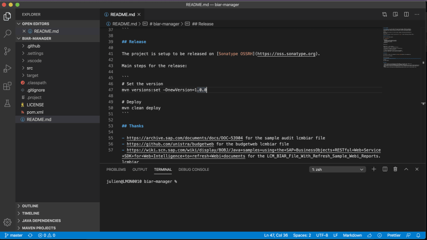
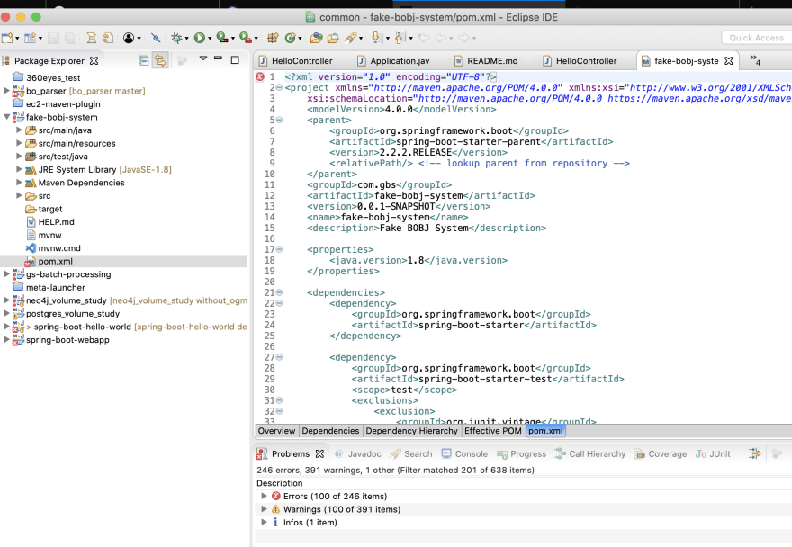
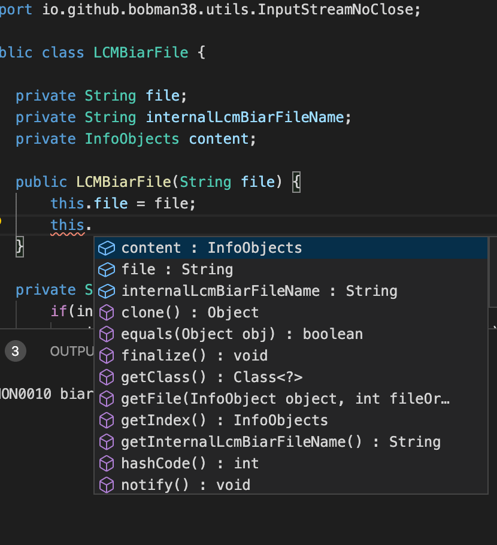
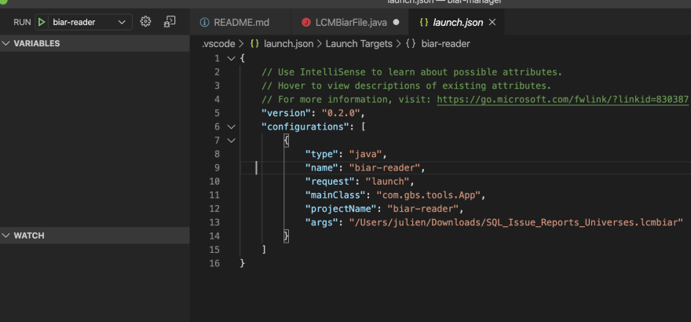
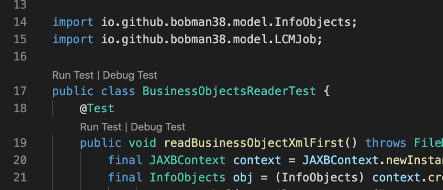
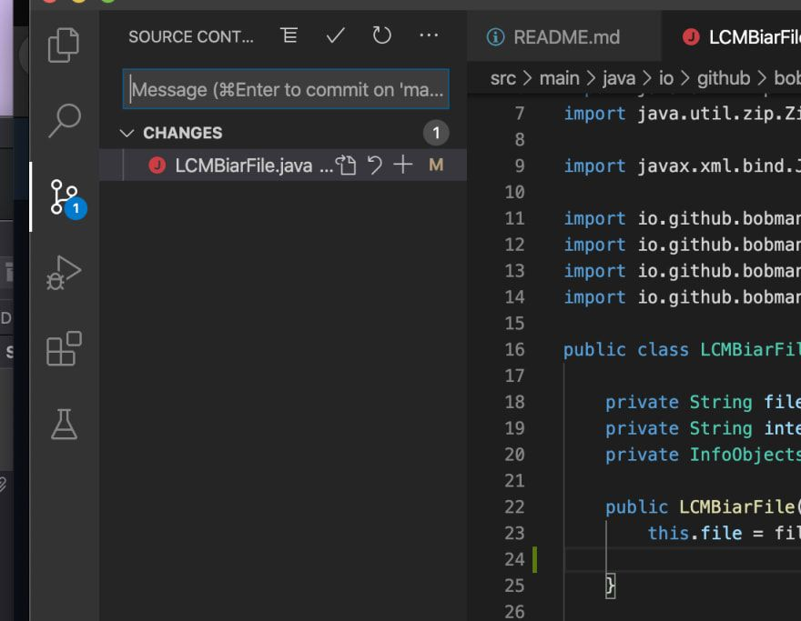

I am working for a software editor and we mainly use *Java* as backend language. I use to work with **Eclipse** since around 2010, only for Java projects. Here is my journey and a quick comparison of the tools.

> First of all I need to inform that I am actually Product Owner and not anymore a full-time developer. So I am still looking at Java source code project, but with a different level of usage than before.

## VSCode setup

VSCode is relying a lot on extension. Each extension add a little extra power to the tool. So the initial text editor can be compared with a fully featured IDE once the right extensions have been installed.

I don't want to present each extension, I found [this article](https://blog.usejournal.com/visual-studio-code-for-java-the-ultimate-guide-2019-8de7d2b59902) which is describing that very well.

Globally you can relly on the [Java Extension Pack](https://marketplace.visualstudio.com/items?itemName=vscjava.vscode-java-pack) that install all the main Java extensions for you.

## Import a project?

This is I think the most important change between Eclipse and VSCode.

Eclipse is relying on a *workspace* concept where you import Java projects. My main concern with this approch is around multi-modules Maven projects : once you add or remove a module, Eclipse is *lost* and you need to import again the missing module.

VSCode is more like other editor (Atom...), and you can simply open a folder that contain your multi-modules Maven project. If some project have been removed then you will not see it anymore.

_Folder presentation in VSCode_

_Workspace in Eclipse_

It's not a big difference but for me it is more easy to switch between projects. I do not loose anymore time to import projects, I just open the right folder. There is also a *workspace* system in VSCode to open multiple folder at once, it may be useful if you work on multiple projects at the same time (front and back for example).

## Develop ?

The global experience is very good.

You still have auto-completion and JavaDoc is shown when it's necessary. There is also an equivalent of the *Run Configuration* with the *Run* panel to fire your project.

The *Run* panel rely on a `launch.json` file, and it can be saved on your git repository if you want to share it with team-workers.

## Test ?

The right extension help to run tests. There is also some *helpers* to run the test directly before the test method or the test class.

## Share your code ?

Git is directly available in VSCode. I have never rely on any Git add-on in Eclipse, as I found some products buggy. So I was relying only on the Git command line. I still rely a lot on the command line but I am happy to see this very good integration of Git directly into the product.

And you have some indicator directly in the editor (green if new line, red if removed lines...). I have never see this kind of indication inside Eclipse. Probably I have never installed the right extension ;)

## Run tooling (Maven, etc) ?

There is also a Maven extension that let you execute all Maven commands. But here I prefer using the excellent terminal that let you do what you want. It's here, just use it.

## Conclusion

One month after VSCode installation and first test on Java projects, I realize that I haven't opened anymore Eclipse. Just today to make a screenshot...I have not yet speak of the performance too. I have a decent MBP and Eclipse take always a couple of seconds to startup. VSCode start in less than a second. Last, I am not only coding in Java but also Javascript. I have originally installed *VSCode* to replace *Atom* editor for my JS projects... So I am happy to be able to use a single tool for all my programming needs. It's faster and I am more comfortable to use a single tool for coding. **So just an advice: get a try on one of your Java project, you may be surprised to change your habits !**
