During the first weeks of the COVID-19 pandemic, back in April 2020 my son ask me to build a Minecraft server in order to play on the same world with his school friend. After checking [some available services](https://clovux.net/mc/) (yeah not so expensive finally), I have chosen to build a server on a EC2 instance. This article will explain you how to optimize the cost 😜, based on the usage!

### Some Tools Used in the Article

#### AWS

I want to rely only on AWS services as I want to increase my knowledge on this big cloud offering. There is always one service you don't know ! In this particular example I will use the following services:

- [EC2](https://aws.amazon.com/ec2/) (virtual servers in the cloud)
- [Lambda](https://aws.amazon.com/lambda/) (serverless functions)
- [Simple Email Service](https://aws.amazon.com/ses/) (Email Sending and Receiving Service)

#### Minecraft

[Minecraft](https://www.minecraft.net/) is a popular sandbox video-game. In this case I will focus on the Minecraft *Java Edition*, because the server version is running well on Linux server, and my son is running a laptop on Debian.

### Global Architecture of the Solution

The first month operating the server, I noticed that my son is using it a couple of hours each day, and then the server was idle. It's built on a EC2 `t2.small` with a 8 GB disk so I have a monthly cost of about **18 US$**. Not a lot but I was thinking that there is room for improvement! The main part of the cost is the EC2 compute cost (~17 US$) and I know that it's not used 100% of the time. The global idea is to **start the server only when my son is using it**, but he doesn't have access to my AWS Console so I need to find a sweet solution!

Here is the various blocks used:

- an **EC2 instance**, the Minecraft server
- use **SES** (Simple Email Service) to receive e-mail, and trigger a Lambda function
- one **Lambda** function to start the server
- one **Lambda** function to stop the server

And that's it. My son is using it this way:

- send an e-mail to a specific and secret e-mail address, this will start the instance
- after 8h the instance is shutdown by the lambda function (I estimate that my son must not play on Minecraft more than 8h straight 😅)

### Let's Build it Together

#### Build the EC2 Instance

This is the initial part, you must create a new EC2 instance. From the EC2 dashboard, click on `Launch Instance` and choose the *Amazon Linux 2 AMI* with the *x86* option.


Next you must choose the *Instance Type*. I recommend you the `t2.small` for Minecraft. You will able to change it after the creation.

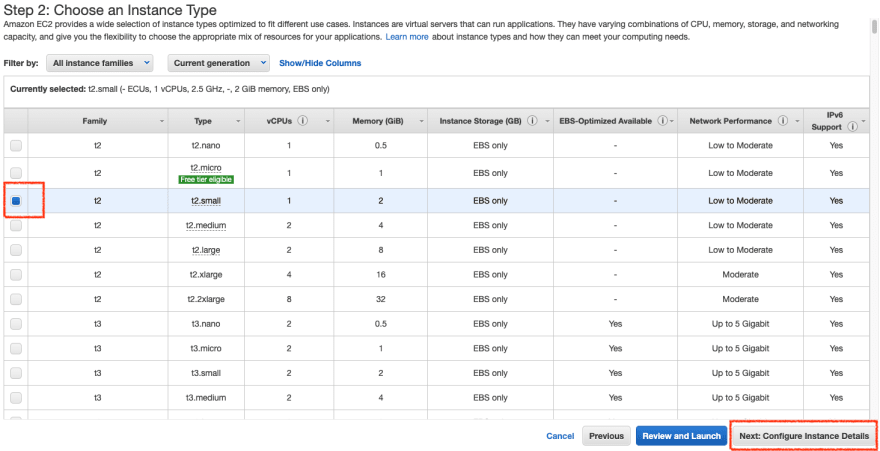

Click on `Next: Configure Instance Details` to continue the configuration. Keep the default settings, and the default size for the disk (8 GB) as it's enough.

For the tag screen I generally provide a `Name` (it's then displayed on EC2 instance list) and a `costcenter` (I use it for cost management later).

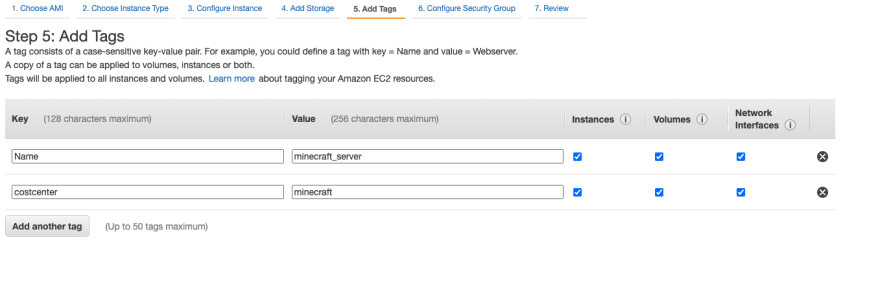

For the Security Group, it the equivalent of a firewall on EC2 and you must configure which port will be accessible from internet on your server. I add SSH port and the Minecraft port (25565) like you see on the following screen:

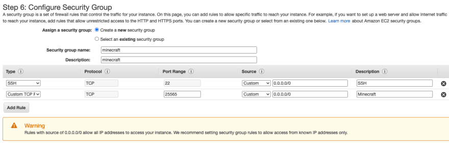

Then to start the instance you must select or create a key pair. It's mandatory and allow then to connect remotely to your EC2 instance. In my case I am using an existing key pair but if you create a new key don't forget to download on your laptop the *private key file*.

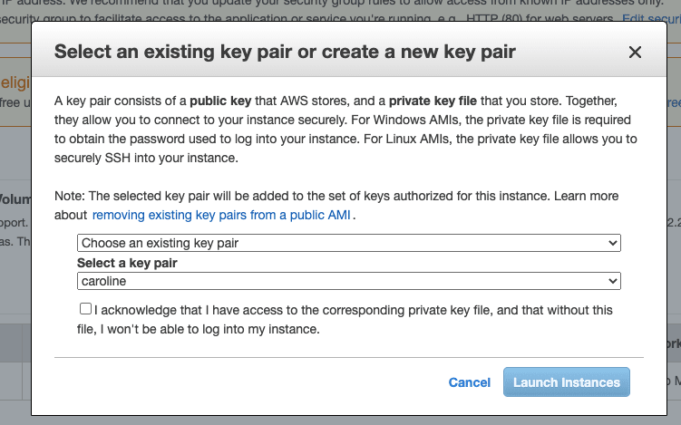

_Yes my key is named caroline. Why not?_

Then you must connect your instance via SSH, I recommend this [guide](https://docs.aws.amazon.com/AWSEC2/latest/UserGuide/AccessingInstances.html) if you need help. Basically you must run this kind of command:

```
ssh -i my_private_key.pem ec2-user@public-ipv4
```

The `public-ipv4` is available in the instance list:

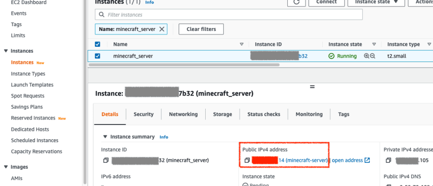

You first need java. As newer build of minecraft (since 1.17) are running only on Java 17, I recommend to use Corretto (the Amazon Java version):

```
sudo rpm --import https://yum.corretto.aws/corretto.key
sudo curl -L -o /etc/yum.repos.d/corretto.repo https://yum.corretto.aws/corretto.repo
sudo yum install -y java-17-amazon-corretto-devel.x86_64
java --version
```

You must have something like:

```
openjdk 17.0.1 2021-10-19 LTS
OpenJDK Runtime Environment Corretto-17.0.1.12.1 (build 17.0.1+12-LTS)
OpenJDK 64-Bit Server VM Corretto-17.0.1.12.1 (build 17.0.1+12-LTS, mixed mode, sharing)
```

Thanks [@mudhen459](https://dev.to/mudhen459) for the research on this java issue ;)

And I want a dedicated user:

```
sudo adduser minecraft
```

To install Minecraft you can rely on the Minecraft server page [here](https://www.minecraft.net/en-us/download/server).

For example for the version `1.17.1` I can run the following:

```
sudo su
mkdir /opt/minecraft/
mkdir /opt/minecraft/server/
cd /opt/minecraft/server
wget https://launcher.mojang.com/v1/objects/a16d67e5807f57fc4e550299cf20226194497dc2/server.jar
sudo chown -R minecraft:minecraft /opt/minecraft/
```

> ⚠️ Warning regarding Java version: It seems that starting with Minecraft 1.17, it require now a Java JRE 16 (instead of Java JRE 8).This site is giving you links to download older Minecraft versions if needed.

> [!WARNING] Java version
> It seems that starting with Minecraft 1.17, it require now a Java JRE 16 (instead of Java JRE 8).This site is giving you links to download older Minecraft versions if needed.

```
Exception in thread "main" java.lang.UnsupportedClassVersionError: net/minecraft/server/Main has been compiled by a more recent version of the Java Runtime (class file version 60.0), this version of the Java Runtime only recognizes class file versions up to 52.0
```

I have created a little service to avoid start manually the server. I want the Minecraft process to start as soon as I start the server.

To do that I have created a file under `/etc/systemd/system/minecraft.service` with the following content:

```
[Unit]
Description=Minecraft Server
After=network.target

[Service]
User=minecraft
Nice=5
KillMode=none
SuccessExitStatus=0 1
InaccessibleDirectories=/root /sys /srv /media -/lost+found
NoNewPrivileges=true
WorkingDirectory=/opt/minecraft/server
ReadWriteDirectories=/opt/minecraft/server
ExecStart=/usr/bin/java -Xmx1024M -Xms1024M -jar server.jar nogui
ExecStop=/opt/minecraft/tools/mcrcon/mcrcon -H 127.0.0.1 -P 25575 -p strong-password stop

[Install]
WantedBy=multi-user.target
```

Then advise the new service by the following:

```
chmod 664 /etc/systemd/system/minecraft.service
systemctl daemon-reload
```

More information on systemd [here](https://access.redhat.com/documentation/en-us/red_hat_enterprise_linux/7/html/system_administrators_guide/chap-managing_services_with_systemd#sect-Managing_Services_with_systemd-Unit_Files).

> [!SUCCESS]
> Now if you restart the EC2 instance a Minecraft server must be available! You can check ✅ this first step!

#### Build the Start Scenario

Let's first create our Lambda function. Go into **Lambda**, and click on `Create function` to build a new one. Name it `mc_start` and use a `Node.js 14.x` or more runtime.

Then you must have this type of screen:

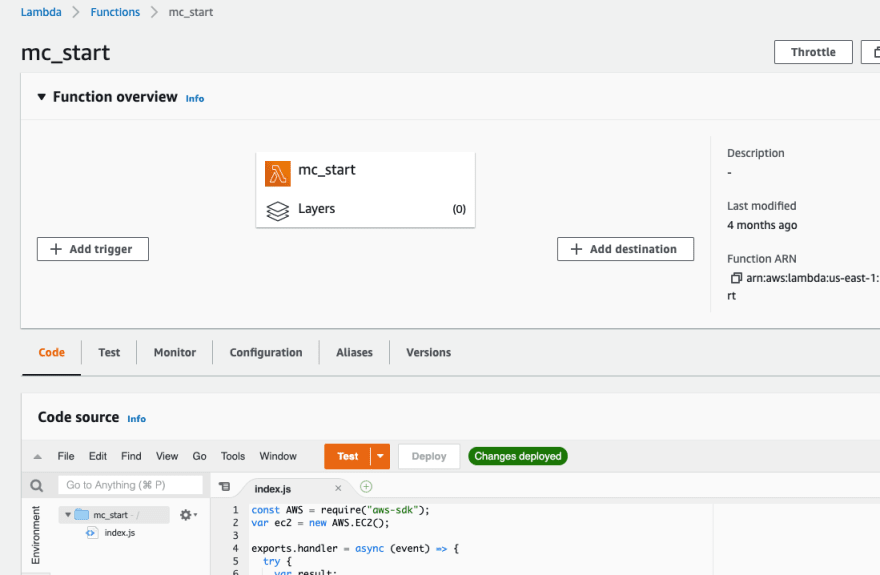

Replace the content of `index.js` file with the following:

```
const AWS = require("aws-sdk");
var ec2 = new AWS.EC2();

exports.handler = async (event) => {
  try {
    var result;
    var params = {
      InstanceIds: [process.env.INSTANCE_ID],
    };
    var data = await ec2.startInstances(params).promise();
    result = "instance started"

    const response = {
      statusCode: 200,
      body: result,
    };
    return response;
  } catch (error) {
    console.error(error);
    const response = {
      statusCode: 500,
      body: "error during script",
    };
    return response;
  }
};
```

In Configuration, set the following:

- add an environnement variable named `INSTANCE_ID` with the value that correspond to the Instance Id of your Minecraft server (something like `i-031fdf9c3bafd7a34`).

- the role permissions must include the right to start our EC2 instance like this:

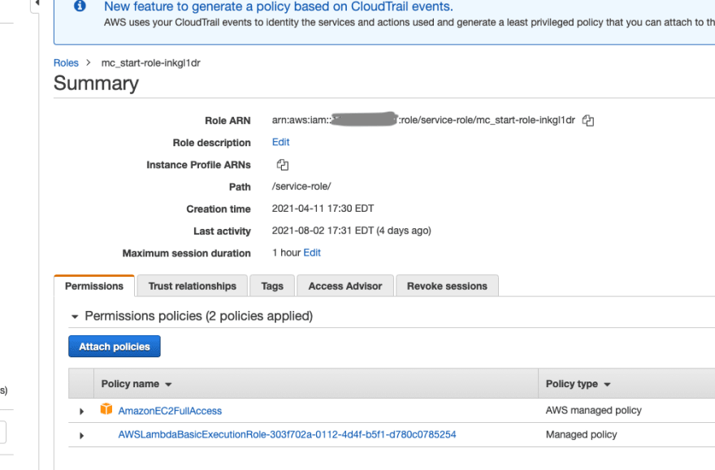

In Simple Email Service, it's time to create a new *Rule Set* in the `Email Receiving` section:

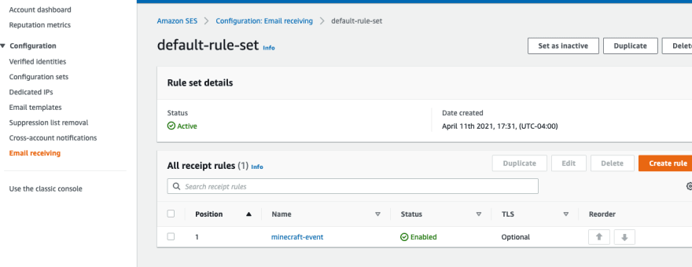

Click on `Create rule` inside `default-rule-set`. Take note that the Email Receiving feature is only available today in 3 regions: `us-east-1`, `us-west-2` and `eu-west-1` (source [here](https://docs.aws.amazon.com/ses/latest/DeveloperGuide/receiving-email.html)).

If SES is receiving an email on this particular identity:

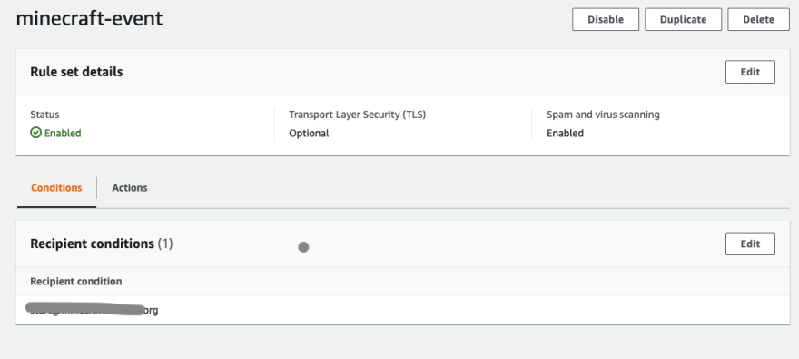

It invoke a Lambda function:

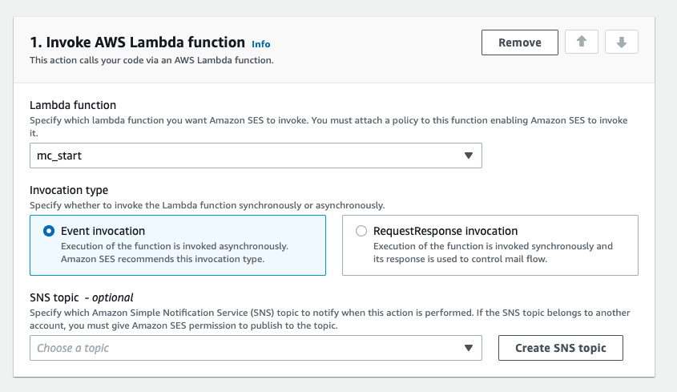

> You must add the domain to the Verified identities to make this work. It's also necessary to publish an MX entry in order to declare SES as the email receiver for a specific domain or subdomain (more info here).

#### Build the Stop Scenario

This time we want to stop the instance after 8h. It's a simple Lambda function.

Let's first create our Lambda function. Go into **Lambda**, and click on `Create function` to build a new one. Name it `mc_shutdown` and use a `Node.js 14.x` or more runtime.

Replace the content of `index.js` file with the following:

```
const AWS = require("aws-sdk");
var ec2 = new AWS.EC2();

exports.handler = async (event) => {
  try {
    var result;
    var params = {
      InstanceIds: [process.env.INSTANCE_ID],
    };
    var data = await ec2.describeInstances(params).promise();
    var instance = data.Reservations[0].Instances[0];

    if (instance.State.Name !== "stopped") {
      var launch_time = new Date(instance.LaunchTime);
      var today = new Date();
      result = "instance running";
      if ((today - launch_time) / 3600000 > process.env.MAX_HOURS) {
        console.log("stopping the instance...");
        var stop_data = await ec2.stopInstances(params).promise();
        result = "instance stopped";
      }
    } else {
      result = "instance not running";
    }
    const response = {
      statusCode: 200,
      body: result,
    };
    return response;
  } catch (error) {
    console.error(error);
    const response = {
      statusCode: 500,
      body: "error during script",
    };
    return response;
  }
};

```

In Configuration, set the following:

- add an environnement variable named `INSTANCE_ID` with the value that correspond to the Instance Id of your Minecraft server (something like `i-031fdf9c3bafd7a34`).

- add an environnement variable named `MAX_HOURS` with the value that correspond to number of hours allowed after startup, like `8` for 8 hours).

- the role permissions must include the right to start our EC2 instance like this:

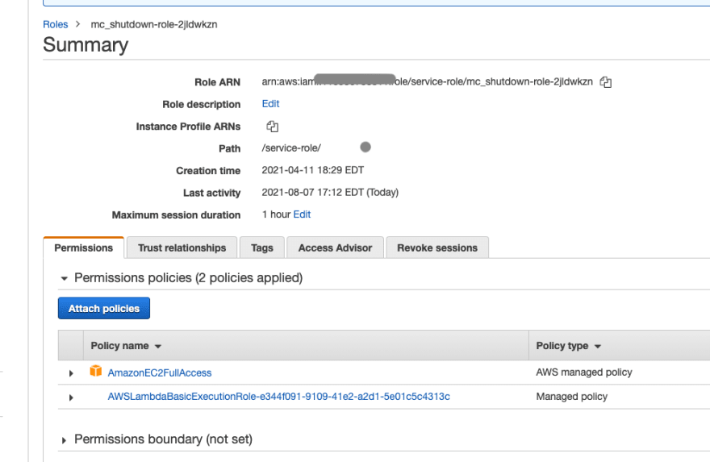

We add a trigger to fire the task every 20 minutes:

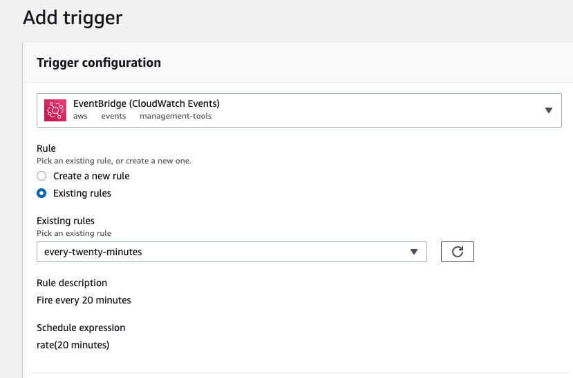

Hurray the configuration is done !

### Conclusion

This setup is working nicely here, my son is happy because he start himself the instance when he need. I am happy because it reduce **a lot** the cost of this service. On the last 3 months I see that the EC2 Compute cost for this server is less than 1 US$ 😅 (around 17 US$ before the optimization) so **95% less expensive** !

Currently the configuration is made manually in the console, I would love to spend some time to change that one day, using for example the [CDK toolkit](https://docs.aws.amazon.com/cdk/latest/guide/home.html).

It's also probably possible to manage the storage of the Minecraft world on S3 instead of the Instance EBS disk (some 💰 to save here, but not a lot).

It was a very fun project to build using multiple AWS services! Do you see other usages of dynamically boot EC2 instances using Lambda functions? Let me know in the comments!
