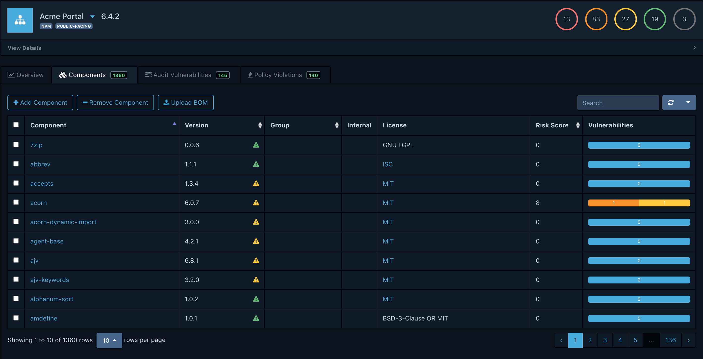
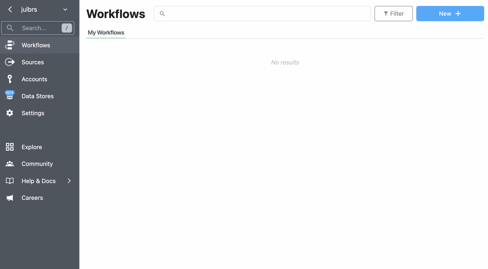
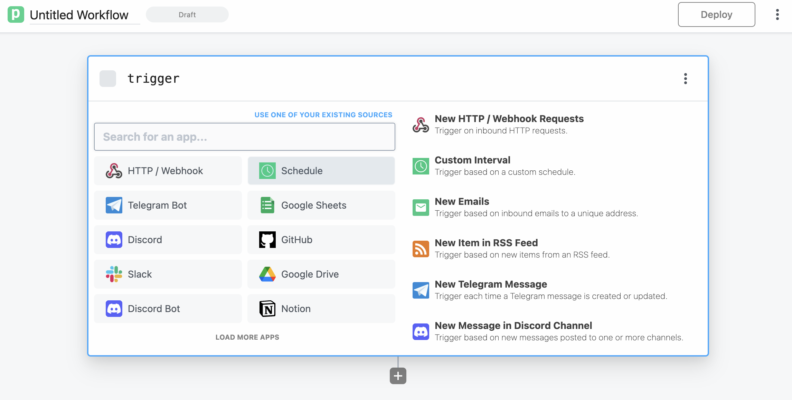
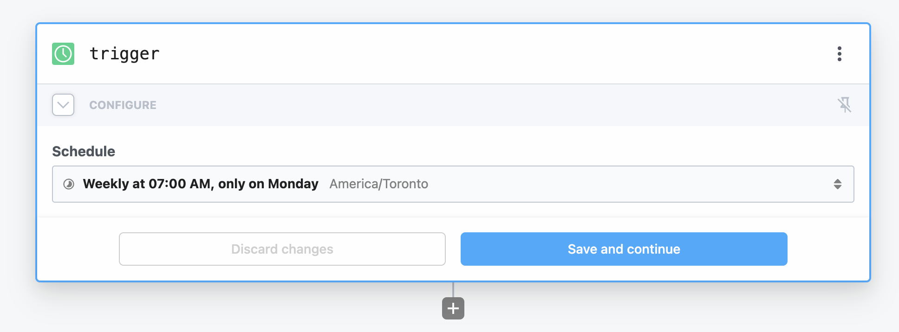
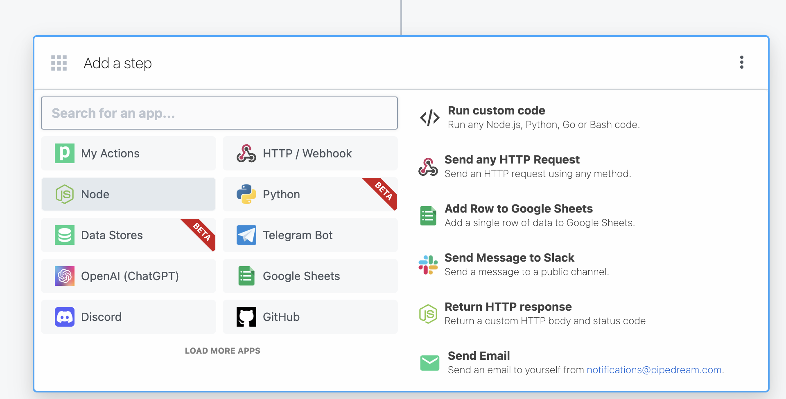
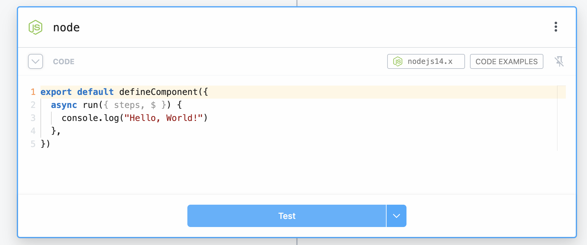

In my company we are using a solution named [Dependency Track](https://dependencytrack.org/) to follow the dependencies of all our projects, in order to be quickly informed in case of a vulnerable component, or a license risk. The solution is open-source, supported by the [OWASP foundation](https://owasp.org/).



It's a nice tool, but it require to connect to the application in order to get a full view of my projects, and what are the most risked ones. I would like to have some information every week, to follow my risk trend and identify very quickly the projects where I need to put more attention because there is more risks.

By default the platform provide some tooling to send notification to classic platforms (Slack, Teams) but you cannot build your own specific message, like:

> Today, your projects have a cumulated risk score of **123**. The TOP 3 most risked are:
>
> - **7zip** (_49)_,
> - **acorn** (_33)_,
> - **ajv** (_30)_
>
> Connect on LINK for more details,

Let's see how to build that!

## Architecture

The idea is very simple: Dependency Track can be queried by an [API](https://docs.dependencytrack.org/integrations/rest-api/) (secured by an API Key specific for each _team_ defined in the application), and it's possible to send message to a Google Chat Space via [webhooks](https://developers.google.com/chat/how-tos/webhooks).
In the middle, I am suggesting to use a solution named [Pipedream](https://pipedream.com/) in order to connect the source and the destination. The advantage of Pipedream is the ability to run small piece of code (Javascript for example) and link that to existing connector or services. It is much more powerful than other tooling like _Zappier_ or _Make_ because it's code based (in my own opinion 😅).

## Step-by-step Process

Pipedream is a SAAS solution, and there is a nice free tiers available. If you don't setup to many workflows like that, then it will be fine with the free tiers only 🤓. Go and create an account.



Then in the workflow panel click on **New**.



The trigger of your script will be a schedule. In my case I want to run this workflow once a week, Monday morning.



Then go to Save and continue. It will require to fire a test event, and you will be able to add a new step in the workflow with the little **+** sign at the bottom.



Here let's select **Node** to write our own code that will be triggered every week. You can start with the Hello world template, and click on **Test** to launch it.



Finally when you are happy with your code, just click on **Deploy** (will appears after first Test!) and it will run the code every week as you scheduled it before.

## The Script Used Here

Here is the template that is reading data from **Dependency Track** and sending it to **Google Chat**. It's very simple, don't forget to use your own Dependency Track URL and API key, and also the correct Google Chat Webhook URL.

```javascript
// To use any npm package on Pipedream, just import it
import axios from "axios";

const webhookUrl = "https://chat.googleapis.com/v1/spaces/xxxx/messages?key=xxx";

export default defineComponent({
  async run({ steps, $ }) {
    // grabbing project information from Dependency Track
    const { data } = await axios({
      method: "GET",
      url: "https://dependency-track-url/api/v1/project",
      headers: {
        "X-Api-Key": "xxxxx",
      },
      params: {
        excludeInactive: "true",
      },
    });

    // transformation (sum the lastInheritedRiskScore, identify TOP3)
    const d = {
      sum: data.map((i) => i.lastInheritedRiskScore).reduce((a, b) => a + b),
      top: data
        .sort((a, b) => b.lastInheritedRiskScore - a.lastInheritedRiskScore)
        .map((a) => ({ project: a.name, risk: a.lastInheritedRiskScore }))
        .slice(0, 3),
    };

    // send the message to Google Chat Webhook
    await axios.post(webhookUrl, {
      text: `Today, your projects have a cumulated risk score of *${
        d.sum
      }*. The TOP 3 most risked are: \n - ${d.top
        .map((a) => `*${a.project}* (_${a.risk})_`)
        .join(", \n - ")}
Connect on XXX for more details,`,
    });

    // return the formatted data to Pipedream, can be used in a next step for example
    return d;
  },
});
```

> There is a nice option in Pipedream to store sensitive data, [you can use it](https://pipedream.com/docs/environment-variables/)!

A first call to Dependency Track is grabbing the project for the team, then a second call is sending a chat message to Google Chat with the formatted information. I want to have the sum of the `lastInheritedRiskScore` for all the projects of the team, plus a TOP 3 based on the same `lastInheritedRiskScore` value.

At the end of my quick exploration, I have created a nice little personalized script, thanks to products that are exposing API and Pipedream to connect all together:


It will allow me to follow my risk score week after week, and put a focus on what to do first. Go and create your own with [Pipedream](https://pipedream.com/)!
