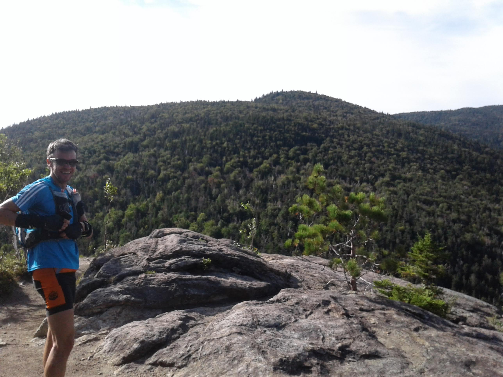
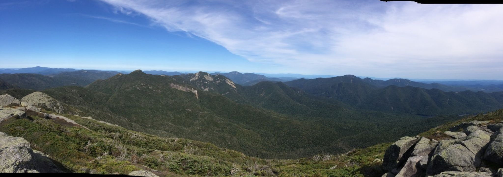
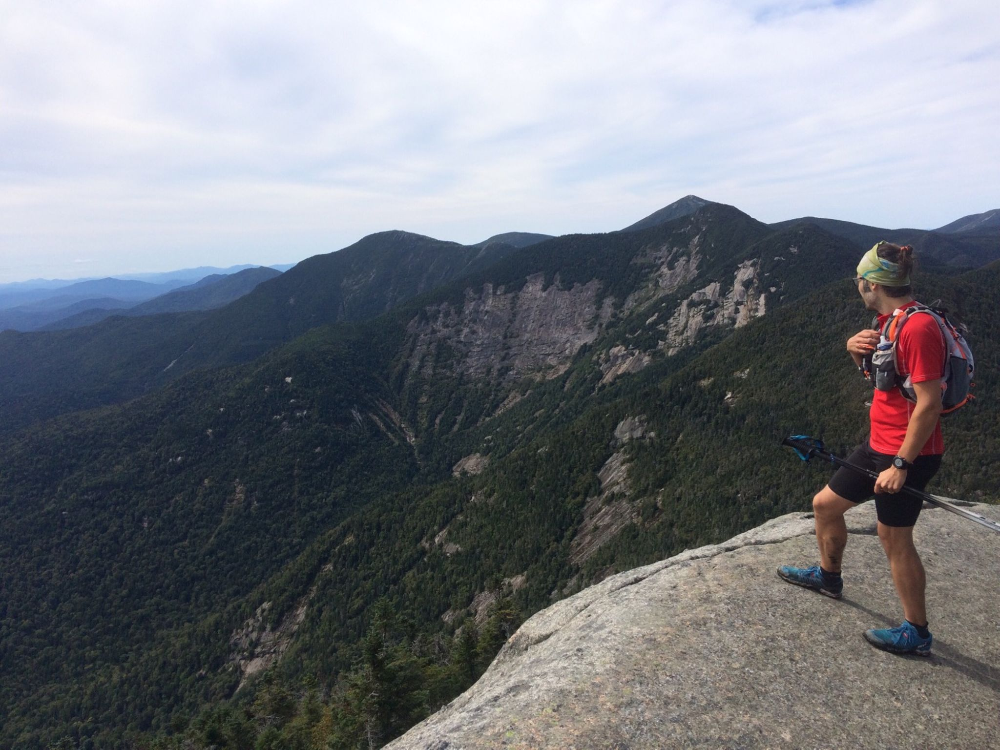

> Petit [OFF] sur le sentier Great Range dans les Adirondack réalisé ce 8 septembre 2018 avec Christian. Un sentier qui était dans la bucket list des choses à faire dans le coin...

Les mensurations de la bête :

- 40km (4km de bitume entre les 2 parkings)
- environ 3000m D+ (exclusivement sur les 22 premiers kilos...)
- 10h30 pour boucler le parcours. Pas de longues pauses, juste le temps d'échanger avec les randonneurs et aller pas trop vite dans les sections dangereuses.

**Attention** : ce n'est pas une course en sentier comme les autres... On prend pas ça pour préparer un 50k ou autre... Ici ça va lentement, les sentiers sont difficiles, on pose les mains souvent, et il n'y a pas d'assistance :) Rendu a mi-parcours on est a bien 15 kilomètres d'un accès routier... Bien évaluer sa forme avant de se lancer, vérifier son équipement (si je dois passer la nuit vers Marcy à cause d'une entorse j'ai ce qu'il faut ?).

## Préparation

Pas mal de documentation disponible en anglais mais assez peu en français. Le concept du tracé c'est de s'enchaîner un bon tas de sommets assez haut des Adirondack pour finir par le Mont Marcy : Roostercomb, Hedgehog, Lower Wolfjaw, Upper Wolfjaw, Armstrong, Gothics, Saddleback, Basin, Little and Big Haystack. Le Mont Marcy est le point le plus haut de l'état de NY (1629m), vue a 360 sur le parc des Adirondack ! Le retour (beaucoup plus rapide) se fait en fond de vallée.

- https://www.hikingproject.com/trail/7009885/adirondack-great-range en anglais mais bien complet
- Garer sa voiture au Roostercomb Trailhead sur la NY 73. Pas de frais d'entrée sur le parc.

Le matériel préconisé pour ce genre d'aventure :

- 2 litres d'eau + filtre (pas d'eau fiable sur tout le parcours, mais rivière disponible entre Basin et Little Haystack mais c'est au bout de ~5h de course). Temps frais pour nous mais on a quand même rempli ici et j'étais a sec le soir à la voiture. Filtre indispensable. Je plussoie pour le Katadyn BeSafe.
- Ravito ! (snacks/sandwich/barres, temps prévu au moins 8h plutôt 10h !)
- Couche chaude si temps moyen / coupe vent (on peut avoir froid au sommets)
- Bâtons
- Chaussures avec un super grip (dalles !)

## Trace

<iframe allowfullscreen="yes" src="https://www.visugpx.com/qcWt6FlInR?iframe" id="ivisugpx" scrolling="no" marginheight="0" marginwidth="0" frameborder="0" width="800" height="535"></iframe>

## Récit du chantier

La journée commence mal avec un accident de réveil... Bref on part de Montréal à 6h au lieu du 5h planifiée. Que 2 bonnes heures de route jusqu'au parking, c'est pas siiii loin. On s'élance sur le sentier ensoleillé à 8h45. On décide de partir sur la range en premier pour au pire finir la nuit dans la vallée.

Les premiers sommets s’enchaînent assez bien. En même temps on ne 'prend' que 200m à 300m pour chaque sommet, c'est rapide. PEU ou PAS de course a pied ! Jusqu'au mont Marcy c'est super rare de courir et c'est quelques dizaines de mètres maximum ! On croise des randonneurs venus faire 1, 2 ou 3 sommets. Nous bah c'est _Great Range_ ;)

Au sommet de Roostercomb, on voit bien le chantier....

A partir des sommets Wolfjaw, les sentiers sont parfois complexes. Quelques pas d'escalade ou de désescalades. La descente de Gothics se fait sur des dalles à 45 degrés, aidé par une corde pour éviter de glisser... La descente de Saddleback est pas mal non plus avec une bonne session de rochers a descendre... Les bâtons sont parfois encombrants !

Après Basin on peut faire le plein d'eau dans la rivière. Filtre indispensable car on est pas sûr de la qualité de l'eau. On repart avec bien 2 litres chacun. Il ne reste ensuite que deux sommets mais les plus gros ! Big Haystack se fait assez bien avec un super pano en haut.

Au sommet de Big Haystack

La montée vers Mont Marcy est la plus longue (une heure je crois) mais c'est là on a le plus de D+ et de distance pour un sommet. On est au sommet de l'état de NY vers 16h30. On a mis plus de 7h30 pour venir jusqu'à ce point !

Je sais plus à quel sommet correspond cette photo !

Il ne reste ensuite que de la descente dans la vallée. Mais une longue et lente descente... J'imaginais courir dès qu'on atteint le bas de Marcy mais quelle erreur ! On doit négocier un sentier semé de gros rochers pendant un bon bout, avant de finalement trouver un sentier 'courable'. Ça prend bien 2h30 / 3h pour redescendre depuis Mont Marcy jusqu'à notre parking.

Whaou ! Une belle course sur une belle journée ensoleillée avec un super partner ! Merci Christian !

<iframe width="800" height="500" src="https://www.youtube.com/embed/-Q1xUXuv_bo" frameborder="0" allow="accelerometer; autoplay; encrypted-media; gyroscope; picture-in-picture" allowfullscreen></iframe>
