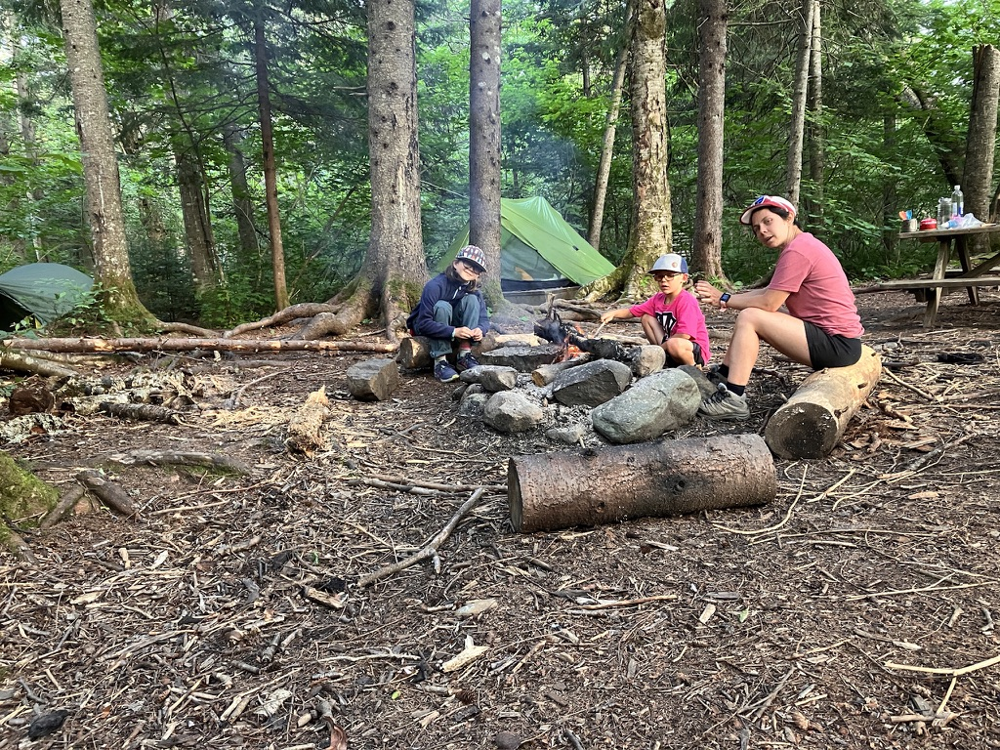
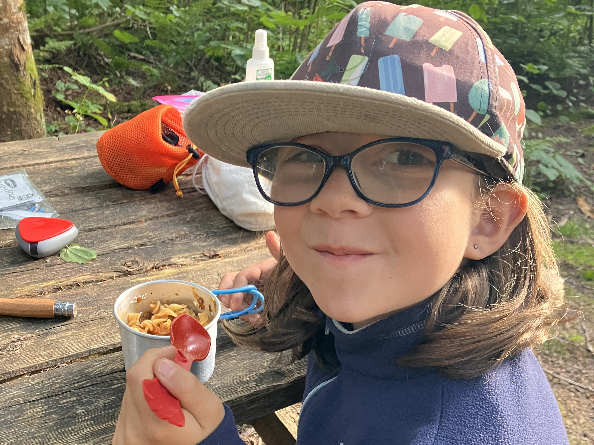
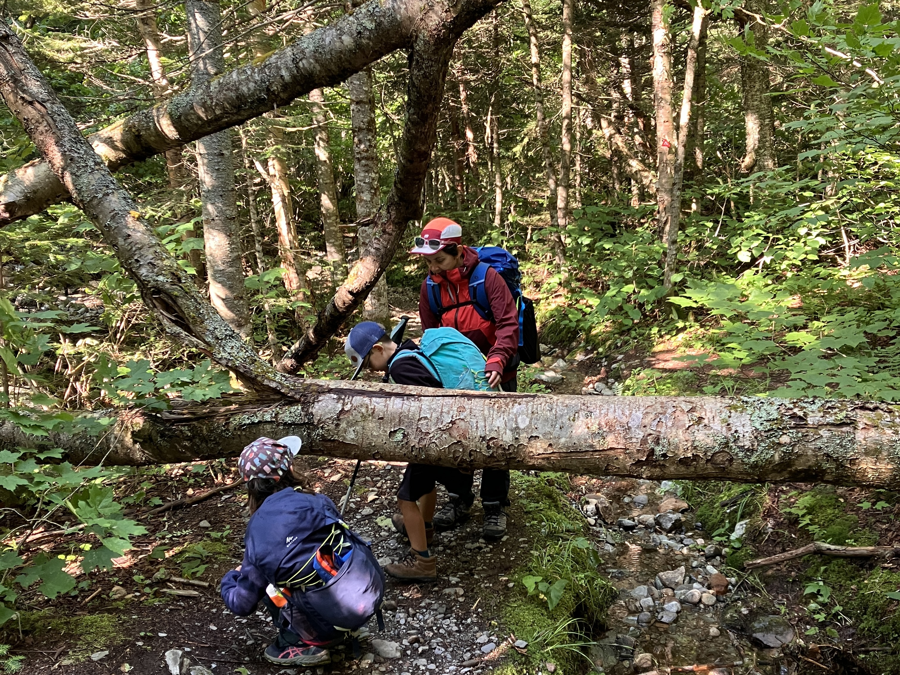
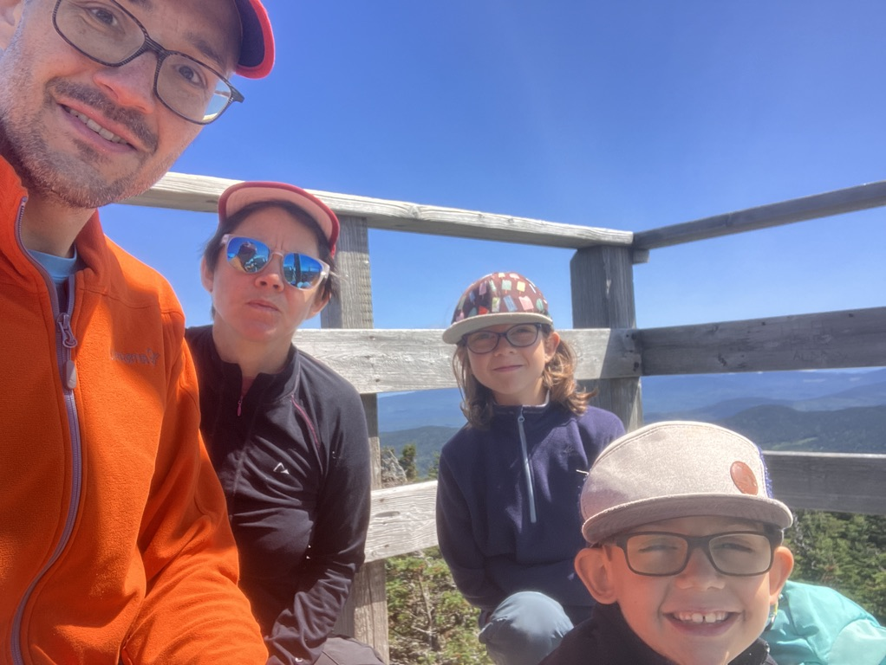

Avec le beau temps qui se profile pour la fin de semaine, on se dit qu'une randonnée pourrait être le fun, mais nos enfants (8 et 11 ans, le plus grand est chez son chum!) sont plus motivés pour marcher quand il y a un dodo dans le bois au milieu! On se décide pour aller à la ZEC Louise-Gosford, à 1h15 de chez nous et surtout avec un coup de fil à l'accueil qui nous informe qu'il reste de la place sur certaines plateformes.

## Jour 1 - 20 juillet - 4.5km

Arrivés sur place avec notre stock, on passe un bon 10mn à l’accueil de la ZEC, l'agent qui est en charge des randonneurs est super aidante et construit avec nous une suggestion de randonnée en fonction des chemins d'accès (beaucoup de sentiers routiers dans la ZEC sont impraticables avec les pluies des dernières semaines), du niveau de nos enfants, et de notre désir de camper le samedi soir dans bois! On réserve donc une plateforme au Camping de la rivière Arnold. Pour ce premier jour qui commence vers 13h30 on se gare au parking 3 et on se donne juste un 4.5km sur la route de gravel, qui est plus praticable que le SF1 (barrage de castor!).

On arrive clairement très tôt au camping après une bonne heure de marche et on profite de la fin de journée pour chiller avec un bon feu! Le soir on déguste un bon plat de pates aux lentilles et aux champignons (merci Robert et Françoise du blog [Derrière l'Horizon](https://derrierelhorizon.home.blog), vous êtes le Ricardo des sentiers pour moi 😅).

## Jour 2 - 21 juillet - 11 km

Un peu de pluie durant la nuit, mais une journée qui semble être parfaite pour une plus longue marche et un sommet! On plie nos affaires et on commence à marcher vers 8h30, on prend la direction du mont Gosford en suivant le SF1 depuis le camping. La montée est longue (environ 600m de dénivellation) et pas mal abîmé par les récentes pluies (il manquait un pont!).

Les enfants ont été très téméraires sur la montée et toujours très enclins à grimper à leur vitesse! On a a rencontré des bénévoles des sentiers frontaliers avec qui on a pu échanger sur la passe annuelle (oui, en plein recrutement de membres ;)) et on est passé à coté de l'abri 3-faces du ruisseau du cap qui a l'air bien confortable. On arrive au sommet du Mont Gosford vers 11h15, moins de 3h après notre départ. La vue est à couper le souffle, un 360 degrés de vision avec un ciel bleu! Juste le temps d'une collation car il fait un peu frais là haut, et on redescend en direction du parking 3 sur le chemin SF8 puis SF6. On arrive à l'auto vers 13h15, soit moins de 5h de marche sur cette journée.

Pour nous c'est une belle découverte des Sentiers Frontaliers, et du fait que l'on peut partir "sans réserver" pour aller camper le soir même. Les 2 enfants ont aimé cela et sont prêt pour un autre session 24h dans le bois (ou plus longtemps 😅)

La trace gps sur Strava: https://www.strava.com/activities/11946947798
