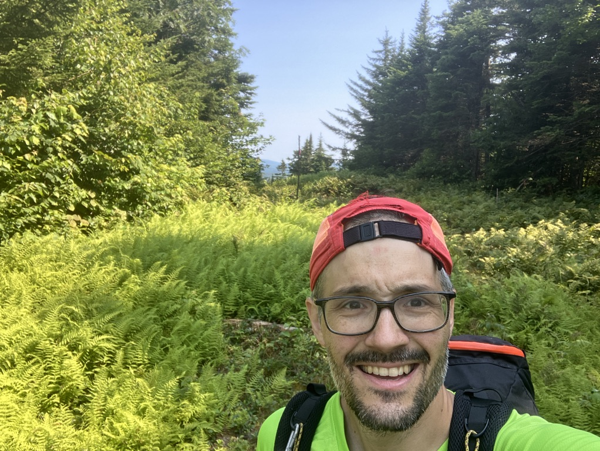
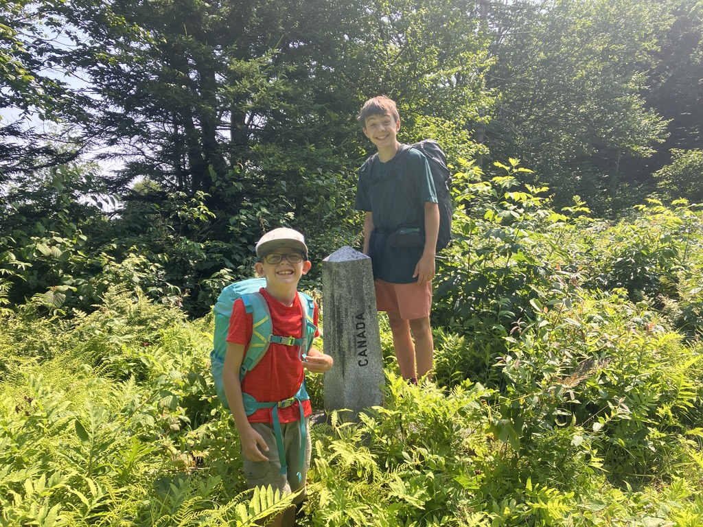
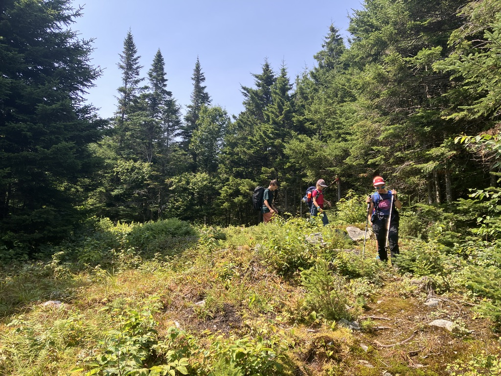

On a découvert la ZEC Louise-Gosford [la semaine passée](/outdoor/2024-07-mont-gosford/), et on gratté la surface du réseau [Sentiers Frontaliers](https://sentiersfrontaliers.com). Il nous reste une fin de semaine avant de partir en congé, on se dit que ça peut être l’occasion d'aller découvrir le secteur Montagne de Marbre / lac Danger qui fait partie du réseau SF!

Je trace une route sur CalTopo pour notre fin de semaine, avec une option vers le Mont Saddle également, que l'on va finalement skipper le dimanche:

<iframe src="https://caltopo.com/m/BPK7BUT" width="100%" height="600px"></iframe>

## Jour 1 - 27 juillet - 8km

On arrive sur le parking au fond du 10ème rang à Notre Dame des bois. On est un peu étonné de voir 3 roulottes positionnés en cercle qui prennent un bon morceau du stationnement. Les joies des terres de la couronne on dirait 😅.

On revient un peu sur nos pas pour prendre dans le bois en directement du sentier SF1, et non SF2 qui va directement au lac Danger. La montée est longue mais dans le bois. Une fois arrivés en haut, on est physiquement sur la frontière entre le Canada et les États-Unis, c'est particulier! Le chemin est pas facile sur la frontière, pas mal de bouette, de fougère, c'est moins bien tracé que dans le bois! Marion s'est perdue un moment car elle ne trouvait plus la trace (et elle fermait la marche en solitaire!).

On croise quelques bornes qui marquent la frontière, c'est rigolo! Il faut bien rester du bon bord!

On finit par arriver sur le lac Danger. On ne trouve pas de place sur un des 3 plateformes de bois (une plateforme était endommagé et 2 étaient occupés, pas de réservation ici, premiers arrivés premiers servis!). On trouve un coin un peu plat à coté du lac. On se régale d'un bon plat et on a un peu de misère avec l'eau qu'il faut aller chercher à la décharge du lac. On notera que c'est sans doute à ce moment là que mon filtre a rendu les armes et ce qui m'a causé quelques désagréments les semaines qui ont suivi!

## Jour 2 - 28 juillet - 12 km

Belle nuit à coté du lac, on range notre stock pour aller monter la "face de singe" en direction de la montagne de Marbre! Finalement on ne voit pas tant de marbre que cela sur le chemin, mais la vue en haut est bien correcte, on arrive à voir assez facilement le Mont Gosford qu'on a gravi dimanche dernier.

On décide de redescendre directement et de skipper Saddle. Bon choix car Saddle semble relativement pret mais ca coûte une paire d'heure pour aller le cocher en plus! Voilà c'est fini on est rendu amoureux de l'aspect rustique / rugueux des Sentiers Frontaliers 😅 Ca prend pas long!!

La trace gps sur Strava: https://www.strava.com/activities/12004012694
