Pour cet été, on souhaite combiner pour nos vacances un séjour en itinérance et un séjour en canot-camping. On s'appuie sur la SEPAQ pour le canot, mais on hésite coté itinérance. Ma blonde m'a offert le livre [Les longues randonnées du Québec](https://editionshomme.groupelivre.com/products/les-longues-randonnees-du-quebec) de Frédérique Sauvée qui donne pas mal d'info. Je m'appuie aussi sur le groupe Facebook ["Longues Randonnées • Communauté du Québec"](https://www.facebook.com/groups/2299157603728038) pour me donner des idées! J'aimerai ça allonger à 3 jours d'autonomie avec les enfants, on est pas mal à l'aise sur le format 2 jours avec nos diverses expéditions passées! On finit avec la short-list suivante:

- passer 3 jours dans **Pharaoh Lake**, dans les Adirondacks, qui semble pas mal adapté avec des enfants
- s'appuyer sur un [itinéraire dans le Parc des Appalaches](https://www.parcappalaches.com/fr/cartes-et-circuits/itineraires-de-randonnee/), les itinéraires proposés sur le site web sont pas mal dans ce que je cherchais!

On valide cette dernière option qui est plus simple coté administratif vs les USA, et ça permet d'aller explorer le Bas Saint-Laurent que l'on connaît pas bien!

## Route

Voici la route que j'ai tracée sur CalTopo:

<iframe src="https://caltopo.com/m/LUSC2TQ" width="100%" height="600px"></iframe>

Ce circuit démarre au parking 13 etnous fait dormir 2 nuits au même camping (Camping de la Devost), avec une petite boucle en extra sur le J2. Ça permettra de s'adapter à l'énergie des enfants si nécessaire, et J1 + J3 sont bien distincts!

## Préparation

Coté matériel c'est assez classique. On prend 2 tentes (une 2 places dome pour les adultes, et une 2 places qui se monte avec les batons pour les enfants car elle est légèrement plus grande). On a chacun un sac à dos avec sleeping, tapis de sol, collation pour la journée. Les adultes et Eliott portent la bouffe.

Coté bouffe, on a pas mal fait tourner le déshydrateur pour ce séjour!

| Jour       | Déjeuner                                                 | Diner                                                                                                                | Souper                                                                               |
| ---------- | -------------------------------------------------------- | -------------------------------------------------------------------------------------------------------------------- | ------------------------------------------------------------------------------------ |
| 31 juillet | N/A                                                      | Diner sur la route                                                                                                   | [Pates aux lentilles et aux champignons](/recipes/pates-lentilles-champignons/)      |
| 1er août   | Gruau maison, [granola maison](/recipes/granola-maison/) | [Cari de quinoa aux légumes et aux noix](https://derrierelhorizon.home.blog/cari-de-quinoa-aux-legumes-et-aux-noix/) | [Couscous du randonneur](https://derrierelhorizon.home.blog/couscous-du-randonneur/) |
| 2 août     | Gruau maison, granola maison                             | Vivres de course                                                                                                     | Restaurant!                                                                          |

> **Note**: pour J3 on a pas prévu de réel diner, mais on va s'appuyer sur des vivres de course: barres tendres, noix, jujubes au fil de la journée comme font Françoise et Robert du blog [Derrière l'horizon](https://derrierelhorizon.home.blog/alimentation-en-longue-randonnee-pedestre/).

> **Note 2**: comme cet article a été écrit plus d'un an après les faits, il se peut que j'ai inversé ou mélangé certains menus 😅. Ca m'apprendra à ne pas prendre de notes pendant la randonnée et à délaisser le blog!

## Jour 1 - 31 juillet - 7.4km - 200m de D+

Le premier jour on voyage depuis Sherbrooke vers Sainte-Lucie-de-Beauregard ou se situe un des accueils du parc. Un bon 3h de route avec une pause lunch un peu avant d'arriver (IGA de Sainte-Justine, on recommande les frites!).

A l’accueil, on reçoit toutes les informations nécessaire pour notre randonnée, on a même droit à des itinéraire papier qui reprennent les trajets "par défaut" disponible sur le site web, c'est bien rodé je trouve! On roule ensuite quelques minutes supplémentaire pour rejoindre le parking P13, le point de départ de notre aventure. Un beau stationnement nous y attend, on va revenir ici dans un peu plus de 48h par un autre chemin!

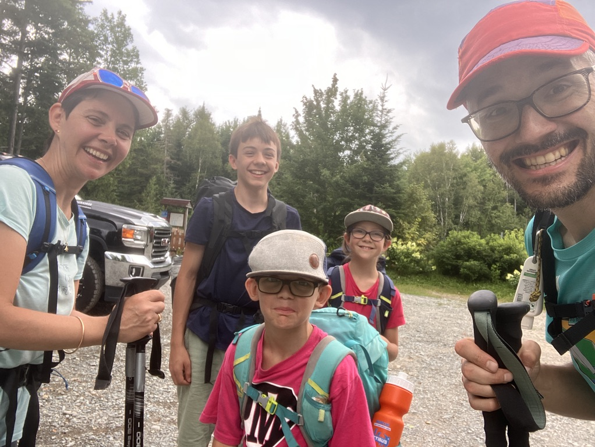
_Le départ! Marcus a pas l'air si content!!_

On décolle vers 13h30 depuis le parking pour un 7km sans grande difficultés. On profite des petits abris en bois construits le long du sentier pour se désaltérer et reprendre un peu d'énergie avec des barres tendres et des noix!

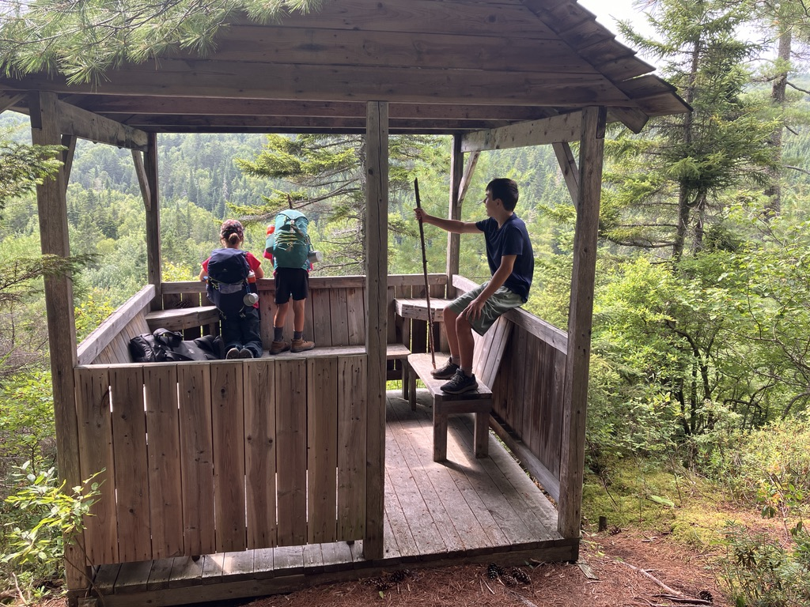

On arrive sans grande difficultés au camping de la Devost, après environ 3h de marche. C'est un site de camping avec 3 plateformes en bois de 12x12, une bécosse et un rond de feu communautaire. Au cours de la randonnée on ne va pas croiser beaucoup de monde et surtout on sera seul les 2 nuits dans ce camping!

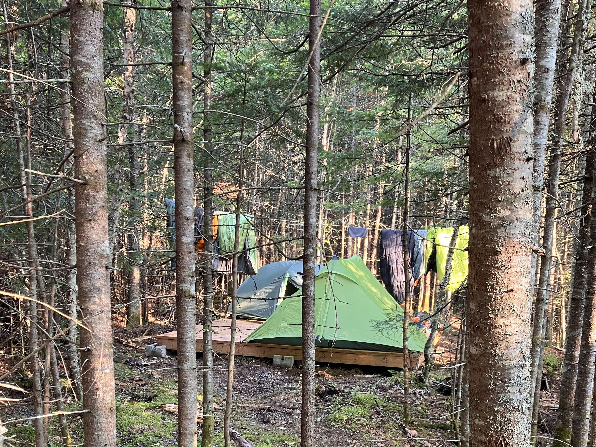

L'avantage du camping est comme son nom d'indique le site des chutes de la Devost à quelques dizaines de mètres, qui invite pas mal à la baignade! C'est sur cette journée que mon filtre (Katadyn Befree) a décidé de finir sa vie, le débit était de plus en plus faible et la poche vient de se percer. On va finir le séjour avec des pastilles d'aquatabs!

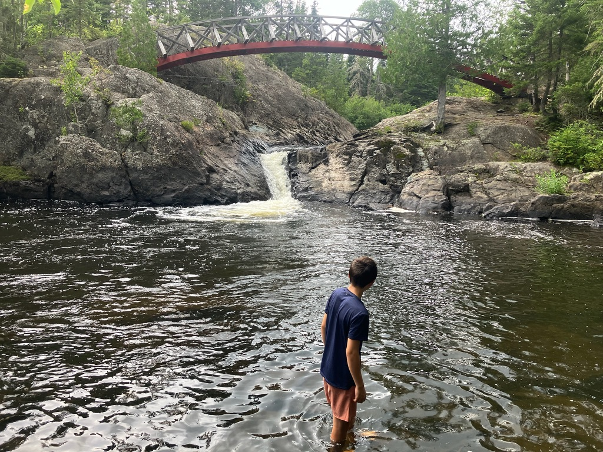

Trace [Strava](https://www.strava.com/activities/12046119857)

## Jour 2 - 1er août - 10km - 150m de D+

Ce second jour est plus contemplatif, car il ne s'agit que d'une boucle qui nous ramènera au camping ce soir. On en profite pour faire pas mal de photos sur les ponts du parc, qui sont nombreux et en plus bien réalisés!

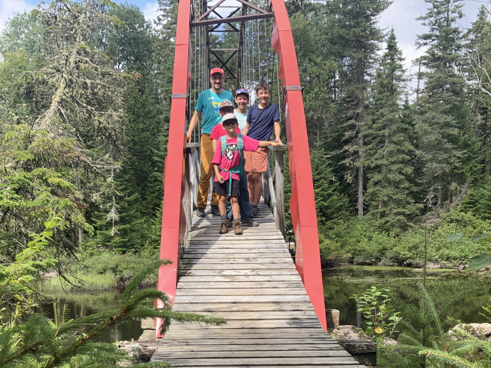

On se rend jusqu'à la halte du nénuphar pour la pause lunch, où on se gâte avec un bon plat chaud pour changer des vivres de courses!

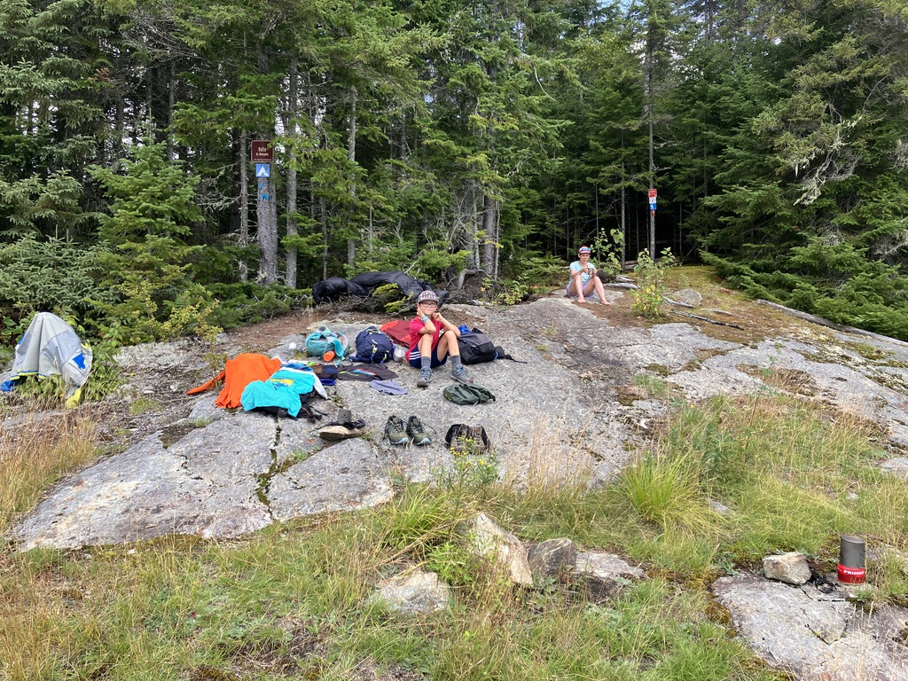

On reprend ensuite la route pour rejoindre nos plateformes que l'on connaît déjà! Cette petite boucle nous aura pris environ 4h30 d'après Strava, avec un rythme très moderé!

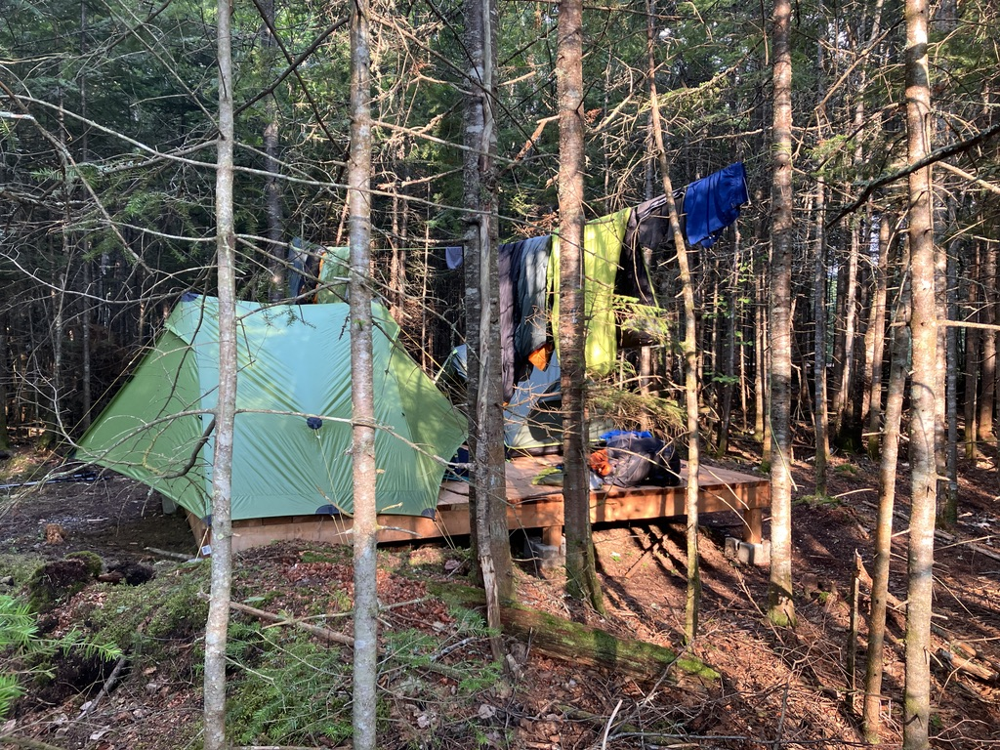

Le soir, on trouve du bois pour le feu sur un site de camping le long de la rivière plus bas, ce qui nous permet de démarrer un feu pour faire nos guimauves!

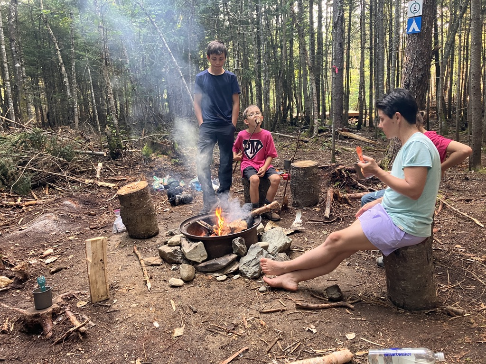

Trace [Strava](https://www.strava.com/activities/12046122642)

## Jour 3 - 2 août - 8.7km - 400m de D+

Le troisième jour arrive déjà, et après un bon petit déjeuner il faut tout plier à nouveau pour rentrer jusqu'à l'auto!

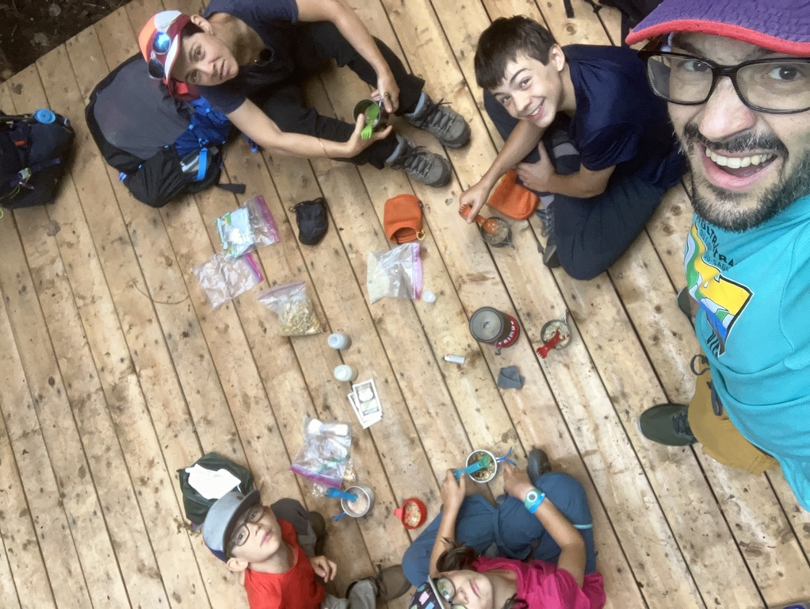

Le programme de ce dernier jour est le plus chargé, avec un beau sommet à gravir, le Mont Sugar Loaf. Le plan était pas super clair, CalTopo indiquait un sentier qui permettait d'éviter de faire un aller-retour au Sugar Loaf par un sentier d'ascension au sud-ouest. Arrivé sur place on voit que c'est un sentier "expert", on s'y engage en se disant que "ça passe" 😅.

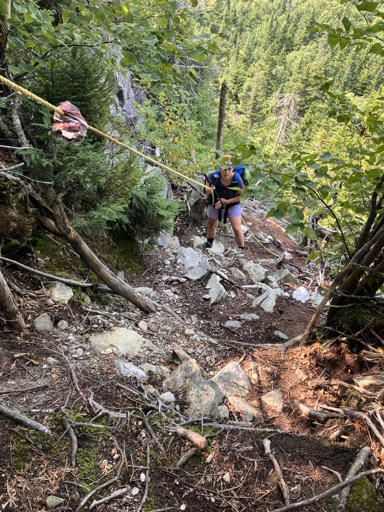

Effectivement le sentier arrive sur une section assez verticale avec des cordes pour se maintenir! Moins évident avec un gros sac de randonnée mais c'est passé 😂.

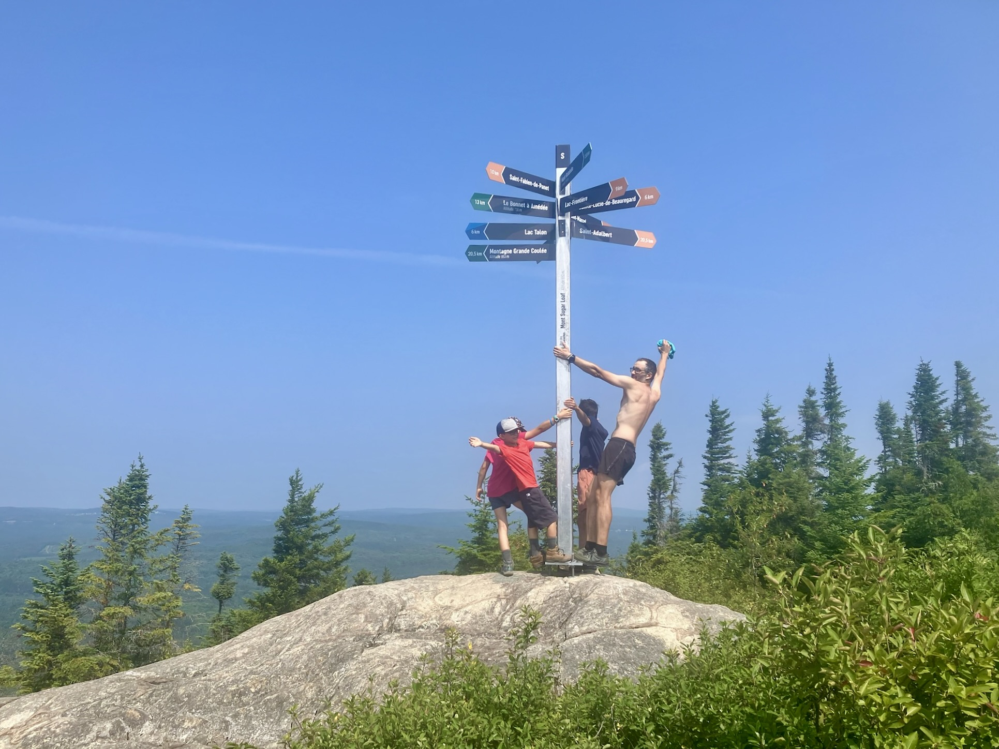

Au sommet on profite de la vue pour se remplir la panse et penser à descendre tranquillement vers le fin de notre belle expérience. Je vais passer sous silence la fatigue de Marcus sur les 2 derniers kilomètres, mes oreilles s'en souviennent encore... Mais selon Strava une durée de 4h30 pause comprises pour 8.7 km. Retour à l'auto et direction Mikes pour un copieux souper de fin de randonnée!

Trace [Strava](https://www.strava.com/activities/12046126074)
