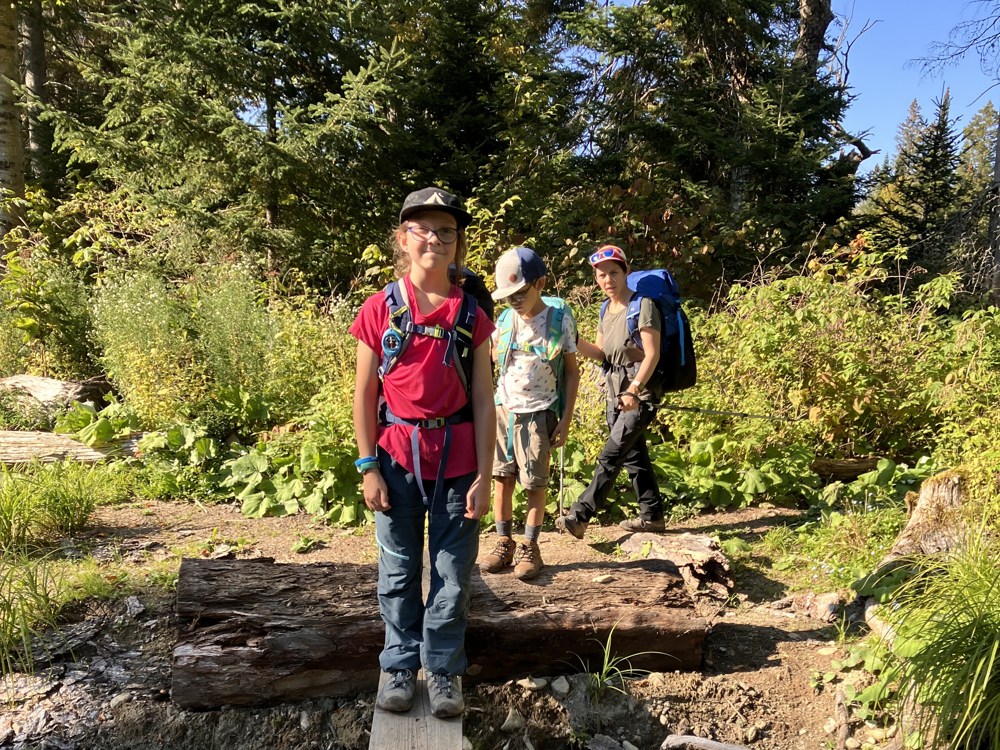
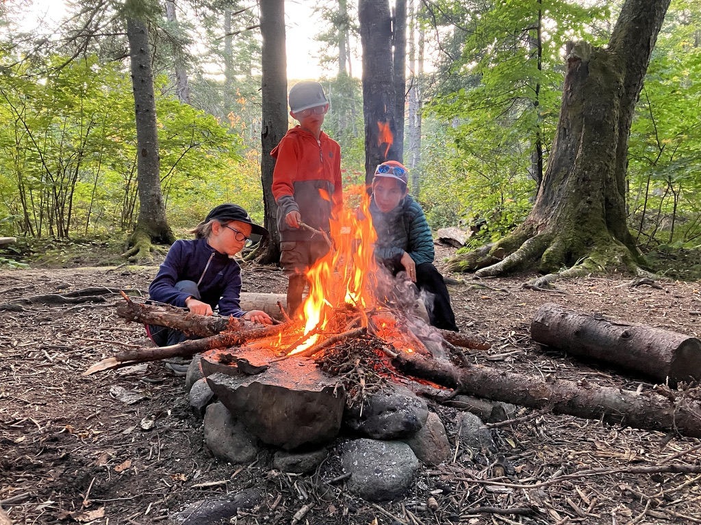
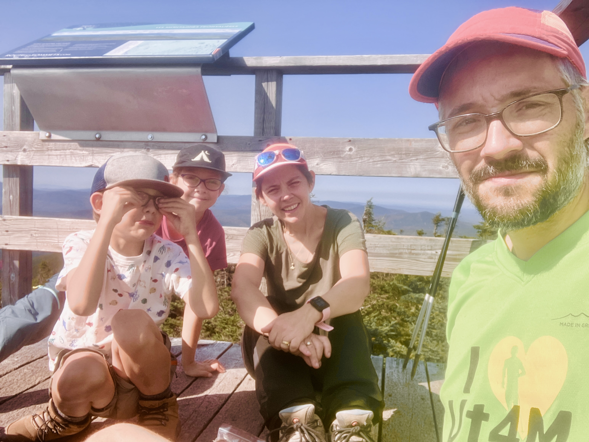

On a l'impression d'être privilégiés d'avoir accès à ce terrain de jeu (merci les Sentiers frontaliers!) et de pouvoir passer une fin de semaine en famille dans l'bois! On remet le couvert après un premier Mont Gosford en [juillet](/outdoor/2024-07-mont-gosford/)!

## Jour 1 - 14 septembre - 4km

Cette fois on part de l'accueil Gosford, on prend le sentier SF1 jusqu'au camping de la rivière Arnold. Ça permet d'éviter de payer les frais pour rentrer l'auto dans la ZEC, et notre statut de membres des Sentiers Frontaliers nous fait sauver l'entrée pédestre et les frais de réservation de la plateforme! C'est 5km relativement plat, ça passe vite! Cette portion du sentier est réouverte depuis peu, merci aux bénévoles! On est seul au camping qui est composé de 3 plateformes en bois, un rond de feu et une table. Meilleure soirée au monde avec un 🔥 qui réchauffe...

Lien [Strava](https://www.strava.com/activities/12420025906)

## Jour 2 - 15 septembre - 12km

On décolle tôt (~ 8h30) pour continuer le SF1 en direction du Mont Gosford! Une belle grimpette de 600m D+. La vue au sommet est toujours aussi spectaculaire. Puis la descente dans les sapins puis dans l'érablière, jusqu'à l'auto après plus de 5h de marche. Retour vers 14h, pile 24h après être parti hier!

Lien [Strava](https://www.strava.com/activities/12420029949)

On est chanceux de pouvoir faire ce genre d'affaire avec Marcus et Sidonie! 🥰
Cet été on a pu s'organiser au moins 5 ou 6 "24h dans le bois". La formule est simple et marche bien pour nous, on a pu visiter des bouts des sentiers de l'Estrie (Mont Glen!), et surtout des beau coins des sentiers frontaliers (Montagne de Marbre, Mont Gosford x 2). Prochaine étape: réussir à embarquer Eliott notre grand fils de 14 ans qui trouve toujours une excuse quand on va grimper le Mont Gosford!
