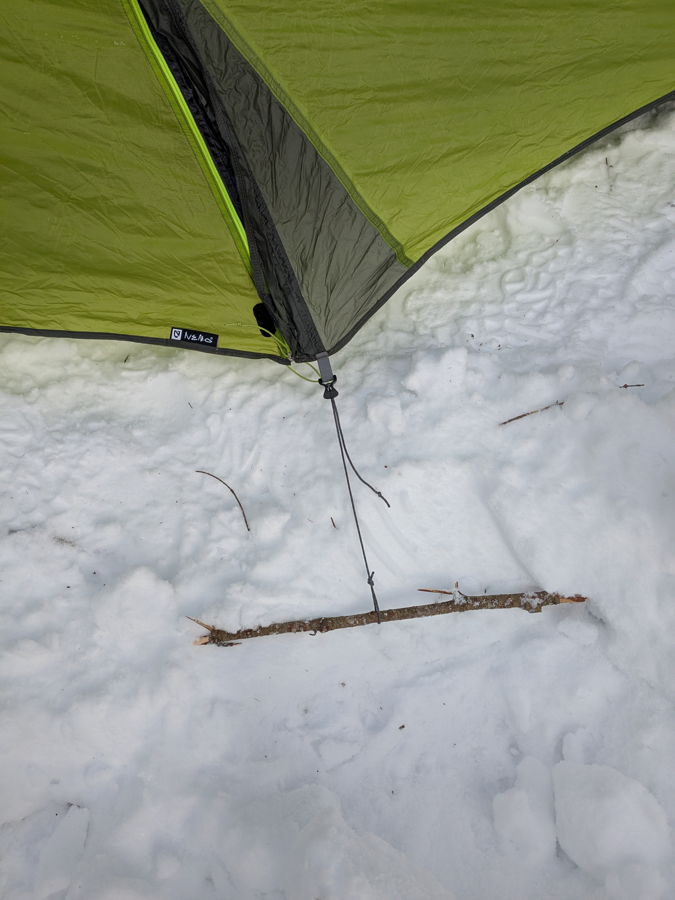
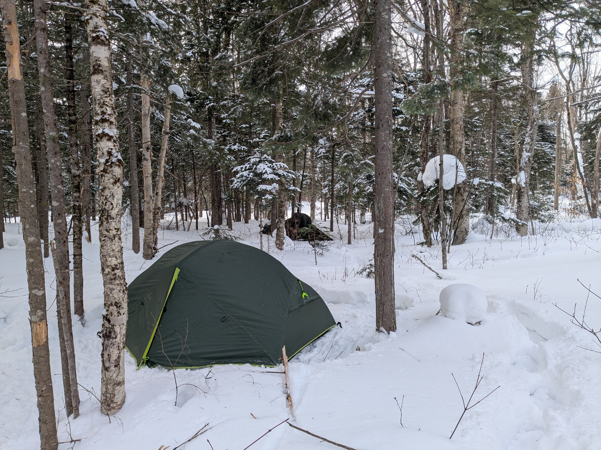
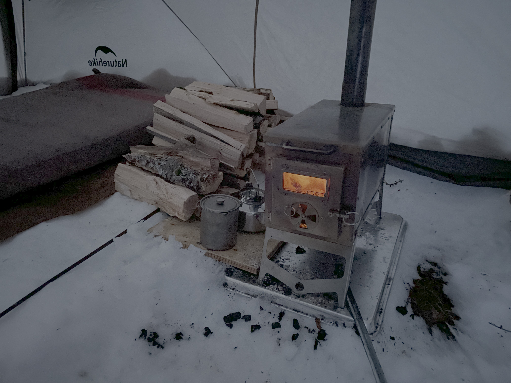
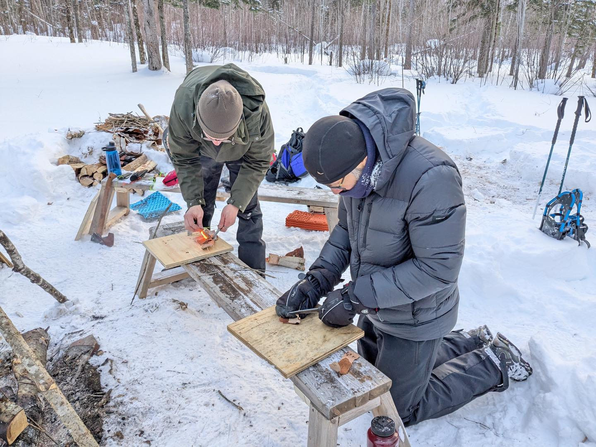
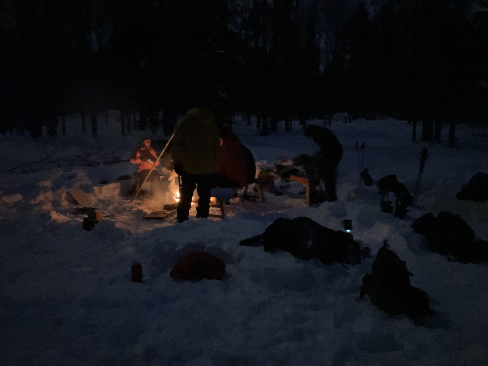
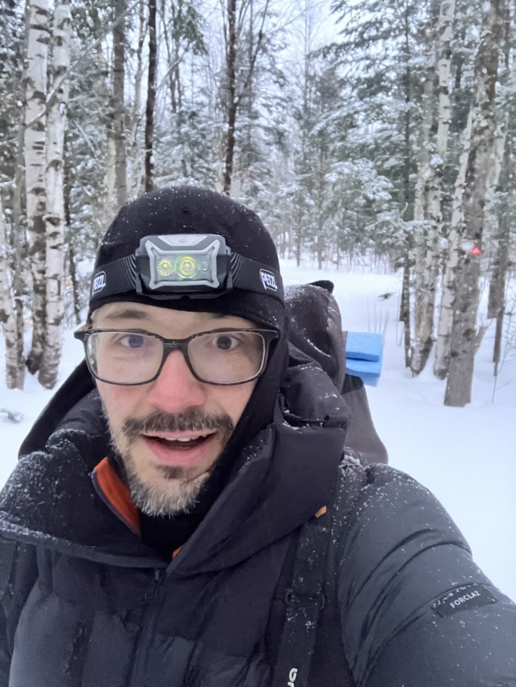
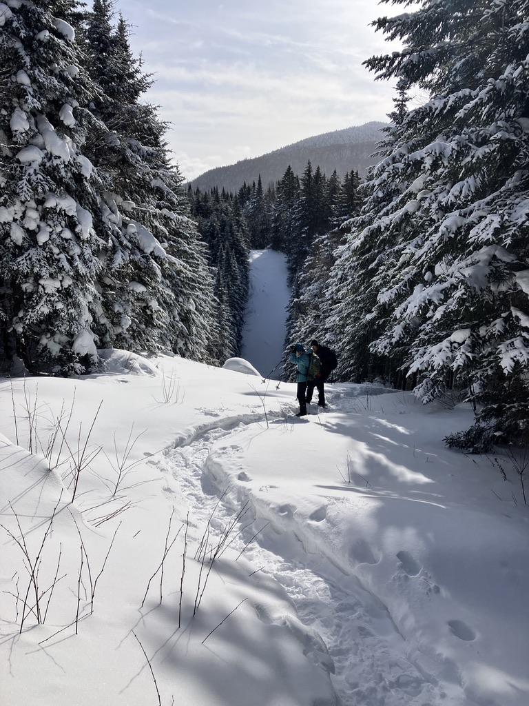

J'ai participé lors de la fin de semaine des 8 et 9 février à une activité d'initiation au camping d'hiver organisé par les [Sentiers Frontaliers](https://sentiersfrontaliers.com), et encadrés par Catherine et Jérôme. L'activité consistait à un encadrement pour camper en hiver dans des températures négatives (on parle de -10°C à -20°C) le samedi soir, puis une randonnée le dimanche si tout est beau! En amont de la sortie, une rencontre Zoom a été organisée pour vérifier que tout le monde avait l'équipement requis (sleeping, matelas, etc...) et répondre aux questions des participants.

## Jour 1 - 8 février

On avait un RDV au niveau du camping du 10ème rang à Notre-Dame-des-Bois vers 13h30, histoire d'avoir suffisamment de temps pour s'installer en tente avant de souper. Catherine nous guide sur la façon de trouver une bonne place pour poser sa tente: pas trop exposé au vent pour éviter d'avoir trop froid, et suffisamment plat. On se trouve chacun un spot qui nous parait idéal. Ensuite on vient taper la couche de neige avec nos raquettes, afin de former une base solide pour y poser la tente. Il faut veiller à laisser un 15 mn avant de poser la tente, sinon la neige tapée n'est pas assez solide! Un autre truc appris pendant la journée, c'est la façon d'ancrer sa tente. Un piquet de tente classique ne va pas fonctionner! On peut s'équiper d'ancre à neige (comme le [MSR Blizzard](https://www.mec.ca/en/product/5046-304/msr-blizzard-tent-stake-kit-4-pack)) ou sinon on peut simplement utiliser une branche d'arbre comme ancre. Il faut ensuite bien tasser la neige au dessus de l'ancre pour que le système fonctionne correctement!

_Une des ancres de la tente de Catherine_

De mon bord, j'avais embarqué la tente la plus petite (moins d'air à chauffer!) et la plus lourde (plus de chaleur qui reste dans la tente!), une Mc Kinley Escape 2 tente dome 2 places toute simple. J'ai pris aussi un tapis de sol type Z-lite + un matelas autogonflant (plusieurs matelas permet d'addtionner les R-values, donc plus d'isolation!). Pour finir j'ai emprunté un sleeping RAB -13 °C confort à mon amie Marylin pour l'occasion (merci à toi!!).

_Mon spot de camping avec ma tente Mc Kinley Escape 2_
Lien [Strava](https://www.strava.com/activities/13586655174)

On en profite pour faire un tour des différentes installations, voir les stratégies "chaleur" de chacun! Jérôme a installé une tente chaude prêt du coin à feu, qui servira en cas d'urgence. Il y a un petit poêle dedans! De son bord il prévoir de dormir sous une simple bâche!

On en profite également pour se tester au démarrage de feu en condition froide avec Jérôme, et les différentes techniques.

On commence à préparer le souper assez tôt, car la nuit tombe vite en hiver! Chacun gère son stock. De mon bord j'avais pris une boite à lunch isotherme d'un de mes enfants pour faire réhydrater mon repas. Le hic c'est que j'ai eu de la misère à faire chauffer mon eau! Je suis parti avec mon réchaud habituel (un [BRS 3000](https://geartrade.ca/products/brs-3000t-isobutain-stove), tout petit et tout léger) qui fonctionne avec des bouteilles de mélange propane / isobutane. Le soucis c'est que ce genre de réchaud fonctionne mal à basse température. L'isobutane a un point d’ébullition de -11.7 °C, donc le gaz ne sort plus trop en dessous de -11 °C 😅. La stratégie est de mettre ses mains sur la can de gaz pour la réchauffer, puis ensuite de se réchauffer les mains sur le chaudron au dessus, puis on switch à nouveau... C'est tout une technique!

La soirée se termine avec quelques conseils autour du feu pour passer une bonne nuit en hiver ; avec par exemple la technique de la bouteille d'eau chaude: chauffer un litre d'eau et le mettre dans une gourde de type Nalgène, puis mettre un bas autour de la gourde (pour éviter de se brûler!) et mettre ça au fond du sleeping pour avoir un extra de chaleur au niveau des pieds! J'avais 2 Nalgène donc j'y suis allé avec 2 bouteilles chaudes!

## Jour 2 - 9 février

La nuit s'est passé pas si pire! Le mercure est tombé aux environ de -15°C, les gourdes d'eau chaude ont bien aidé les pieds à se réchauffer, et la chaleur diffuse pendant un bon 4 à 5 heures. Le plus dur c'est de se lever à 4h AM pour aller faire un petit pipi, mais le retour dans le sleeping est bien agréable! Au final j'ai pas plus mal dormi qu'une autre nuit en camping. Le cadran était réglé sur 6h AM, le temps pour plier la tente et partir le feu - manger un peu avant de partir en randonnée pour 7h30. Le plus complexe c'est de plier les arceaux métalliques (froids!) avec les mains. Il faut jouer avec les différentes épaisseur de mitaines / gants pour ne pas finir avec les doigts gelés.

_le gars heureux d'avoir réussi à plier sa tente et pas geler pendant la nuit!_

Après un bon combo démarrage de feu préparé avec soin par Jérôme - café - gruau bien au chaud dans le thermos, on est pas mal prêt pour démarrer la randonnée guidée par Catherine. Jérôme de son bord organise une matinée plus relax au camp avec les participants qui le souhaitent, le temps de plier tout le matériel amené pour le confort (tente chaude, etc....). Un seul participant a eu notablement trop froid pendant la nuit, son équipement plutôt orienté 2 voir 3 saisons n'était clairement pas adapté. On se retrouve à 4 pour la randonnée du dimanche, un boucle en raquette autour de la Montagne de Marbre!

Cette boucle de 12km nous prend environ 5h à accomplir, la progression avec les raquettes est notablement plus lente qu'en randonnée pédestre! Mais les sapins enneigés du sommet sont splendides avec le beau temps qu'on a eu, et la pause au sommet est appréciée!

Lien [Strava](https://www.strava.com/activities/13586658405)
