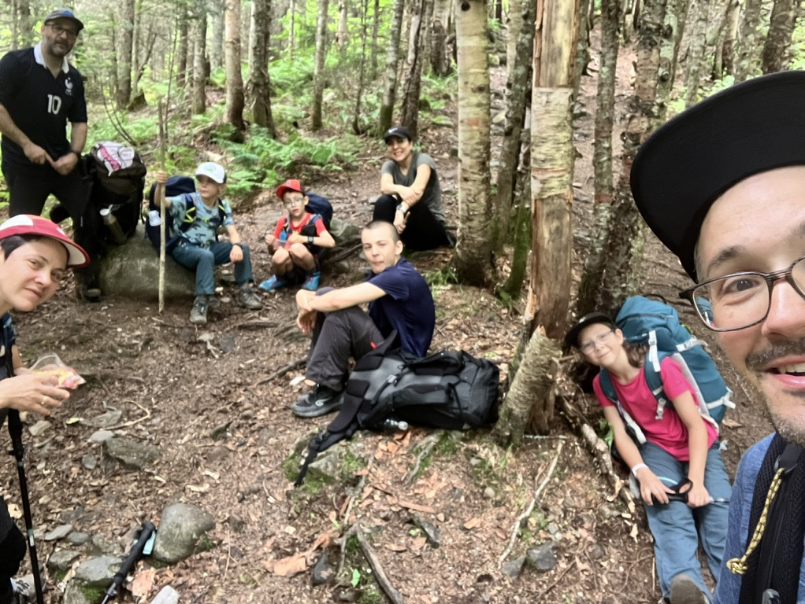
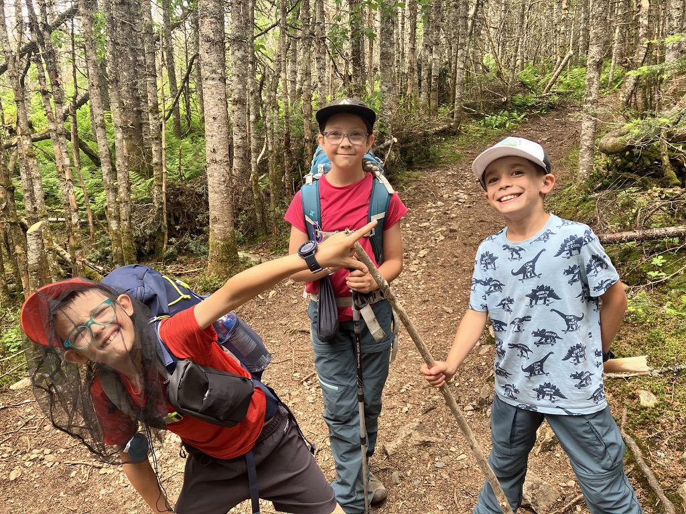

On remet le couvert avec notre traditionnelle boucle au Mont Gosford en 2 jours avec une nuit au camping de la rivière Arnold! Cette fois on a suivi le même itinéraire que lors de [notre sortie de septembre 2024](/outdoor/2024-09-mont-gosford/), mais on a réussi à emmener des amis (Gégé, Laura et Thomas avant leur retour aux USA!) et notre grand fils Eliott! Je met juste quelques photos ici pour conserver quelques traces 😇

- Dates: 5 et 6 juillet 2025
- Distances: 5.3k le premier jour et 13k le second jour.

_La belle gang!_

_Ca prenait un headnet, les mouches étaient intenses!_

Lien [Strava](https://www.strava.com/activities/15030108649)
