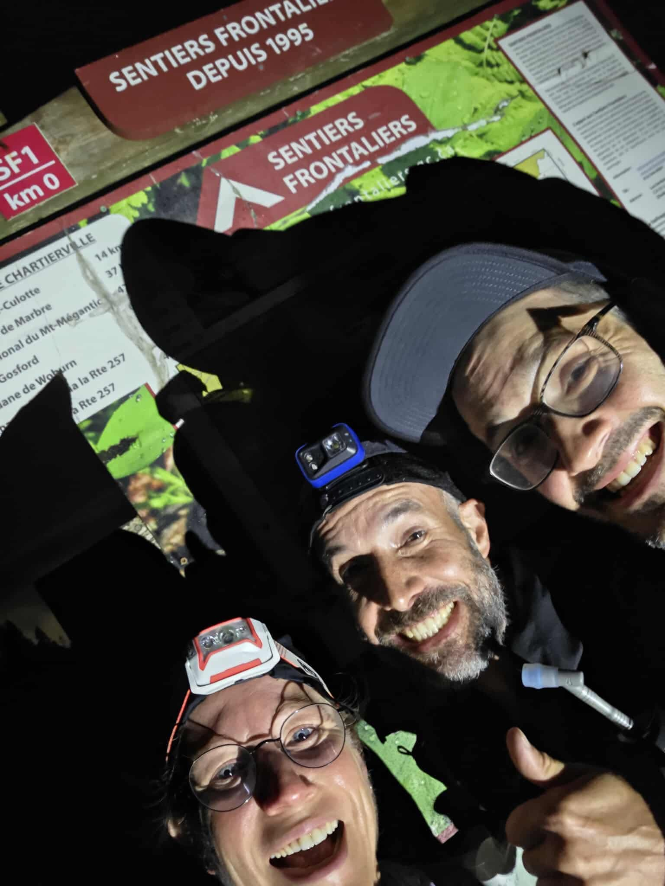
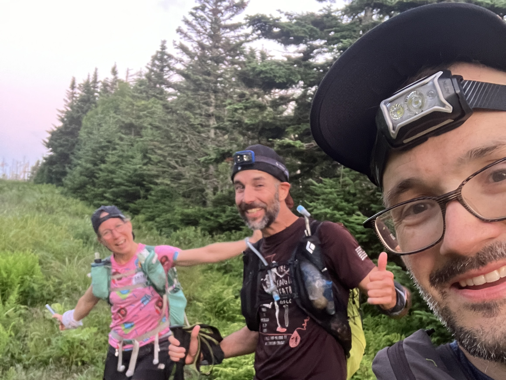
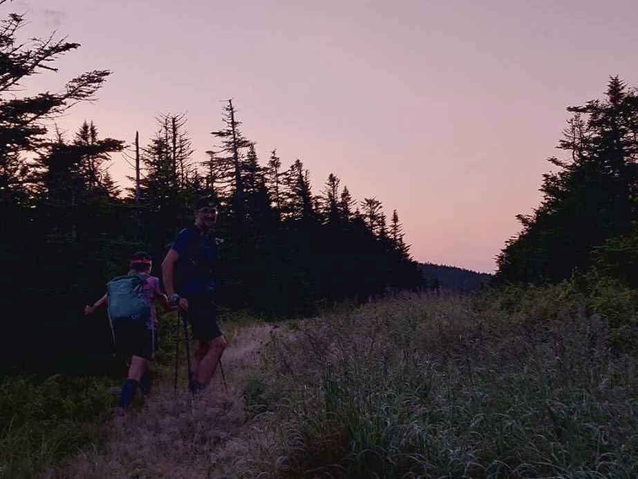
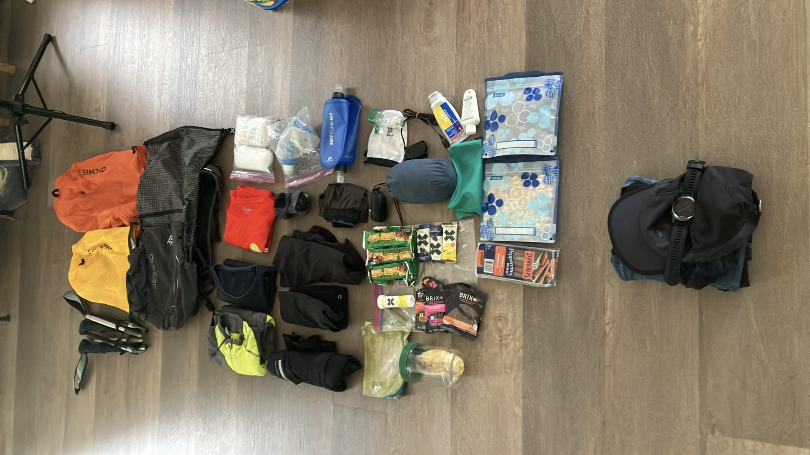

**Tentative de [FKT](https://fastestknowntime.com/route/la-grande-traversee-des-sentiers-frontaliers-sf1-chartierville-woburn) sur le sentier SF1 des [Sentiers Frontaliers](https://sentiersfrontaliers.com) le 12 juillet 2025**

## Genèse du projet

Tout part nécessairement d'un projet de M... lancé par [David Bombardier](https://davidbombardier.wordpress.com/2022/06/28/la-grande-traversee-des-sentiers-frontaliers-en-une-journee/), en 2022. L'idée trottait dans la tête de Marylin... De mon bord je suis tombé en amour avec ce bout de territoire l'an passé, à la suite de quelques expéditions familiales sur ces sentiers un peu _rough_! Avec Hugo on se sentait game pour tenter ce plan avec quelques détails pour pimenter l'affaire:

- pas plus de 24h, sinon ça tombe dans la catégorie rando 🤣
- en mode _unsupported_, car il n'y a aucune référence avec ce mode sur la page FKT de ce défi

## La route

David a balisé le défi en fournissant son fichier GPX sur la platforme [FKT](https://fastestknowntime.com/route/la-grande-traversee-des-sentiers-frontaliers-sf1-chartierville-woburn). De plus, comme la première version de l'Utra Trail du Mont Gosford avait lieu juste une semaine après notre défi, on s'est rapproché de l'association des Sentiers Frontaliers pour avoir quelques indications. Je remercie ici Gilles qui nous a fourni le GPX de l'UTMG!

Je met ci-dessous un lien _CalTopo_ avec les différentes traces que l'on a utilisé.

<iframe src="https://caltopo.com/m/0TRBK" width="100%" height="600px"></iframe>

On voit clairement qu'il y a un "gap" sur le premier kilomètre de la traversée. A la fois David et l'UTMG emprunte un sentier de 4 roues alors que SF1 serpente à travers le bois. On décide d'y aller avec SF1 et donc de suivre au plus pret le vrai sentier. C'est le seul coin "pas évident" dans nos préparatifs ; mais on est conscient que l'orientation sera un défi pendant toute la traversée!

## Le défi

### La logistique

Comme on part à 3, on a la chance d'avoir 2 autos. On décide donc d'en placer une à l'arrivée, à coté de la douane de Woburn, et on laissera l'autre au départ, à coté de la douane de Chartierville. On planifie un départ tôt, le matin vers 3h00 AM pour avoir un maximum de fraîcheur sur la traversée. Donc on décide de camper à proximité, on décide de se poser pour la nuit au camping du 10ème rang géré par les Sentiers Frontaliers. C'était une bonne idée car c'est à un gros 15 minutes en auto du départ de Chartierville. C'est l'occasion aussi de revoir nos stocks en équipe, et de chiller autour d'un copieux souper devant un petit feu bien agréable!

### Premier tiers: Chartierville au 10ème rang

J'ai divisé le sentier en 3 "tiers" et c'est également de cette manière que le sentier est divisé pour l'UTMG dans le cadre de la course à relais. Ça fait des sections presque identiques, et ça donne le moyen de se comparer en terme de vitesse entre les sections (ou bien entre les tentatives!)

Ce premier tiers était pas mal inconnu pour moi. J'ai pu randonner avec les enfants sur la montagne de Marbre / lac Danger mais c'est la fin de la section! Ca commence à Chartierville, près de la fameuse [cote magnétique](https://fr.wikipedia.org/wiki/Côte_magnétique) qui n'est rien qu'une illusion d'optique rigolote! On pose l'auto tout proche de la frontière, et on est parti pour notre défi à 2h51 précisément!!

On a un premier bout ou le sentier est pas simple à trouver. Sur les traces GPX qu'on a trouvé, on voit que David et Guillaume ont suivi un chemin forestier, comme l'UTMG fera dans une semaine. Nous on veut trouver le vrai sentier SF1 et on le le trouve! Ça nous prend mettons un 20mn pour faire le premier kilomètre qui n'est pas roulant du tout. Ensuite on rejoint une piste forestière (Brise Culotte) et on allonge un peu la foulée. On rejoint la frontière après 7 km et l'abri Brise Culotte vers 13km. On refill en eau. Ca nous a prit 3h pour ce premier bout. Marylin trouve qu'on avance trop vite pour ce long défi! Elle aura raison par la suite!

Ensuite on fait un bout soit dans le bois, soit sur la frontière, on passe le mont d'Urbain, puis Boundary Montain. Pas trop de problème d'orientation. On se repère via CalTopo sur le cellulaire quand le tracé est pas évident. On arrive bien vite au km 26, soit le 10ème rang. J'en profite pour faire un plus gros ravitaillement et un autre refill en eau. J'avais au total 1.6l de capacité (2 flasques de 500mL + le filtre BeFree de 600mL). Ça fonctionnait pas mal quand on arrive à trouver de l'eau au 7 ou 8 km car la journée a été pas mal chaude. Je consommais donc environ 1.5l par 7 km! On arrive au 10ème rang après 6h38, donc une règle de 3 nous évaluerai un temps total de course de 7 x 3 = 21 heures de course. On verra que ça va changer dans le second tiers!

### Second tiers: 10ème rang à l’accueil Gosford

Ce second tiers commence avec un peu de route sur le 10ème rang, puis on attaque assez vite une montée sèche qui nous emmène jusqu'au lac Danger. Je connais ce coin pour y avoir dormi en famille en 2024. Tout va plutôt bien pour le moment! On fait le refill d'eau à la décharge du lac. Mauvais souvenirs pour moi car je pense que c'est ici que j'ai bu de l'eau souillé en 2024, j'ai eu quelques semaines pas le fun l'été dernier! Bref avec un filtre presque neuf ça devrait mieux aller!

Ensuite la _face de singe_ pour monter la montagne de Marbre et pour finir une dernière cote sur la frontière pour rejoindre Saddle Hill. Sur cette dernière montée, je commence à avoir quelques indicateurs au rouge: mon rythme cardiaque semble bien élevé pour la vitesse à laquelle je progresse, donc je monte doucement. Hugo commence aussi à être moins bien. On se pause à l'ombre. Il annonce un maximum de 29 degrés C aujourd'hui, et on approche de 14h (environ 10h30 de course).

La suite est une belle descente pour rejoindre le trois-face des Appalaches et son point d'eau (on se pert dans un ruisseau au niveau du km 41!), puis un long morceau sur la frontière à nouveau avec un terrain pas mal hostile: fougères, roches, mouches à chevreuil... Même le head-net est pas suffisant! Hugo s'est pas bien remis du coup de chaud dans Saddle Hill et montre des signes de déshydratation. Les 10 derniers kms pour rejoindre l'accueil Gosford sont pas mal un calvaire pour lui. Monique, des Sentiers Frontaliers nous accueille à environ 1km de l’accueil avec des pommes! Quelle belle surprise! Monique était notre ange de sentier sur cette tentative, on échangait avec elle et elle pouvait nous appuyer pour des demande non-urgentes comme un lift! On fini en marchant jusqu'à l’accueil.

### Dernier tiers: l’accueil Gosford à Woburn

On arrive vers 18h à l’accueil Gosford, soit environ 15h de course. On a mis pas loin de 8h pour ce deuxième bout, c'est plus long que prévu! On sait pertinemment dans nos têtes que Hugo va arrêter ici. Moi je commence à lancer ma routine de "gros" ravitaillement: refill des bouteilles d'eau (pratique il y a un robinet à l'accueil!), je commence à manger ma semoule qui a bien réhydratée avec un bon filet d'huile d'olive (miam!).

Ensuite arrive le moment où on hésite à repartir à deux, Marylin et moi. Finalement on décide de stopper tous ici, car dans tous les cas notre tentative _unsupported_ est invalide si l'un de nous abandonne avant la fin, et c'est une aventure qu'on a commencé à 3, on aimerait ça finir à 3! On profite de la générosité de Monique pour faire un lift jusqu'à l'auto positionné coté Woburn.

## Pour finir

C'est un échec mais on a tellement appris sur ces premiers 54 km! Et puis la crème glacée était aussi bonne que si c'était un succès! Le sentier sera encore là pour notre prochain essai! On a le goût d'y revenir pour retenter, avec un peu moins de chaleur et un peu moins de végétation! Je pense que fin mai est idéal pour éviter les fougères et les grosses chaleurs. Ou sinon septembre!

## Le matériel

On avait décidé d'embarquer avec le mode `unsupported` décrit sur le site [FKT](https://fastestknowntime.com/guidelines). Donc ça veut dire:

- On embarque toute la bouffe nécessaire sur nous dès le départ. On peut ravitailler en eau sur le chemin dans les sources
- On ne peut pas avoir d'aide extérieure (genre pacer par exemple)
- Si un membre quitte alors le défi bascule en `supported` (car c'est comme si on avait eu un pacer pour un bout du défi)

Pour cela j'avais embarqué un sac de type _fastpack_, le AONIJIE 30L. Guillaume avait fait une belle présentation de ce sac sur [sa chaîne Youtube](https://www.youtube.com/watch?v=f7YxdGkSBqM)! Dedans j'ai embarqué le stock suivant:

- Nutrition:
  - 6 barres tendres classiques (genre Val Nature)
  - 4 barres Cliff
  - 3 pates de fruits Xact
  - quelques gels / gaufres Brix
  - des pepperoni!
  - des electrolytes
  - un wrap au jambon a manger au premier tiers
  - un cold soak de semoule/légumes pour le second tiers
  - des grignotines
- Linge:
  - un collant 3/4 pour le bas pour la nuit
  - un chandail manche longue pour le haut
  - un chandail manche court en extra
  - un polar fin pour le matin et la nuit
  - une veste imperméable
  - bas et sous vêtements de spare
- Frontale et batterie en plus
- Filtre Katadyn BeFree
- Batons
- Trousse de premiers soins
- Heat Net
- Battery Pack pour recharger la montre au cours du défi

## Références

- Page [FKT du SF1](https://fastestknowntime.com/route/la-grande-traversee-des-sentiers-frontaliers-sf1-chartierville-woburn)
- Tentative de Guillaume en 2024 sur [Youtube](https://www.youtube.com/watch?v=sKci0n_7xu8)
- Ma trace [Strava](https://www.strava.com/activities/15094174970/overview)
