C'est la longue fin de semaine de la fête du travail au Québec! On avait noté dans le planning familial: "sortie randonnée aux états-unis". En effet depuis qu'on a des passeports canadiens depuis 2024, on a pas encore fait de sortie chez les voisins du sud. Malgré le climat politique un peu plus tendu ces derniers temps, ça reste un beau terrain de jeu quand on aime la montagne et les sorties en nature, et on reste pas très loin de la frontière. On avait ciblé plusieurs coin:

- [Pharaoh Lake](https://dec.ny.gov/places/pharaoh-lake-wilderness) dans les Adirondacks: un coin conseillé pour les familles, avec des campsite, et des lacs, avec assez peu de dénivelé mais ça reste un 4h d'auto depuis Sherbrooke!
- une boucle autour du Mont Cabot dans le New Hampshire ([exemple sur AllTrails](https://www.alltrails.com/trail/us/new-hampshire/mt-cabot-loop-bulge-horn)), semble aussi pas mal intéressant, à juste 2h d'auto!
- une boucle vers la [Grafton Loop](https://www.alltrails.com/trail/us/maine/grafton-loop-trail--2) dans le Maine, plus dur en dénivelé et pas évident à découper pour faire seulement 3 jours! C'est pareil à 2h de route de chez nous.

Mais c'est aussi la semaine de la rentrée, notre fille entame sa première année au secondaire avec les trajets de bus qui viennent avec et donc la fatigue est déjà pas mal présente vendredi quand il est tant de figer notre itinéraire. On se dit que finalement une petite boucle dans un terrain connu sera sans doute plus reposante pour tout le monde et éviter de finir lundi sur les rotules! On profite de l'occasion pour retourner dans les [Sentiers Frontaliers](https://sentiersfrontaliers.com) (étrange 😅) et tester le programme ["Adopte un tronçon"](https://sentiersfrontaliers.com/adopte-un-troncon/).

## Adopte un tronçon?

Qu'est-ce que c'est que ce projet? L'entretien des Sentiers Frontaliers est un enjeu. C'est un territoire sauvage, assez isolé, avec plus de 150 km de sentiers. Ça prend des bénévoles pour entretenir l'ensemble! En plus des corvées régulières organisés au cours de l'année par un comité spécifique, le programme ["Adopte un tronçon"](https://sentiersfrontaliers.com/adopte-un-troncon/) propose à un groupe de bénévole d'_adopter_ un petit tronçon. A charge des bénévoles d'être les yeux et les mains sur ce tronçon pour faire que l'expérience de randonnée soit agréable et sécuritaire: faire de l'entretien léger c'est à dire dégagement des branches qui sont sur le sentier, signalement des chablis, vérification de la signalisation... Il faut s'engager à passer deux fois par an sur le sentier pour l'entretenir.

En famille nous avions identifié le tronçon **SF1-04**, car il est relativement proche d'un accès routier, et la fin du tronçon correspond à l'emplacement de l'abri "Brise-Culotte", c'est parfait pour notre classique programme _24h dans l'bois_!

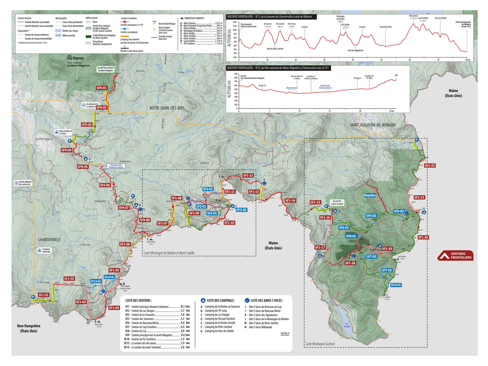
_Carte des tronçons à adopter, mise à jour en 2024_

Bref, engagez-vous qu'il disaient!

## Notre programme

On prévoit donc de stationner sur le nouveau stationnement le long du rang Brise Culotte, à Chartierville, puis prendre SF1 où on va retrouver notre tronçon au niveau de la frontière. On dort à l'abri Brise Culotte le soir à la fin de notre tronçon, et on planifie de continuer SF1 jusqu'au croisement avec SF14 (nouveau sentier inauguré en 2024!) pour revenir à l'auto via SF13 ensuite. Ça représente environ 8km par jour avec un dénivelé très modeste de quelque 350m par jour.

## Samedi 30 août: SF1 jusqu'à l'abri Brise Culotte (9km, 450m de D+)

[Lien Strava](https://www.strava.com/activities/15658793833)

Après avoir validé notre itinéraire, on décide de partir de chez nous vers 11h, le temps de préparer notre bouffe pour 24h et nos sacs à dos. On amène en plus un coupe-branche, une sciotte à archet, et une petit sciotte classique, plus quelques gants de jardinage pour se protéger. On se fait prendre par l'orage sur la route, on se fait une pause à La Patrie pour acheter de quoi diner en attendant la fin de l'orage. Bilan on aura des s'mores en plus pour ce soir!

On trouve assez facilement le nouveau stationnement SF le long du rang Brise Culotte, sur la commune de Chartierville. Il est tout neuf, il manque encore les panneau d'information et la toilette, mais c'est plus confortable que le long du rang. On dîne dans l'auto et on quitte à 13h. On a une bonne section de montée pour rejoindre la frontière qui ne fait pas partie de notre "tronçon" adopté, donc on sort pas encore les outils. La prochaine fois qu'on passera ici je pense qu'on sortira les outils directement! On arrive sur la frontière après un 2h de marche.

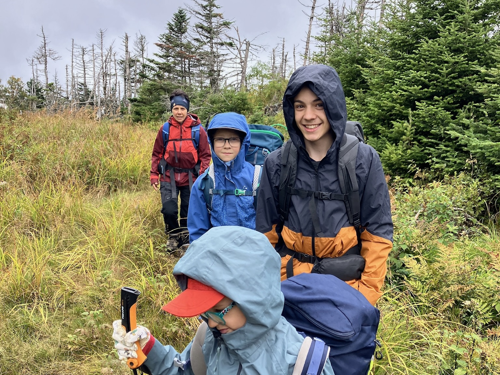
_Vers Mont Salmon_

On sort nos outils, et on commence notre job! Eliott prend le coupe-branche qui est franchement efficace sur les branches sauf quand le bois est bien sec, Marcus est en charge d'une petite sciotte comme moi, et les filles s'occupent de dégager les branches coupés. C'est un équipe bien rodée! On se trouve confronté par deux fois à des arbres qui bloquent le sentier, et qu'on est incapable de couper avec nos petites sciottes. On fait du mieux qu'on peut et on enregistre la position afin de fournir l'information à un autre groupe de bénévole qui passera avec une scie à chaîne.

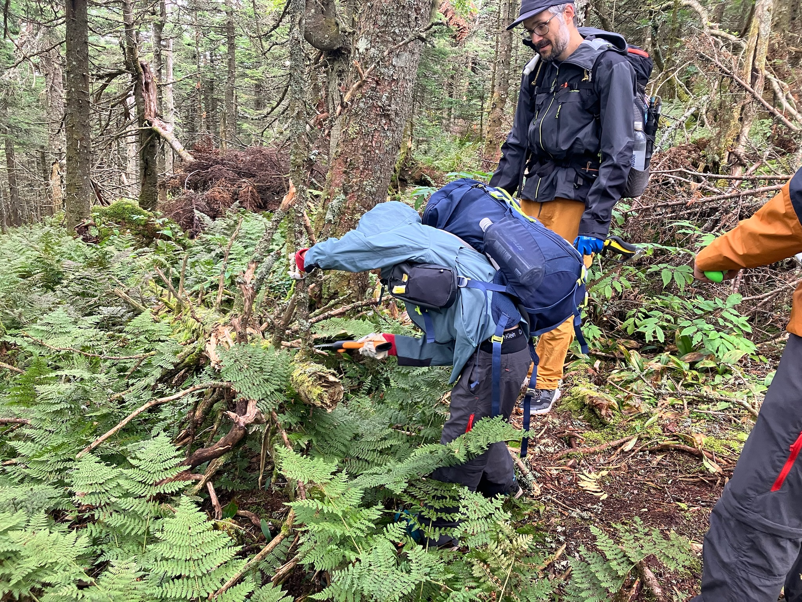
_Marcus en plein effort!_

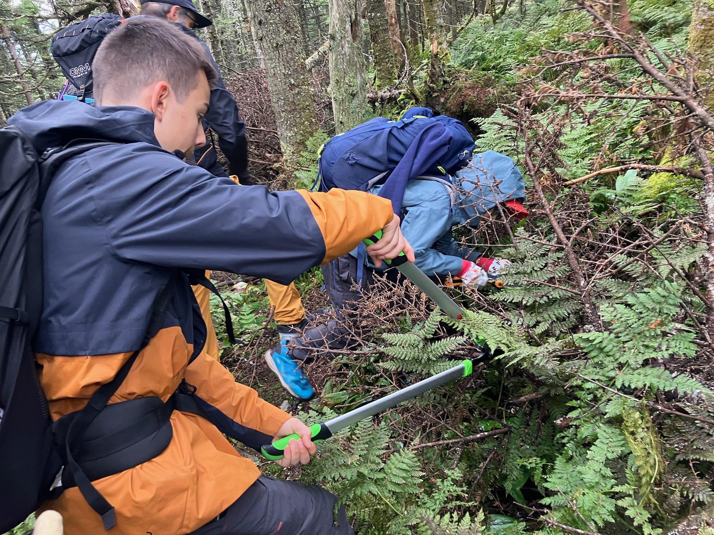
_Eliott gère le coupe-branche_

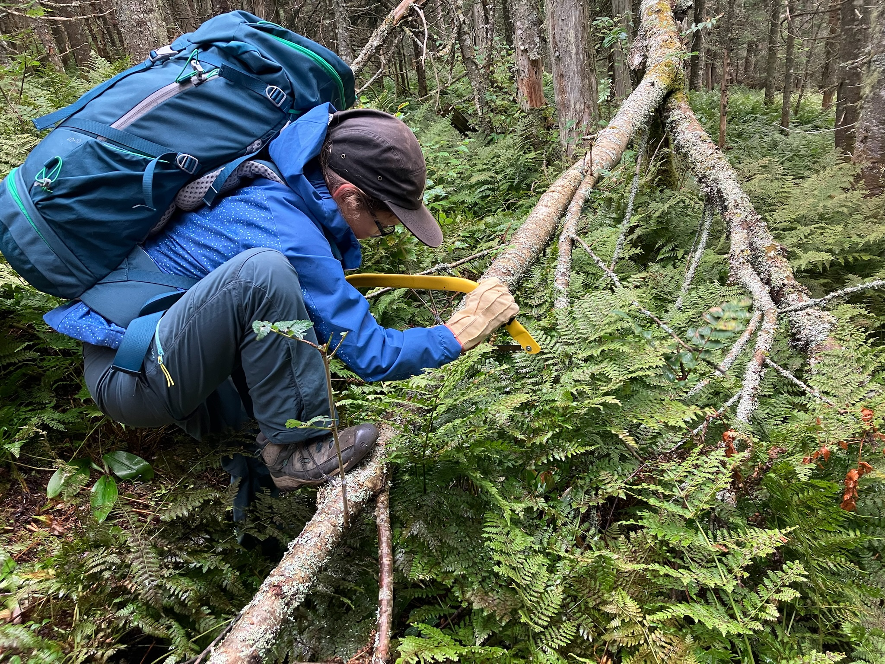
_Sidonie et la sciotte!_

| Avant                | et après!            |
| -------------------- | -------------------- |
| 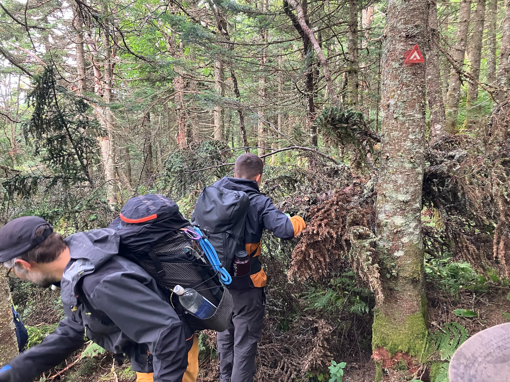 | 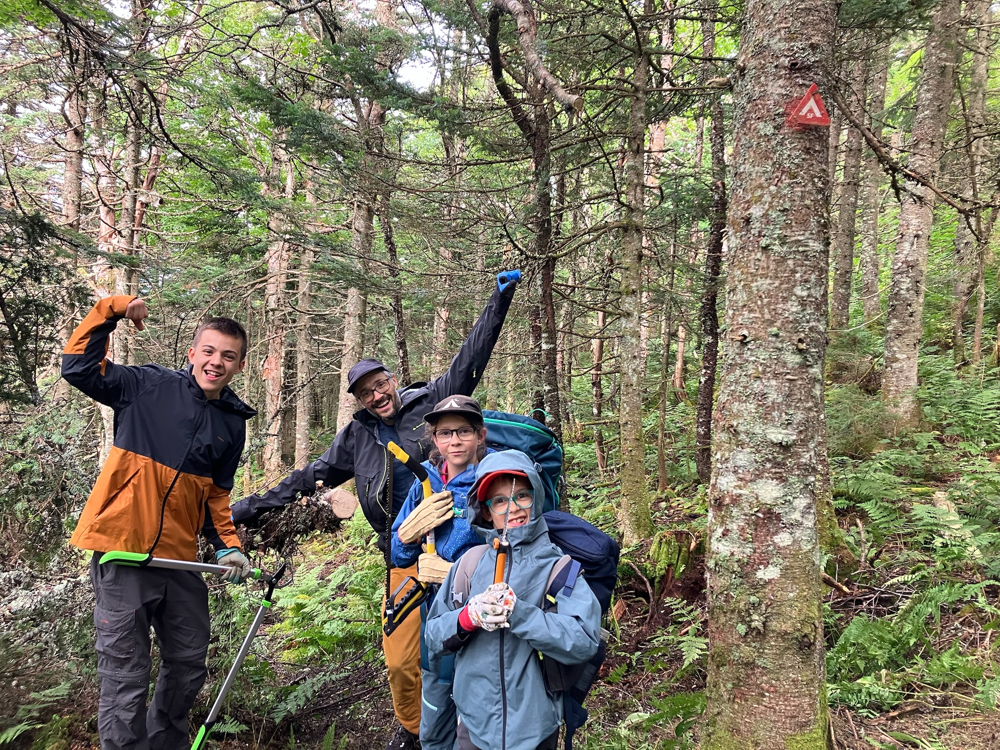 |

La journée avance vite quand on a du job en masse sur le sentier, mais c'est vraiment le fun! Tout le monde met la main à l'ouvrage et oublie le temps passé. Je trouve que ça donne une dimension supplémentaire à la sortie, on donne un coup de main mais surtout on prend du plaisir à entretenir! On rejoint l'abri Brise Culotte vers 18h. On avait transporté les tentes au cas où l'abri serait déjà plein mais il n'y a personne. L'enjeu principal est l'eau, le ruisseau à côté de l'abri est très sec, on trouvera finalement un mince filet d'eau qui nous permet de remplir notre filtre. On va souper un bon [couscous du randonneur](https://sidoine.org/recipes/couscous-du-randonneur/), agrémenté de soupe et noodles. On profite du temps humide pour faire un petit feu et griller quelques guimauves pour faire des s'mores! Le jour tombe vite et la fatigue arrive, on rentre dans nos sleeping avant 21h.

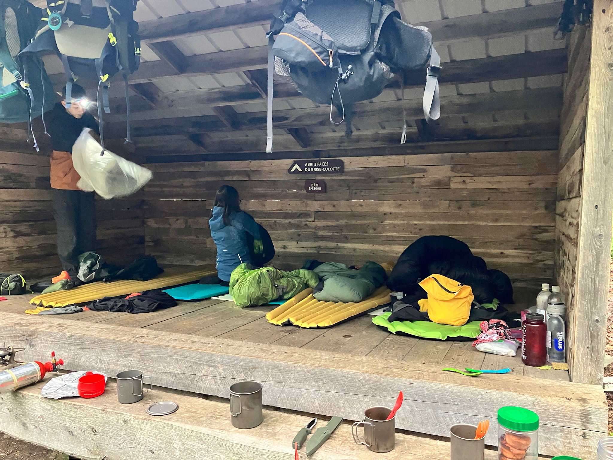

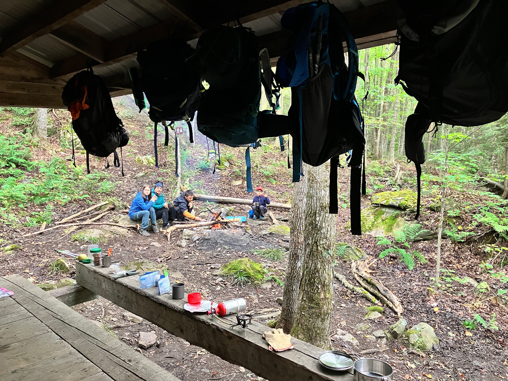

## Dimanche 31 août: SF1 puis SF14 puis SF13 jusqu'au stationnement sur le rang Brise Culotte (7.5km, 400m de D+)

[Lien Strava](https://www.strava.com/activities/15658798758)

Belle nuit, pas trop froid (9 degré C au plus froid). Pas d'ours pendant la nuit! On prépare tranquillement notre déjeuner, le trajet de retour est pas très long, on est pas pressé de rentrer, on peut profiter du décor! On quitte le 3 faces vers 9h en continuant SF1 jusqu'à retrouver la frontière.

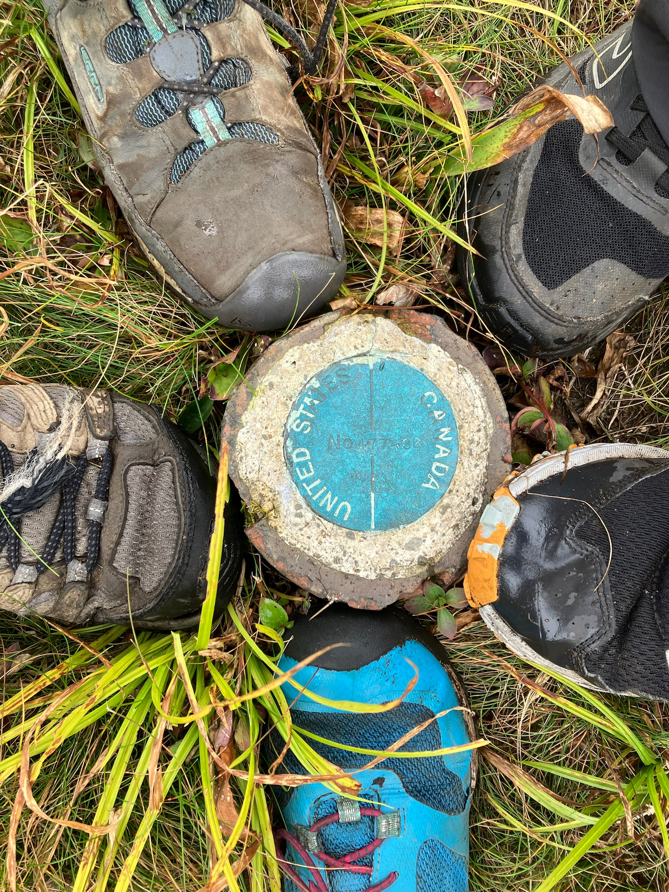

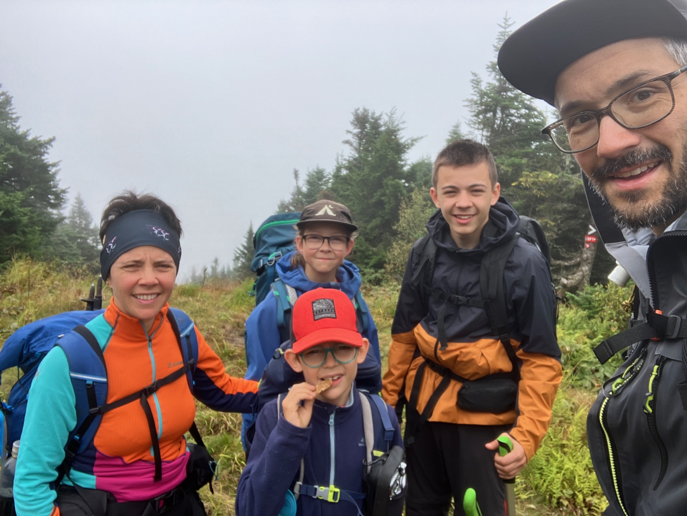
_La gang au complet!_

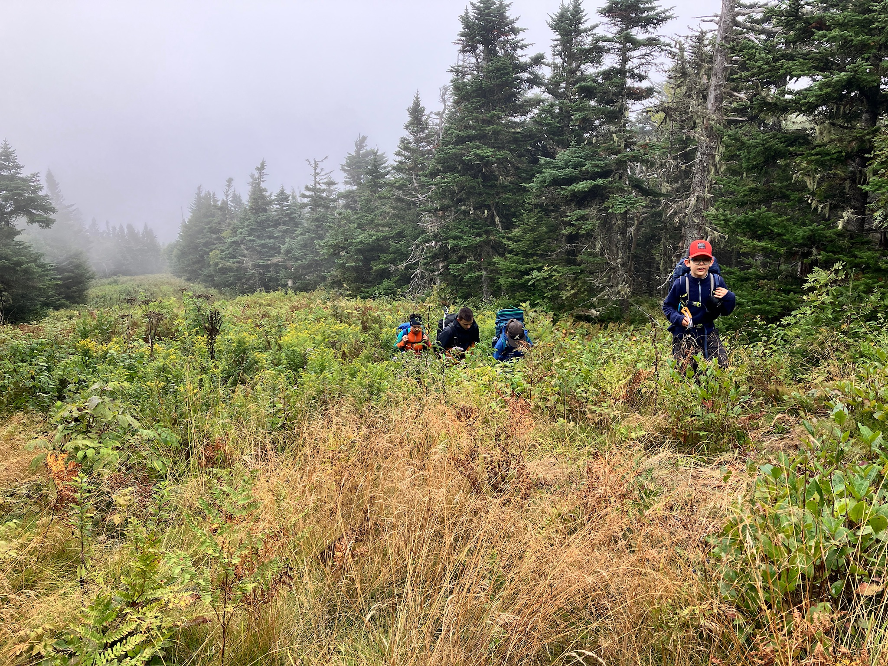

On garde nos équipements à porté de main pour nettoyer, mais c'est plus propre que la section précédente. On bifurque au niveau de l'intersection avec SF14 pour reprendre la direction du stationnement. On trouve un bel arbre à déplacer au milieu de SF14, on est très heureux d'avoir un peu de job! Pauser diner "pizza trail" à la jonction SF13/SF14 (qui permet de remonter à l'abri 3 faces où on a dormi). Ensuite on continue SF13 pour rejoindre le stationnement, en passant au dessus d'un curieux pont de fer. Je me demande pourquoi ce pont a été construit ici (c'est clairement pas pour faire passer le sentier, c'est ancien!). On retrouve notre auto vers 13h30!

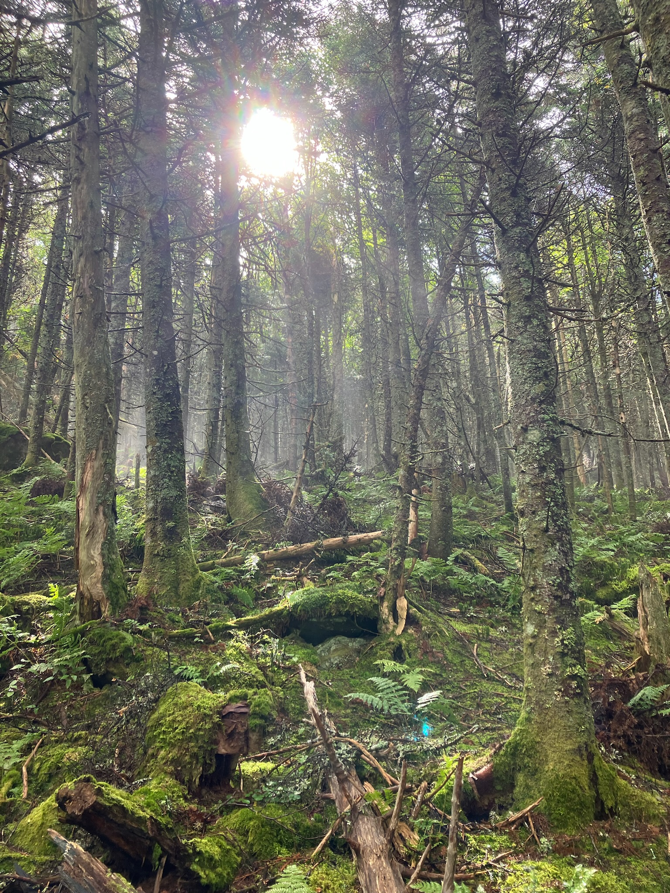

Clairement on a aimé ça. Maintenant l'objectif sera de revenir entretenir ce bout de sentier 2 fois par an, au printemps et en fin d'été. On se donne RDV en mai prochain!
