## Le projet

On a pu valider l'itinérance sur plusieurs jours l'an passé, lors de notre expérience de 3 jours dans le parc des Appalaches. On a avait alors pu gérer 3 jours de bouffe avec les 3 enfants, en tente et avec des étapes qui font jusqu'à 10 km. Cette année on souhaite pouvoir enchaîner 4 jours. Les cousins vont être de passage au Québec, donc on en profite pour leur proposer ce projet! On finit par cibler une demie traversée de Charlevoix car cela permet de s'appuyer sur des refuges (pas de portage de tente) et l'organisation de la traversée facilite le transport de véhicule du départ à l'arrivée. Nos autres options fonctionnaient moins bien:

- faire un bout du [sentier national en Mauricie](https://medias.baliseqc.ca/upload/pap/PaP_SNQ_AventureCoeurMauricie_4j3n.pdf) était tentant mais c'était compliqué et dispendieux d'avoir un transport en taxi pour rejoindre le départ à l'arrivée.
- [le sentier du Philosore](https://valleebrasdunord.com/forfaits/forfait-traverse-philosore/) dans la vallée Bras-du-Nord nous tentait bien mais les refuges peuvent héberger au maximum 8 personnes, on avait un groupe de 10! (4 adultes et 6 enfants)

En plus le territoire de Charlevoix est pas mal apprécié par notre famille (les parcs SEPAQ et la bouffe!) ; et j'ai déjà couru l'autre demi traversée dans le cadre de l'UTHC 80k en 2021.

## Le trajet

Le site de la [Traversée de Charlevoix](https://www.traverseedecharlevoix.qc.ca) est une mine d'information. De plus le trajet pour la demi traversée est très bien indiqué. Les bornes kilométriques sur le parcours indiquent le nombre de km restant jusqu'au prochain refuge, à tous les 500m. Il est virtuellement impossible de se perdre! Il y a des raccourcis disponible si on souhaite raccourcir une étape, au prix de manquer certains points de vue. Le sentier est également très bien tracé et entretenu. C'est une valeur sûre pour partir avec les enfants!

<iframe src="https://caltopo.com/m/FVU57N9" width="100%" height="600px"></iframe>

Avant de partir j'avais tracé sur mon outil de cartographie favori (CalTopo!) les différentes étapes avec les raccourcis possibles. Cela permettait de nous donner plusieurs options en fonction de la forme des enfants. Les détails du tracé est expliqué sur cette [page](https://www.traverseedecharlevoix.qc.ca/randonnees/la-demi-traversee/) avec les options de raccourcis.

Je planifiais donc les étapes suivantes:

- Jour 1, 4 km
- Jour 2, 15 km
- Jour 3, 12 km (on skippe la Noyée)
- Jour 4, 10 km (on skippe Bihoreau)

## La préparation

Comme on part sur une randonnée en refuge, le principal sujet pour la préparation est coté culinaire! Pour 4 jours on ne voulait pas s'appuyer sur les dépôts de nourriture (assez dispendieux!), mais on voulait être capable d'emmener toute notre bouffe pour 4 jours x 10 personnes. Ça fait un beau stock! On a combiné quelques recettes déshydratées (cf la section [ici](/recipes)!), des féculents, une recette "fraîche" (du livre [Food Rando](https://www.glenat.com/glenat-livres/food-rando-9782344066355/)!) pour le premier soir:

| Jour            | Déjeuner                        | Diner                                                                       | Souper                                                                    |
| --------------- | ------------------------------- | --------------------------------------------------------------------------- | ------------------------------------------------------------------------- |
| Mardi 5 août    | N/A                             | N/A                                                                         | Mafé à la semoule (Food Rando, p. 84)                                     |
| Mercredi 6 août | Gruau et Granola                | Pizza trail                                                                 | [Riz aux légumes](/recipes/riz-aux-legumes/) avec saucisses végétariennes |
| Jeudi 7 août    | Gruau et Granola + Pancakes!    | [Salade de pates](https://www.freshoffthegrid.com/cold-soaked-pasta-salad/) | [Dahl de lentilles corail](/recipes/dahl-lentilles-corail/)               |
| Vendredi 8 août | Gruau et Granola + Pain maison! | [Couscous aux légumes](/recipes/couscous-aux-legumes/)                      | N/A                                                                       |

Une fois le menu construit, on doit sécher, mesurer et répartir dans les sacs type ziplocs pour faciliter la cuisine à chaque repas. Pour 10 personnes ça donne une certaine logistique! Par exemple pour les 3 matins, on est parti avec 18 portions de granola, environ 16 portions de gruau, 12 portions de céréales "Crave", plus de quoi faire des pancake et du pain. Notre table était pleine du stock de bouffe qu'on a emmené!

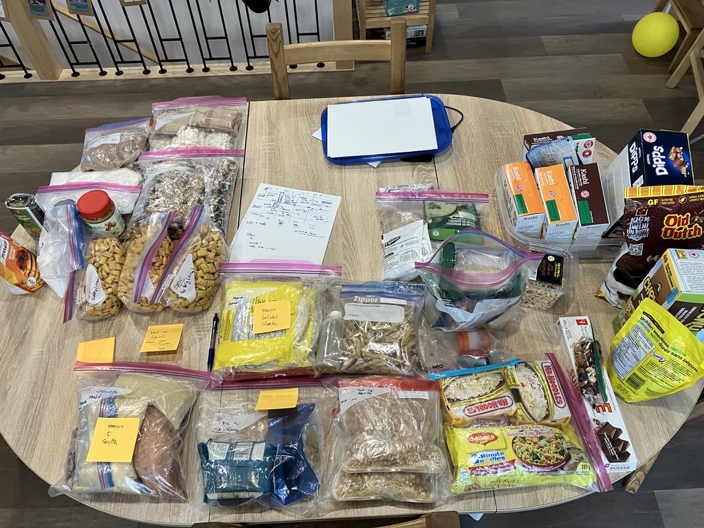

On prend aussi un repas en extra (des mister noodle pour 10!) au cas où comme conseillé par le bureau de la Traversée.

En plus des repas, on prévois des collations à manger au cours de la journée. Environ 10 barres tendres par personne, que chacun stocke dans son sac même les enfants, et un sac de grignotine (noix et jujubes, on est passé quelques jours avant à Bulk Barn pour un gros ravitaillement!)

## Le récit

### 5 août: ZEC des Martres au refuge l’Écureuil

[Lien Strava](https://www.strava.com/activities/15392542142)

On décolle de Sherbrooke le matin du 5 août, on a un bon 4h30 de route pour rejoindre le bureau de la Traversée! Je suis souvent passé devant les bureaux en direction du parc des Grands Jardins, et j'ai toujours eu le goût de m'y arrêter. Cette fois c'est la bonne, c'est excitant!!

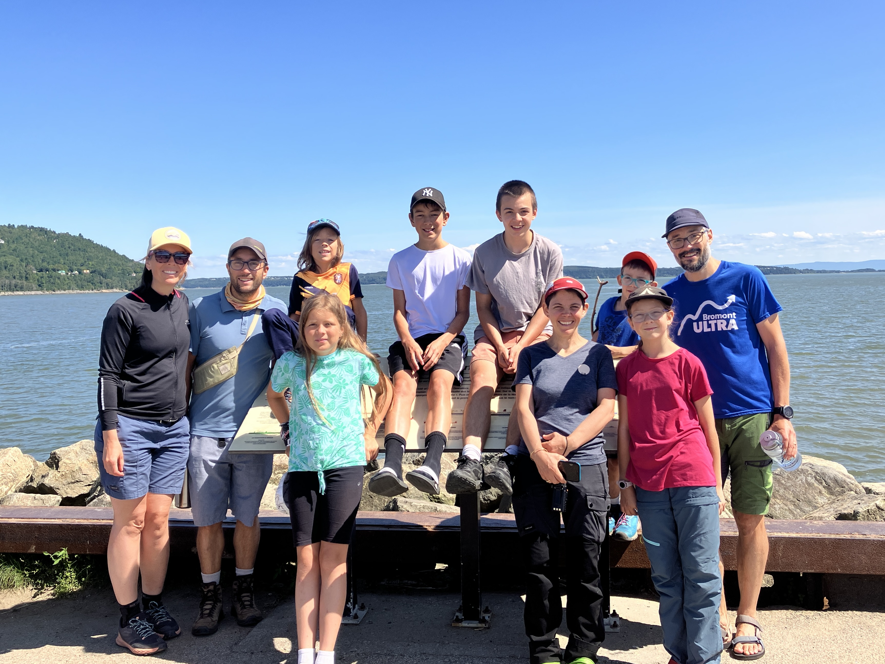

On fait une pause lunch au niveau de Baie Saint Paul après 4h de route. On essaie de passer voir nos amis Sandrine et Alex, la locataire nous informent qu'il ont déménagés en France courant 2024, oups on a pas pris de nouvelles.... Après le passage au bureau très chaleureux et qui nous donne toutes informations pour notre demie-traversée, on arrive dans la ZEC des Martres vers 16h30 pour démarrer notre périple. Le sentier est un chemin forestier pas très intéressant qui permet de rejoindre le premier refuge, mais qui à l'avantage de nous laisser un moment de répit pour régler nos sacs à dos bien chargé par les 4 jours de nourriture. On a chargé majoritairement les adultes, les enfants plus âgés nous aident un peu sur certaines parties du menu. Chaque adulte porte environ 3 à 4 kg de nourriture quand même!

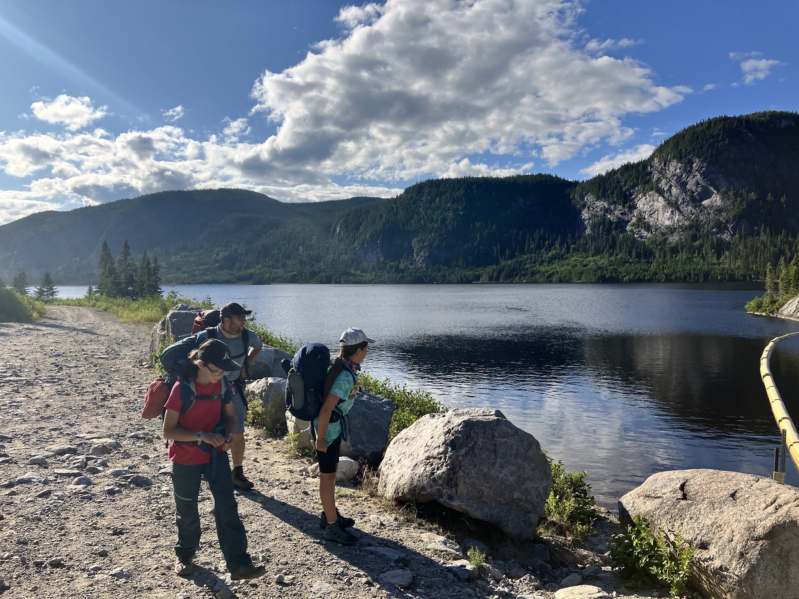

On arrive vers 18h à notre premier refuge. Cela deviendra un rituel pour les prochains jours, rejoindre le prochain refuge! On prépare rapidement le premier souper, un "mafé" avec de la semoule, des patates douces, des carottes et du beurre d'arachide! Délicieux!! C'est une recette tiré du livre [Food Rando](https://www.glenat.com/glenat-livres/food-rando-9782344066355/) que mon frère m'a offert pour ma fête! On a tout mangé, on avait 700g de semoule pour 10, 2 patates douces et 5 carottes.

On prend aussi une petite soupe Lipton (on avait poulet nouille et tomate comme saveurs pour ces 4 jours!) pour améliorer l'hydratation. Un classique quand on part marcher plusieurs jours. On part au dodo assez tôt. La journée de demain sera longue! Les refuges sont bien chaud en cette saison, je dors quasi toute la nuit juste en liner. Le sac de couchage est agréable vers 6h quand la journée se lève!

### 6 août: refuge l’Écureuil au refuge La Marmotte

[Lien Strava](https://www.strava.com/activities/15392547930)

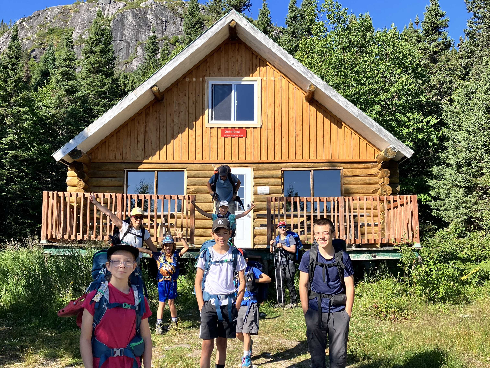

On se lève vers 7h, on arrive à décoller du refuge vers 8h40. On est content car c'est pas simple à 10! Finalement on était tout seul dans le refuge prévu pour 12 personnes. Ce second jour est le "vrai" départ de la traversée avec des paysages sublimes. On contourne le mont Eudore Fortin pour commencer, avant de longer le mont des Lièvres, le mont des Morios... On est jamais très haut mais on a souvent de quoi voir les paysages sublimes de l'arrière pays de Charlevoix. Le sentier est globalement descendant car on descend dans l'astroblème de Charlevoix. L'entretien est A1 quand on compare à d'autres sentiers de la province!!

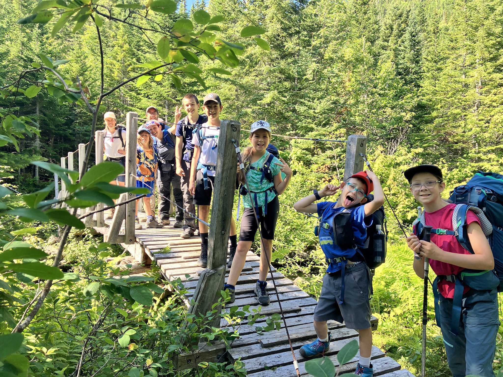

On fait une pause vers 12h30, pour un diner "pizza trail" apprécié par tous il me semble. Une bonne utilisation des tortilla validé!

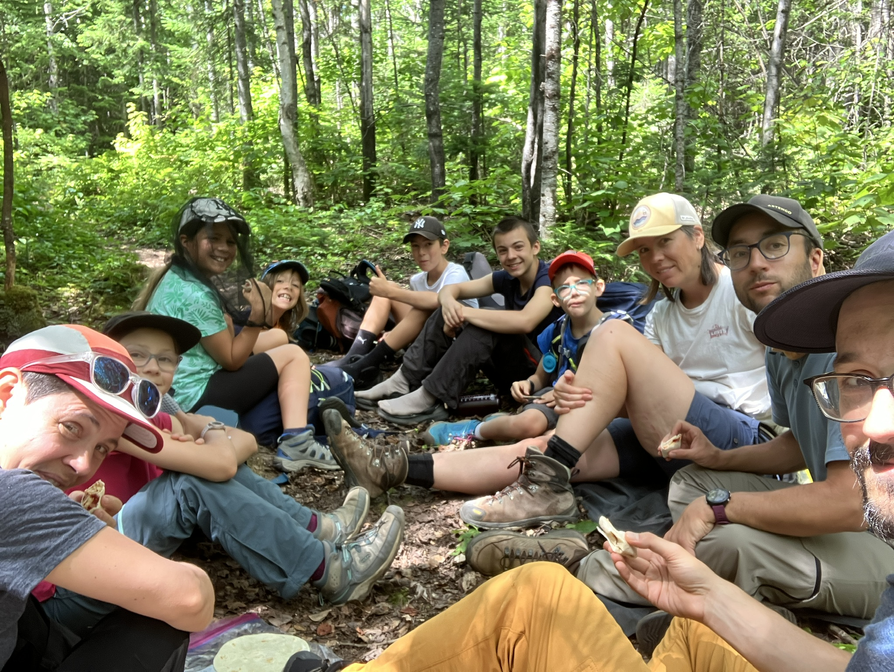

On a déjà fait un bon 8 km, il reste 7km pour l'après midi. La fatigue commence à se faire sentir. Les enfants sont bien fatigués. Marcus, 9 ans est livide sur la fin de la journée. Il était trop fatigué pour protester! C'était pas mal la limite en terme de distance qu'on peut faire avec nos enfants il me semble pour le moment. On prend le chemin normal et pas le sentier alternatif le long des Morios. On arrive finalement pas si tard à 16h30 au refuge de la Marmotte. On prend le temps de se saucer dans le ruisseau en bas du refuge c'est ben agréable!!

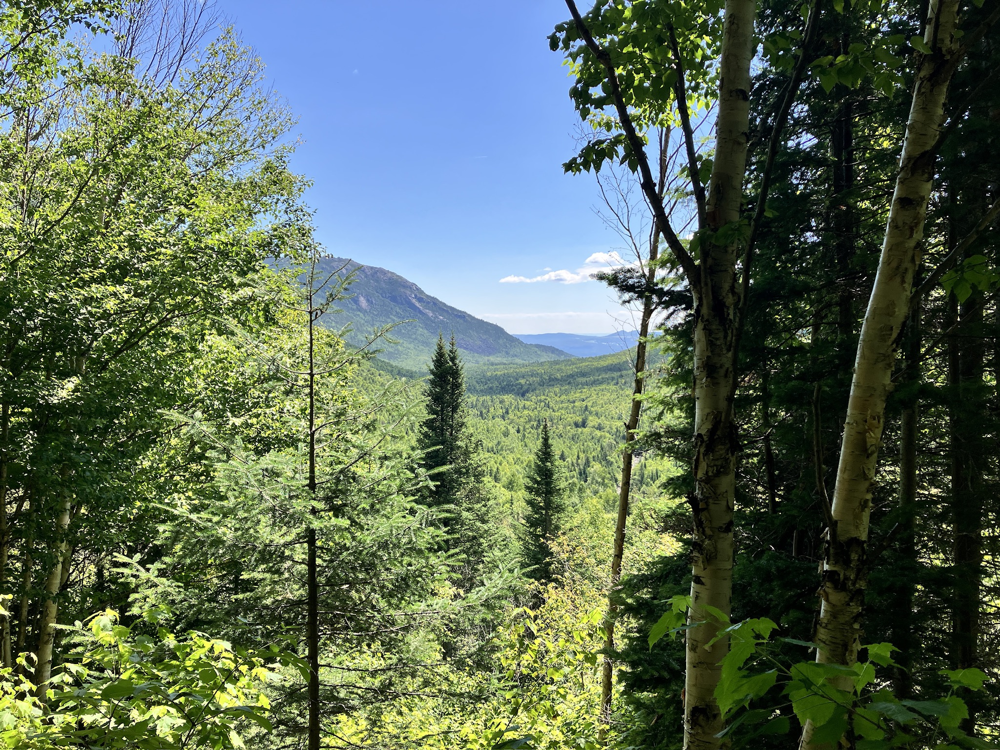
_Les Morios!_

Au menu du souper ce soir: riz aux légumes avec des saucisses végétariennes. Bon dosage (650g de riz pour 10). Un repas simple et efficace après cette belle étape de 15 km qui nous a pris presque 7h. On prend le temps le soir de boire un thé et de commencer à remplir nos carnets d'expédition, une coutume en randonnée! J'ai encore les notes prises lors de nos randonnées dans le Queyras et le TMB entre 2008 et 2010!

On se couche assez tard pour voir quelques étoiles avec Guillaume. On se sent au bout du monde dans ce refuge à 21h30! Quand on part au dodo, il fait encore chaud à l'étage supérieur, le liner est bien agréable.

### 7 août: refuge la Marmotte au refuge La Chouette

[Lien Strava](https://www.strava.com/activities/15392551480)

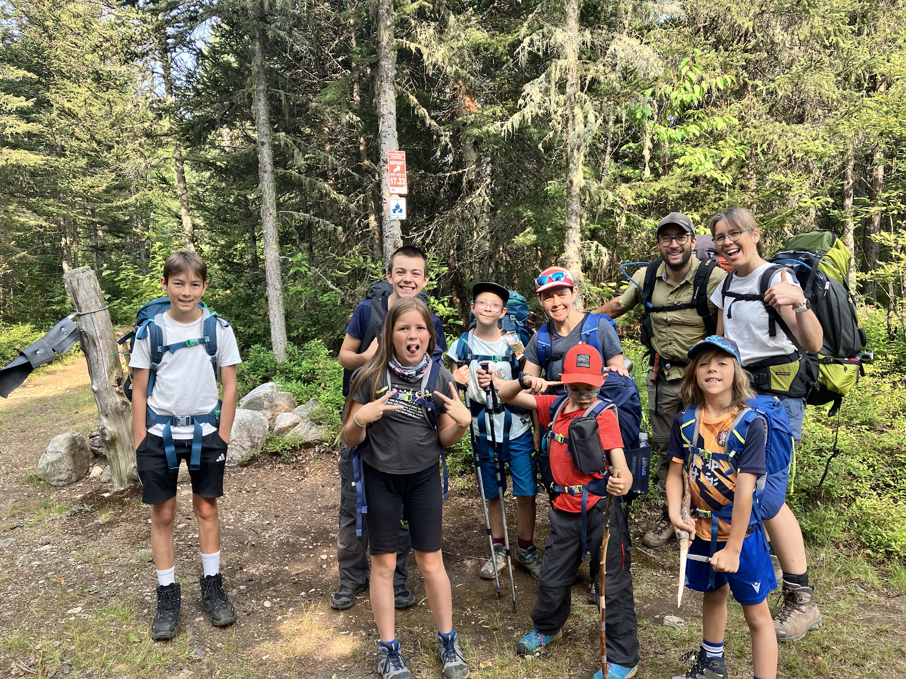

On se lève vers 7h encore ce matin. Ce matin on prend le temps de faire des pancakes, car on planifie de prendre le raccourci et d'éviter le sommet de la Noyée pour raccourcir un peu l'étape. C'est un peu un sacrifice pour les adultes, mais l'idée de randonner avec les enfants c'est de privilégier leur bien-être et de leur donner le gout d’être en nature sur le long terme, pas de les traîner sans qu'il y prennent du plaisir. Les organismes sont encore marqués de la belle étape de la veille!

Quand on ouvre les boites ou on avait stocké la nourriture pour la nuit, on a la désagréable surprise de voir que notre gruau a eu du succès auprès des petits locataire permanents du refuge, à savoir probablement des souris 🐭... Sans doute la boite était mal verrouillée? En tout cas on fera attention pour la suite et on mettra du poids sur les boites pour éviter des visites nocturnes! On avait du rab en déjeuner, mais plus maintenant 😅

On décolle vers 9h10, on y va mollo! Le chemin est un peu trop "route de gravel" sur les premiers kilomètres mais on s'engage vers le massif de la Noyée sur un beau sentier ensuite. Episode frayeur quand j'allume mon cellulaire pour voir si tout est OK dans le monde connecté (c'est le fun d'être débranché pendant la majeure partie!) ; et j'ai un message de la Traversée qui m'indiquent qu'il n'arrivent pas à ouvrir l'auto pour effectuer le transfert entre le départ et l'arrivée. Finalement c'était une fausse alerte suite à des instructions incomplètes, ils ont pu procéder au transfert sans mon intervention. Tout s'est bien fini!

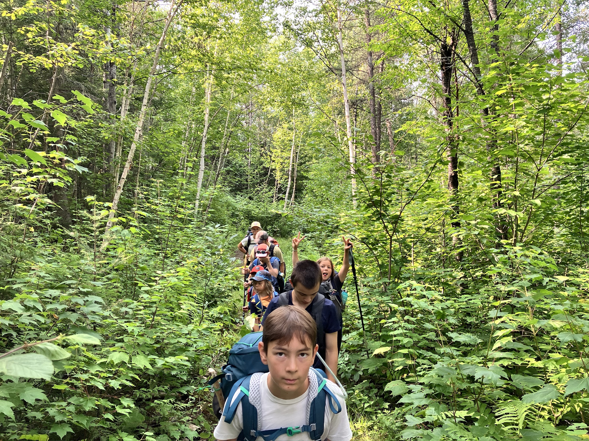

On prend une pause lunch vers 12h30: salade de pates qu'on a "cold soak" depuis ce matin dans des pots de beurre de peanuts. C'était parfait avec un filet d'huile d'olive! J'avoue qu'un des grands plaisirs que j'ai à marcher c'est de prévoir et consommer des plats en pleine nature. Ça ajoute du fun au fun de bien manger quand on marche bien! On repart pour les derniers kilomètres, la journée est bien plus courte qu'hier! On reviendra pour refaire la traversée sans _shortcurts_, j'ai le goût de profiter des beaux points de vue!

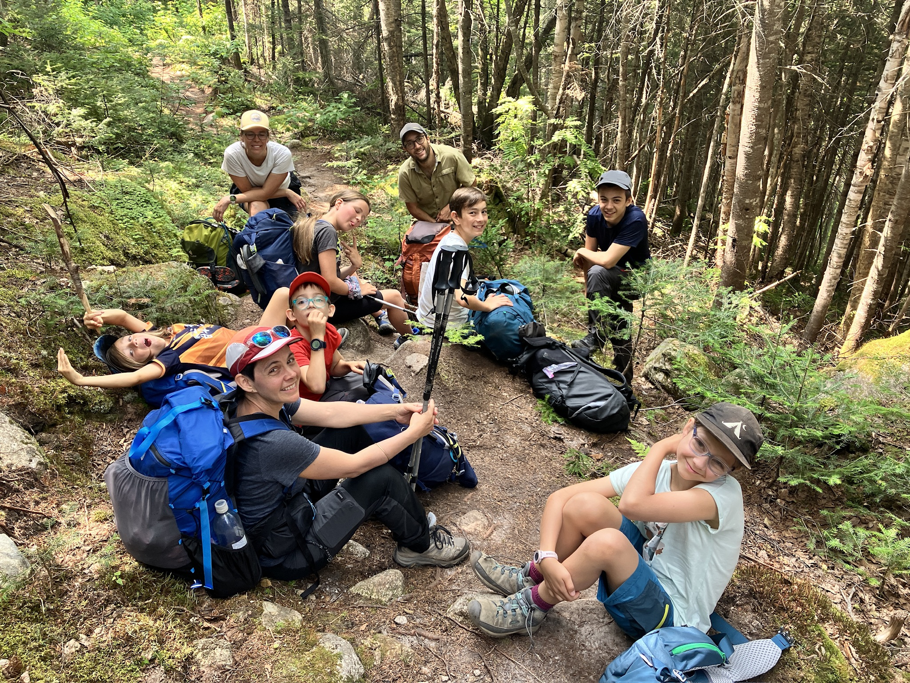

On arrive vers 15h40 au refuge "La Chouette". On en profite pour se baigner un peu dans le lac en bas du refuge, qui est moins accueillant que le ruisseau de la veille. On voit des traces de barrages de castors sr la route d'accès au refuge, il faudra faire attention avec l'eau puisée dans le coin! Mon filtre BeFree commence à donner des signes de débit faible, c'est pas très rassurant.

Au refuge les enfants s'occupent avec des parties de trous du cul, les adultes préparent un bon souper: dahl de lentilles corail avec un peu de riz et soupes pour s'hydrater! On a le temps de se faire un classique "gang of four" avec Marion, Guillaume et Audrey!

### 8 août: refuge la Chouette au parc des Hautes Gorges de la rivière Malbaie

[Lien Strava](https://www.strava.com/activities/15392558626)

On se lève vers 7h, c'est le dernier jour! Excité mais aussi un peu triste de revenir à la vie normale... Pas de souris qui mangent nos réserves dans la nuit, mais pleins de bruits dans les murs, on est définitivement pas seul dans le refuge! Ça m'a bien réveillé et du coup le reste de la gang s'est plaint car j'ai pas mal allumé ma frontale et fait du bruit pour tenter de faire fuir les bruyants colocataires, sans succès 😇.

Ce matin je fais du pain à la poêle, pour changer un peu! On a du beurre du peanut pour aller avec le pain tout chaud 😋. Encore un matin ou on est "chill" car on va reprendre le raccourci pour éviter Bihoreau et garder une étape d'environ 10 km.

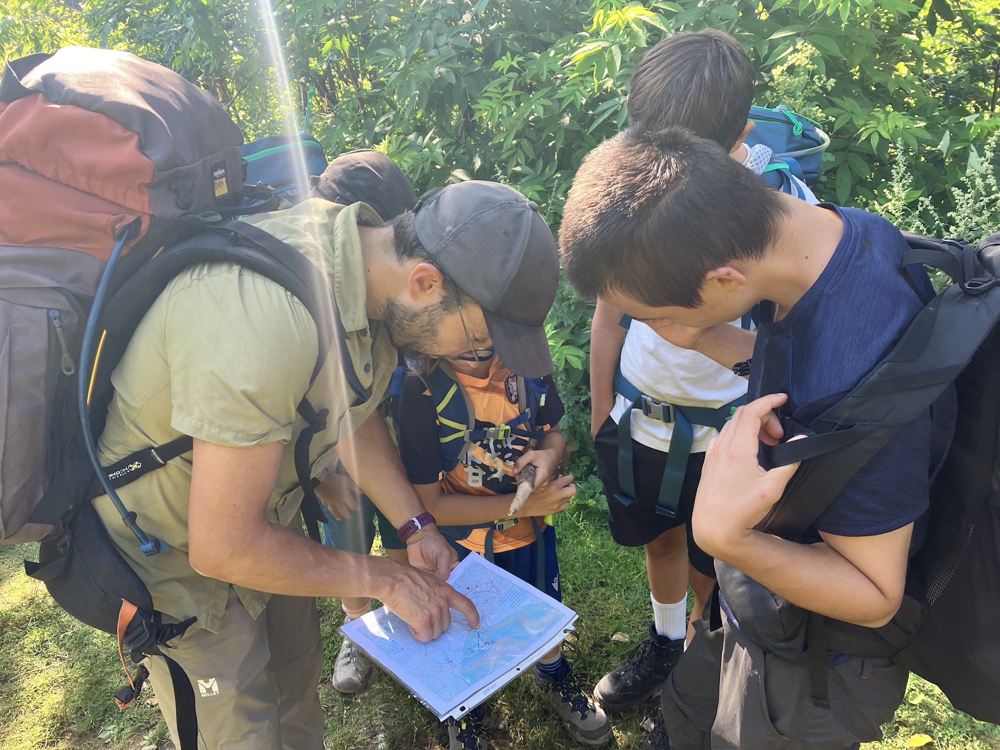
_Orientation avec Guillaume!_

On arrive à décoller vers 9h10, pas pire! Il faut chaud ce matin, on va lentement. On prend le temps de cette dernière étape, c'est juste du bonbon!! On trouve un ruisseau sur le sentier pour se ravitailler en eau. Des randonneurs qui nous doublent à ce niveau nous confirme que l'eau à la Chouette n'était pas très sûre, j'ai bien fait de rajouter une pastille après le filtre! Le sentier croise les lignes d'Hydro, ensuite on fait une longue descente pour quitter la ZEC et rejoindre le parc des Hautes Gorges. On se prend pour objectif de faire la pause lunch le long de la rivière Malbaie, en bas de la gorge!

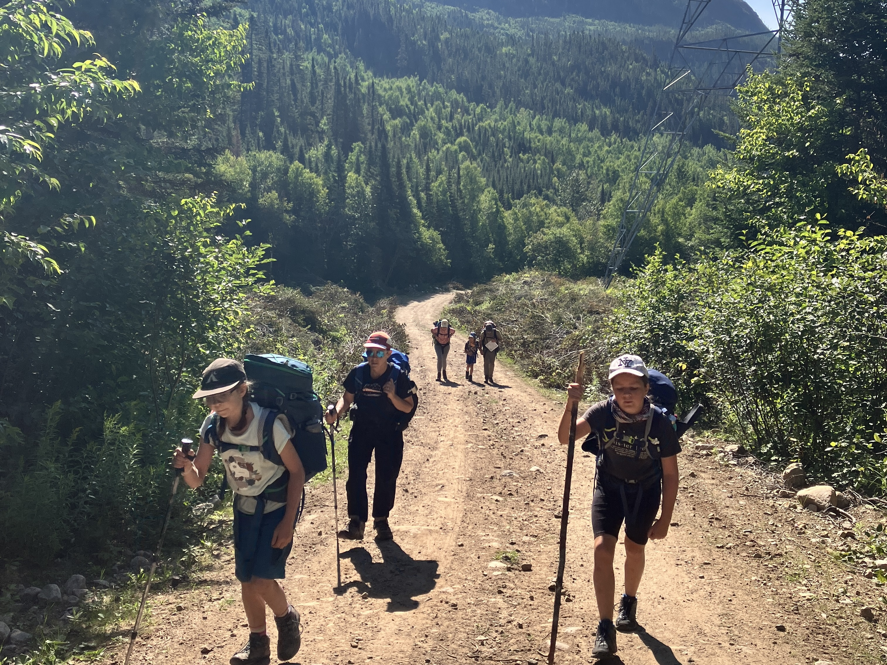
_Il fait chaud sous les lignes d'Hydro!_

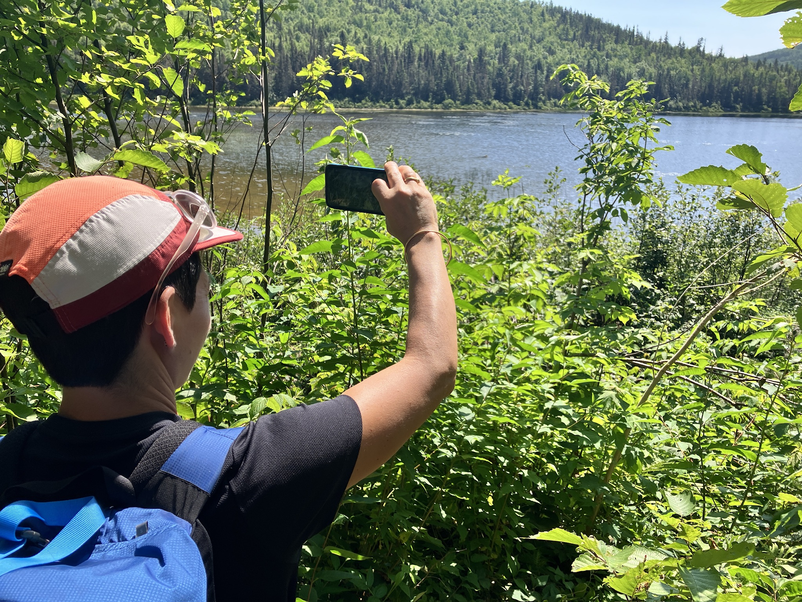
_Photo du photographe avant de quitter la ZEC_

On y arrive vers 13h après avoir marché environ 8km ce matin. On se pose sur la plage au niveau du pont, c'est vraiment beau! On se baigne, il y a un courant assez fort mais c'est tellement agréable de se baigner dans une eau fraîche après toutes ces heures où on a eu chaud! Dîner après la baignade, semoule et légumes _cold soak_ depuis ce matin. Pas mal! Quelques reste de pepperoni en apéro et quelques dattes en dessert!

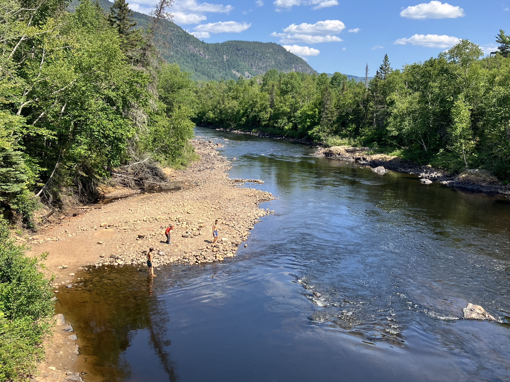

Il nous reste environ 2 km de sentier très propre (sentier Le Riverain) pour rejoindre notre auto, qui a été déplacé jusqu'au parking des Hautes Gorges par l'équipe de la Traversée de Charlevoix. Super service qui nous évite bien des aller-retour! Et oui, on choisit le sentier plutôt que la navette qui passe toutes les 15 minutes, car c'est triché de prendre la navette!! On arrive vers 15h30 au niveau du centre de service! C'est la fin! On a pas de difficulté pour retrouver les autos, j'ai enfin pu utiliser le bouton "ALERT" pour localiser mon auto 😂. Pause chill à la boutique, on boit de l'eau qui n'a pas besoin d'être filtré ou traité, et on peut utiliser des toilettes qui sont ben propres 🤓. Retour à la vie moderne!

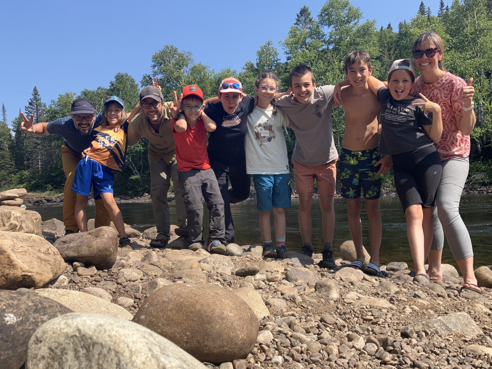
_les vaillants pour la photo de la presque arrivée!!_

Au retour on profite de notre second passage à Baie Saint Paul pour se charger en produits locaux (bière, viandes...), et ensuite on finit pas manger au Mikes vers Québec sur la route du retour, pour continuer une tradition commencé l'an passé lors de notre randonnée dans le parc des Appalaches! Note pour plus tard: une pizza de 12 pouces, c'est ben trop gros, même après 4 jours de randonnée... On est de retour à Sherbrooke vers 23h.

## Un point matériel

C'était une randonnée particulière car on était hébergé en refuge. De ce fait le sac était différent. Par exemple voici le contenu approximatif du mien:

- Sac à dos 45l OMM
- Couette CSC confort à 0 degré C (650g), trop chaud pour ce périple!
- Liner Sea To Summit (200g), très bien pour les refuges!
- Doudoune Décathlon, pas utilisée!
- Linge de spare et pour la nuit, pas tant utilisé vu la chaleur
- Filtre à eau BeFree de Katadyn: on avait de quoi faire chauffer de l'eau en refuge, ça nous a bien aidé pour 10! Il faudrait que je trouve un filtre plus pertinent pour un grand groupe comme on avait. Le BeFree était clairement pas assez performant.
- Trousse de secours
- Cell + Batterie: on avait de quoi charger dans tous les refuges
- 1.6l: capacité de stockage d'eau à la journée, pas mal adapté
- réchaud naphta + combustible + chaudron, pas mal overkill pour ce genre de randonnée ou on avait besoin d'un réchaud juste pour le café du midi. Mais j'aime mon réchaud au naphta 😅
- bouffe: la majeure partie du poids du sac! Je pense entre 3 à 4 kg au départ.
