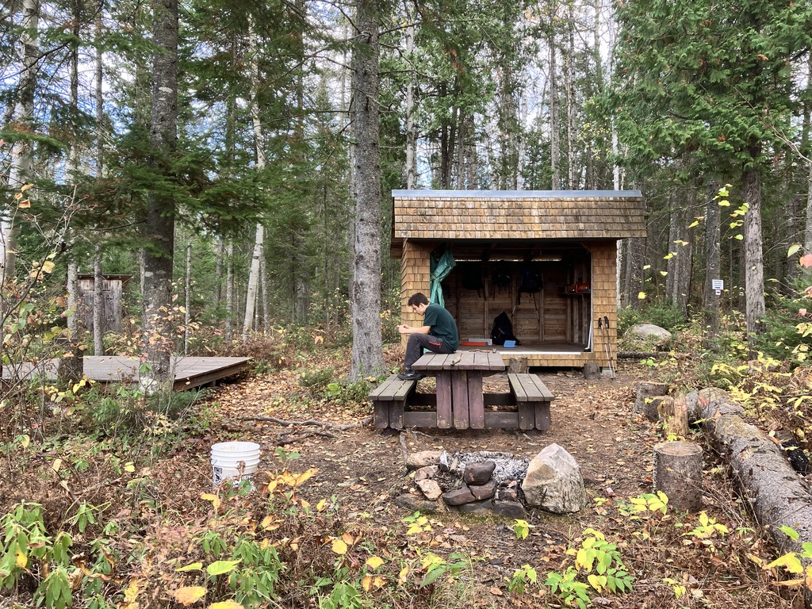
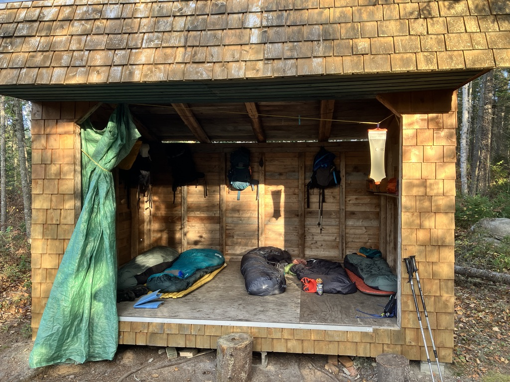
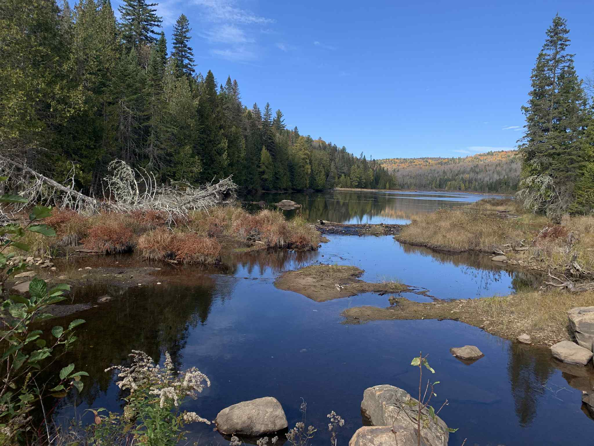
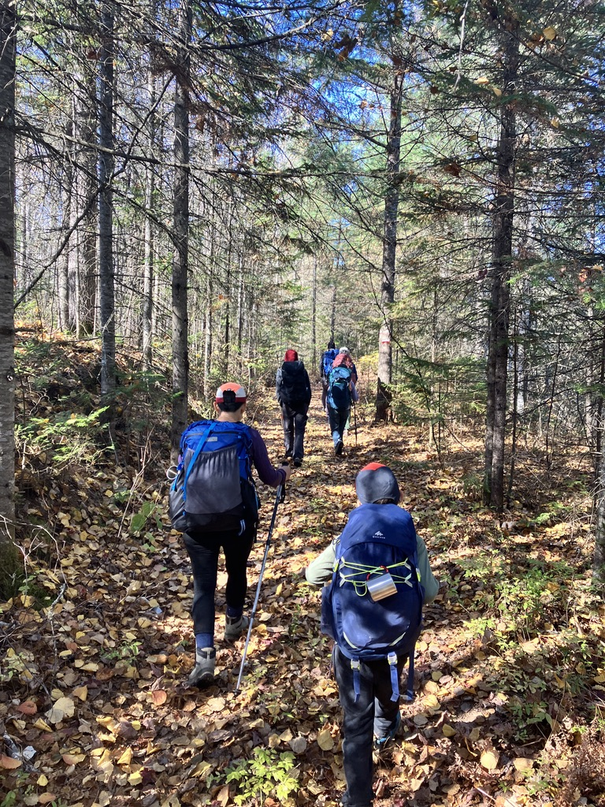
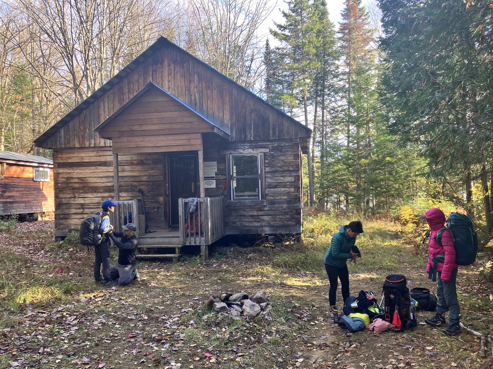
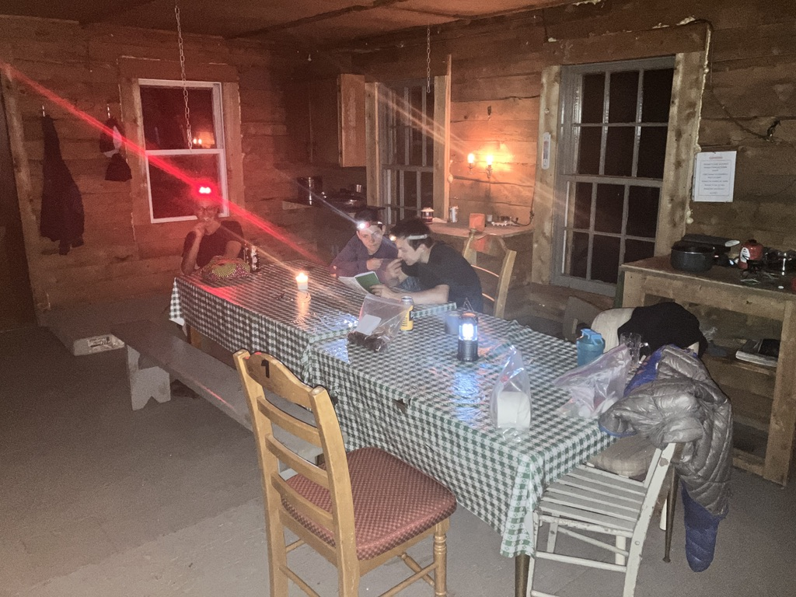
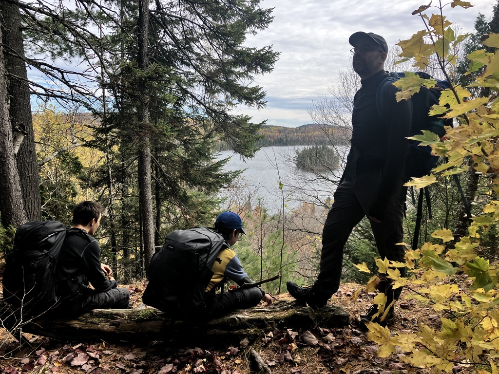

Mi-octobre, on a toujours la longue fin de semaine de l'action de grâce ici au Québec, l'équivalent du Thanksgiving de l'autre bord de la frontière au sud. La chaleur est généralmment encore là, et surtout les couleurs d'automne sont encore bien présentes! Cet été on avait hesité à marcher 4 jours sur le [Sentier National en Maurice](https://sentiernationalmauricie.ca), on se dit que c'est une belle opportunité!

## Le tracé

Je commence à tracer un itinéraire pour 3 jours, et c'est pas simple! Le Sentier National est construit comme un parcours linéaire, donc peu propice à construire des boucles. Il y a des platefomes et des abris trois-faces le long du trajet, mais également 2 refuges en location, un peu comme sur la traversée de Charlevoix. Je propose à des amis de se joindre à nous sur la partie refuge (il y a moins besoin de matériel!). On arrive au final à un tracé un peu étrange mais qui nous occupera ces 3 jours:

- arrivée le samedi au stationnement des Pin- Rouges de la [réserve faunique Mastigouche](https://www.sepaq.com/rf/mas/), on marche à l'envers sur le sentier (tronçon Saint-Bernard) pour aller dormir le samedi soir à l'abri 3 faces Saint Bernard
- dimanche on revient sur nos pas au stationnement, puis on va jusqu'au [refuge Le Huppé](https://sentiernationalmauricie.ca/le-huppeacute.html) (tronçon Vianney-Guillemette) où on passe la nuit
- lundi on revient sur nos pas vers le stationnement

<iframe src="https://caltopo.com/m/UPGRRFN" width="100%" height="600px"></iframe>

Pas le choix que de revenir sur ses pas dans pas avec ce sentier linéraire. L'autre option est un voyage en taxi mais ça mange beaucoup de temps. Et cette version permet à nos amis de nous rejoindre le dimanche matin pour aller dormir au refuge ensemble!

## Samedi 11 octobre

Longue route pour aller jusqu'à à la réserve faunique depuis Sherbrooke. On arrive à partir vers 10h donc on arrive pour manger le lunch à l'auto comme prévu... vers 13h! Notre sentier prévu était un peu plus long que le 2.5k qu'on a finalement fait, mais je n'avais pas prévu un bout de route fermé à cause de la chasse. Fait que on prend juste les 2.5k jusqu'au trois-faces. On laisse notre stock sur place (un couple profite de l'emplacement!) et on va jusqu'au point de vue vers le km 14 du [tronçon Saint-Bernard](https://sentiernationalmauricie.ca/saint-bernard.html). Le point de vue était plutôt une belle place pour observer la rivière (Carufel?).

De retour à notre trois-face, on en profite pour s'installer, on sera seul pour la soirée. Il y a également 2 belles plateformes pour monter des tentes. La vue sur la rivière du Loup est magnifique!

La soirée est classique, la nuit un peu plus froide qu'en été! La montre indique que la température est tombée à 1 degré celsius au petit matin. Les deux propriétaires de sleeping d'hiver ont bien apprécié d'avoir transporté le poids en plus! Les 3 autres ont pas si mal dormi il semble, on a boosté le sleeping avec le fameux "truc" des bouteille Nalgène pleine d'eau chaude et droppé au fond du sleeping.

## Dimanche 12 octobre

On retourne sur nos pas mais on décide de couper par la route pour arriver plus vite au stationnement et ajuster nos sacs. On avait prévu de charger la nourriture pour la suite au stationnement et de changer de sleeping pour optimiser notre charge! Bonne nouvelle nos amis sont en avance sur le planning donc on part avec un peu d'avance, on ne sera pas stressé par la nuit qui se couche un peu plus tôt. Maintenant on est sur le tronçon [Vianney-Guillemette](https://sentiernationalmauricie.ca/vianney-guillemette.html), c'est très beau sans dénivelé excessif. Il y a de nombreux lacs à observer tout au long du parcours.

On fait une pause vers le lac Bouché (on va prendre une bouchée comme dirait Marcus 😂) pour un rapide lunch, environ à mi-chemin. L'après-midi est aussi belle que la matinée, on arrive vers 16h au refuge "Le Huppé".

C'est un beau grand refuge sur un seul niveau. Sur le bord gauche il y a la partie couchette avec de quoi faire dormir au moins 8 personnes. De l'autre bord il y a deux tables, de la vaisselle, un bac pour l'évier, de quoi poser son réchaud. C'est un peu moins bien entretenu que les refuges que l'on peut trouver dans la traversée de Charlevoix: les matelas des lits sont un peu ancien, et je m'attendais à trouver un poêle à gaz et des fanal à gaz! Hugo a parti un feu du diable dans le poêle à bois qui est très efficace (on va dormir au chaud cette nuit!) et on commence à préparer le souper: un classique mafé comme pendant la traversée de Charlevoix! Je vais être content de ne pas porter les patates douces et les carottes demain! On finit le repas comme des rois avec un gateau au chocolat de Sandrine!

J'ai eu un stress lié au fait que je comptais sur une gazinière, mais finalement la combinaison de nos 2 réchauds a bien suffit pour préparer le repas!

On se régale et on va mettre la tête dehors pour voir un spectacle magnifique: le ciel est tout étoilé et on a une superbe vue depuis le ponton du lac à proximité. On distingue la voie lactée et on arrive même à identifier la galaxie d'Andromède! Mais tout le monde est pas mal fatigué, la soirée est pas si longue que ça, on file dans les couchettes pour se reposer avant la dernière journée. La classique question avant de se coucher: faut-il ajouter une bûche ou pas? (la réponse était non, mais on le savait pas, il fera chaud cette nuit!!)

## Lundi 13 octobre

Le réveil est moins dur que la veille, le refuge est encore "chaud"! J'ai dormi juste avec un liner, pas eu besoin du sleeping bag de toute la nuit. On se refait encore quelques corvée d'eau: un gros point positif pour le combo Sawyer Squeeze + poche d'eau Cnoc. Ça filtre tout seul pendant que l'on fait autre chose, c'est très pratique! Un déjeuner de roi encore ce matin (pain frais, ) ; c'est le luxe d'avoir une auto à moins de 1 jour de marche à chaque fois! On est sur le chemin vers 9h, pour le même chemin que la veille.

_Vue sur le lac Thibert_

On enchaîne le trajet plus vite que le dimanche, il y a moins de dénivelé dans ce sens. On arrive sur le stationnement pour retrouver l'auto vers 14h, parfait pour retourner chez nous avant les activités du soir!

## Au final

On a découvert un nouveau coin de Québec très agréable pour marcher. C'est moins exigent que Sentiers Frontaliers, mais c'est un peu plus loin en auto! Ça donne le goût de marcher plus longtemps ; le trajet complet en Mauricie fait environ 100km avec des abris ou des coins pour camper. En plus c'était le fun de marcher avec des amis! Merci Sandrine, Hugo et Cyril de votre présence!

Trajet réel sur Strava:

- [Jour 1: stationnement à l'abri Saint Bernard](https://www.strava.com/activities/16133115772)
- [Jour 2: stationnement au refuge Le Huppé](https://www.strava.com/activities/16133120559)
- [Jour 3: refuge Le Huppé au stationnement](https://www.strava.com/activities/16133125588)

Matériel:

Avec un passage au stationnement le matin du jour 2, ça permet de faire pas mal d'ajustement sur le contenu du sac. Par exemple je suis parti le samedi matin avec un sac de 55l, sleeping d'hiver, matelas, la bouffe pour un souper et un déjeuner uniquement. Le lendemain j'ai troqué le gros sac pour un 45l, sleeping d'été, pas de matelas et on a pris la bouffe pour 2 diner, 1 souper et 1 déjeuner. J'ai traîné tout le long le stock de base (réchaud, linge, filtre à eau, trousse de secours etc ). On a aussi traîné les tentes le samedi soir mais comme on a tous dormi dans l'abri, c'était juste un poids mort!
