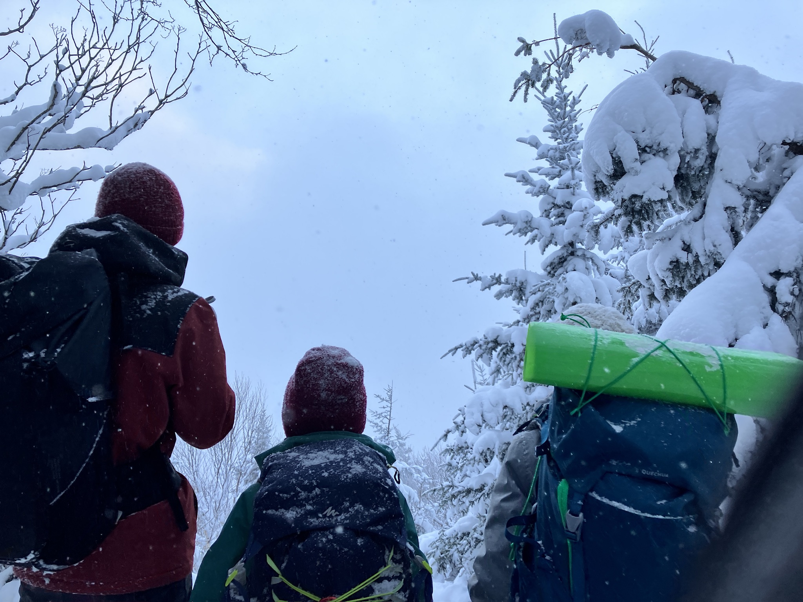
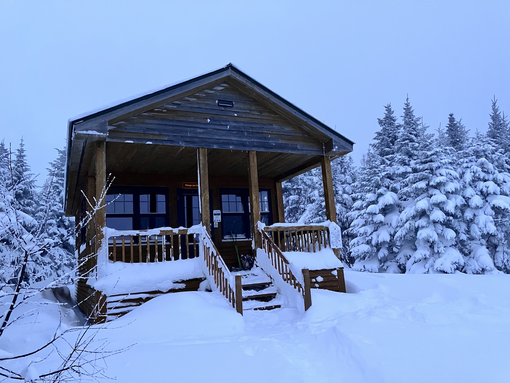
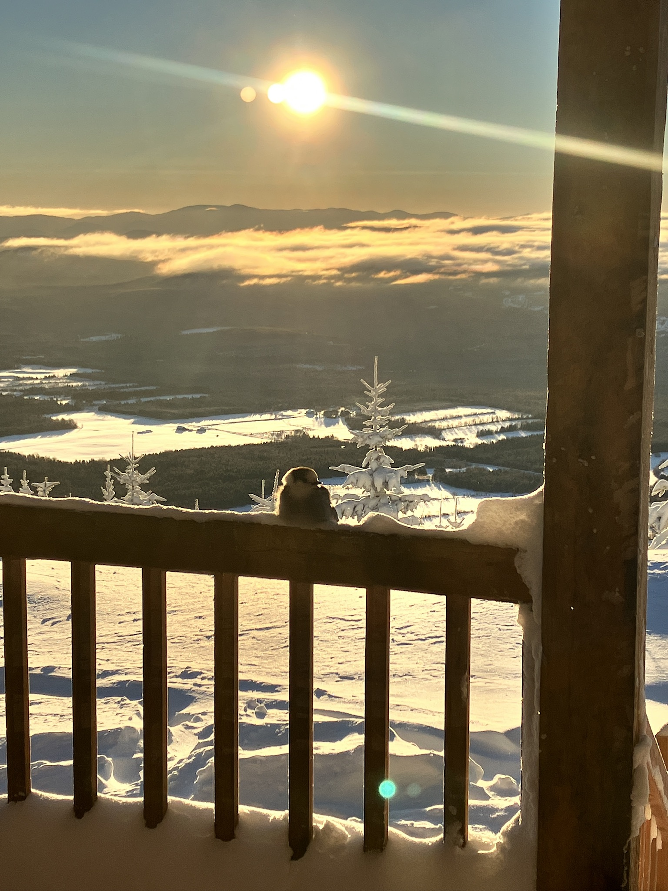
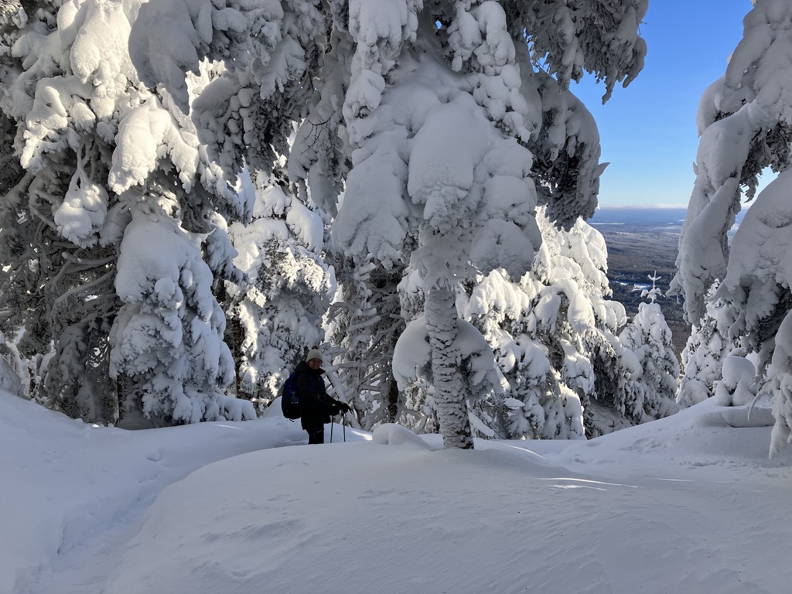

Pour terminer l'année en beauté, nous avons décidé de passer deux jours et une nuit en refuge au Mont Mégantic. C'était une excellente occasion de célébrer les anniversaires de décembre et de profiter de la nature en famille.

## 25 décembre 2025

On part vers 13h de Sherbrooke, pour arriver au environ de 14h à l’accueil de l'observatoire du Mont Mégantic. Il fait froid, c'est pas évident de mettre ses raquettes! Un bon -10 degrés Celsius, avec beaucoup de vent et on attend autour de -15 degrés Celsius en haut de la montagne. On commence à gravir tranquillement le Mont Saint Joseph. On aura droit à une montée "sonore" de Marcus, il est pas toujours willing pour ce genre d'aventures! On a une belle quantité de neige! C'est un temps froid mais c'est tellement beau! Les sapins font des fantômes. Les points de vue avant d'arriver au refuge des pèlerins sont bien bouchés avec les temps neigeux. On voit rien! On croise quelques autres randonneurs en ce jour de Noel, dont ceux qui s'en vont dormir au petit refuge Saint Joseph.

Après moins de 2h après notre départ, on arrive déjà à notre objectif pour la journée, le refuge des pèlerins. On l'avait visité l'an passé pour un lunch très apprécié. Cette fois il est 16h et on va se préparer pour chauffer la place et préparer notre souper. Nos oreilles ont besoin d'un peu de repos!

Au menu: fois gras sur du pain au grains des "Vraies Richesses", mafé "façon tonton Guillaume" pour se réchauffer! Même avec le lux de boissons ce soir! On finit ça avec des chocolats de noel et un classique jeu "Gang of 4". A 21h tout le monde est au lit. Avant d'écrire ces lignes j'ai eu le temps de faire la lecture de notre aventure autour du Mont Blanc en 2010 au kids, ils en redemandent encore!

## 26 décembre 2025

Réveil à 6h30. Le refuge commence à être froid, il est temps de repartir le poêle à bois! Je vide les cendres et relance un feu. Ca réchauffe! On prend le temps de déjeuner: gruau des fêtes, céréales, café, lait au chocolat! Et même du pain aux bananes. On décide même de commencer la journée par une "Gang of 4", c'est trop tôt pour commencer à marcher, il est 8h et il fait -20 degrés Celsius dehors!

On commence à marcher vers 9h. Le bruit de la neige sur les raquettes est enivrant à cette température. Ça "crisse" sous les pieds! On fait un pause 1h après au niveau du refuge du col des trois sommets. Pause bien appréciée pour se réchauffer les mains et les pieds! C'est un avantage au Mont Mégantic d'avoir accès entre 9h et 16h à différents refuge le long des sentiers pour se réchauffer en hiver. Le poêle a déjà été allumé par le personnel de la SEPAQ, c'est apprécié! On prend le temps d'une collation avant de repartir. On croise à nouveau les 2 randonneurs qui nous ont doublés dans la montée la veille et qui ont dormi à l'autre refuge sur le mont St Joseph. Ils sont partis ensuite pour grimper au Mont Mégantic, nous on a décidé de se limiter à la descente vers l’accueil! Sidonie en profite pour tester la crazy carpet au grand dam de Marcus qui aurait aimé en profiter aussi! On prend le temps d'une nouvelle petite pause avec soupe chaude au niveau du refuge de la grande ourse vers 12h. On arrive au bout de notre expédition vers 13h30 après un petit 6km pour la journée, c'est bien assez avec ce temps froid!

## Matériel

- Des raquettes pour tous, afin de profiter pleinement de la neige abondante.
- Duvets d'été pour le refuge, car il est bien chauffé par le poêle à bois.
- Des vêtements chauds et adaptés pour les températures hivernales, notamment des couches thermiques, des manteaux d'hiver, des gants, des bonnets et des bottes isolantes.
- Des sacs à dos pour transporter les affaires nécessaires pour la journée, y compris de la nourriture et de l'eau, le réchaud pour chauffer les repas, et des vêtements de rechange.
- Des lampes frontales pour la nuit, au cas où on aurait besoin de se déplacer dans le refuge ou pour une éventuelle sortie nocturne.
- Des jeux de société pour passer le temps à l'intérieur du refuge, comme le "Gang of 4" que nous avons apprécié.

## Liens Strava

- [Jour 1](https://www.strava.com/activities/16839617864)
- [Jour 2](https://www.strava.com/activities/16847420982)
