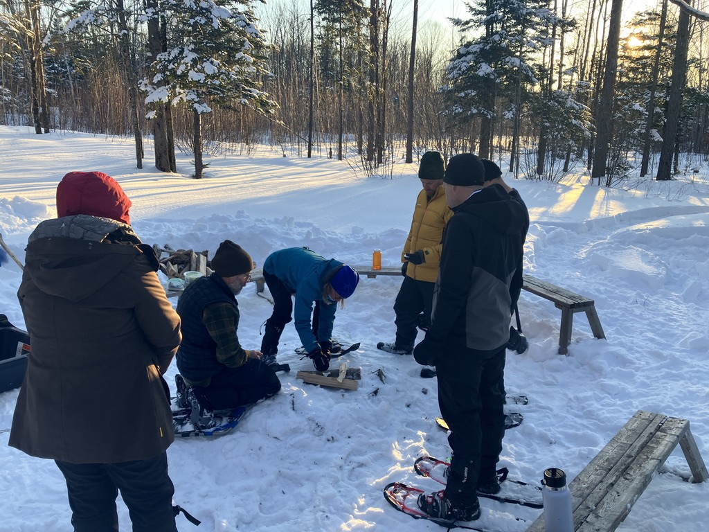
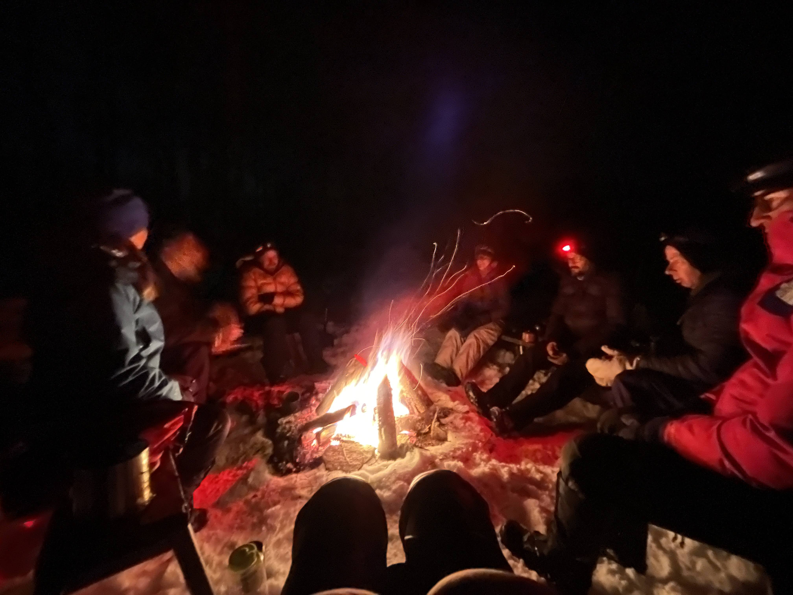
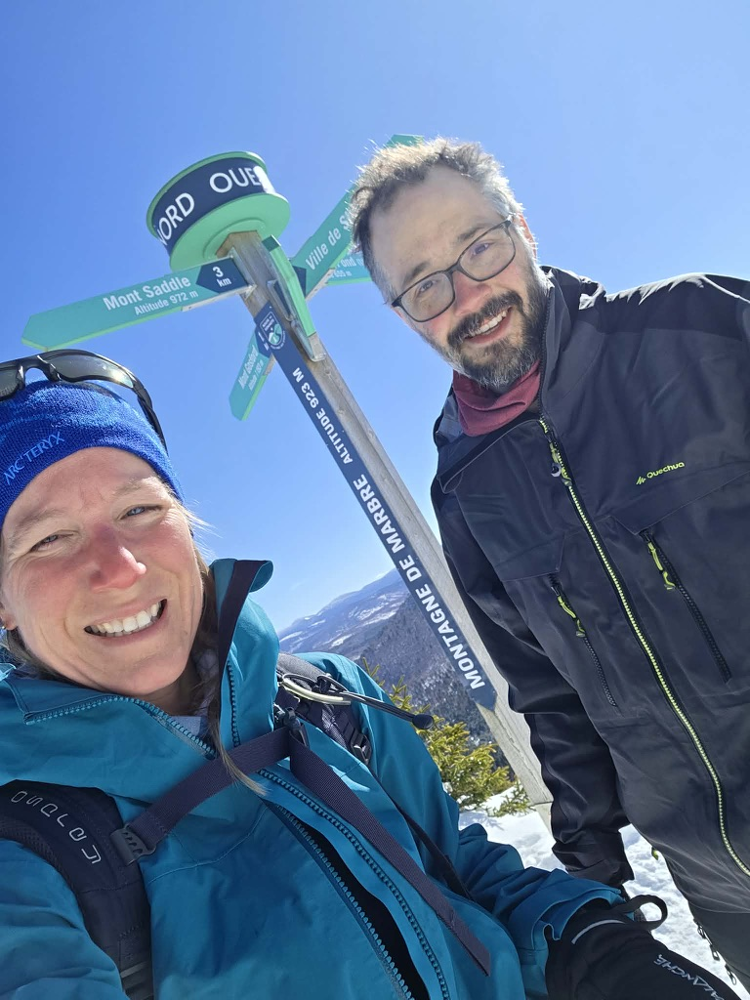

Après le succès de l'an passé (voir [ici](../2025-02-camping-hiver)), je me suis un peu plus impliqué dans les Sentiers Frontaliers. J'ai proposé de participer à l'organisation de la version 2026, et c'était une bonne idée car Catherine était incertaine en raison d'une opération planifiée au pied qui allait l’immobiliser pour quelques mois... On a pu, Jérôme et moi, bénéficier de l'organisation pointue de Catherine en terme de gestion de sondages, relance téléphonique et nous concentrer sur l'organsiation et l'animation de la journée en tant que tel!

## Jour 1 - 22 février

Le rendez-vous était au même lieu que l'an passé c'est à dire au niveau du camping du 10ème rang à Notre-Dame-des-Bois vers 13h30. On a pu accueillir nos participants et les diriger vers la zone la plus propice pour planter les tentes. Chacun a pu tasser la neige à l'aide de ses raquettes pour durcir une zone pour poser la tente. Jérôme avait pu identifier des zones plus proches du coin à feu, de l'autre bord de la rivière qui se sont révélés bien adapté pour poser nos tentes.

On a pu aussi partager les trucs et astuces pour ancrer les tentes dans la neige, avec des ancres à neige ou des branches d'arbre. On a aussi pu faire un tour du matériel utilisé par chacun, et partager les stratégies pour rester au chaud pendant la nuit.

Jérôme a pu ensuite animer un atelier pour faire du feu, avec les différentes techniques pour allumer un feu en hiver, et les différents types de bois à privilégier. On a pu faire un bon feu pour la soirée, et on a pu profiter d'un bon repas autour du feu avec les participants. On a aussi pu partager quelques conseils pour passer une bonne nuit en hiver, avec par exemple la technique de la bouteille d'eau chaude pour réchauffer les pieds dans le sleeping.

Cette année, je n'ai pas eu soucis avec mon réchaud! J'ai maintenant un MSR Whisperlite International qui fonctionne très bien même par temps froid, et j'ai pu faire chauffer de l'eau pour la bouffe et les gourdes d'eau chaude sans problème. La température était un peu plus chaude que l'an passé, on avait de nombreux participants avec des réchaud à gaz qui ont pu faire chauffer leur repas sans soucis. Le truc c'est mettre la canette de gaz au chaud dans le manteau avant de l'utiliser.

La soirée s'est terminé autour du feu, avec des discussions sur le matériel, les techniques pour rester au chaud, et les différentes expériences de camping d'hiver de chacun. C'était une belle soirée pour partager notre passion du camping en général et du camping d'hiver en particulier! Certains participants ont pu participé à l'EBR (Expédition des Braves Randonneurs) et on a pu avoir un aperçu de ce qui les attend pour cette expédition de 5 jours en mai dans les Sentiers Frontaliers!

## Jour 2 - 23 février

Le lendemain matin, j'ai plié ma tente à partir de 6h, et j'ai pu partir le feu pour le groupe rapidement. Toujours douloureux pour les mains de plier la tente dans le froid, mais une fois que c'est fait, c'est un soulagement! On a pu jaser sur les différentes expériences de la nuit, personne n'a eu trop comme l'an passé! On a fini la journée avec une randonnée sur la Montagne de Marbre. On était finalement juste 2 (Maryline et moi) mais c'était un belle journée pour marcher, assez chaude!

