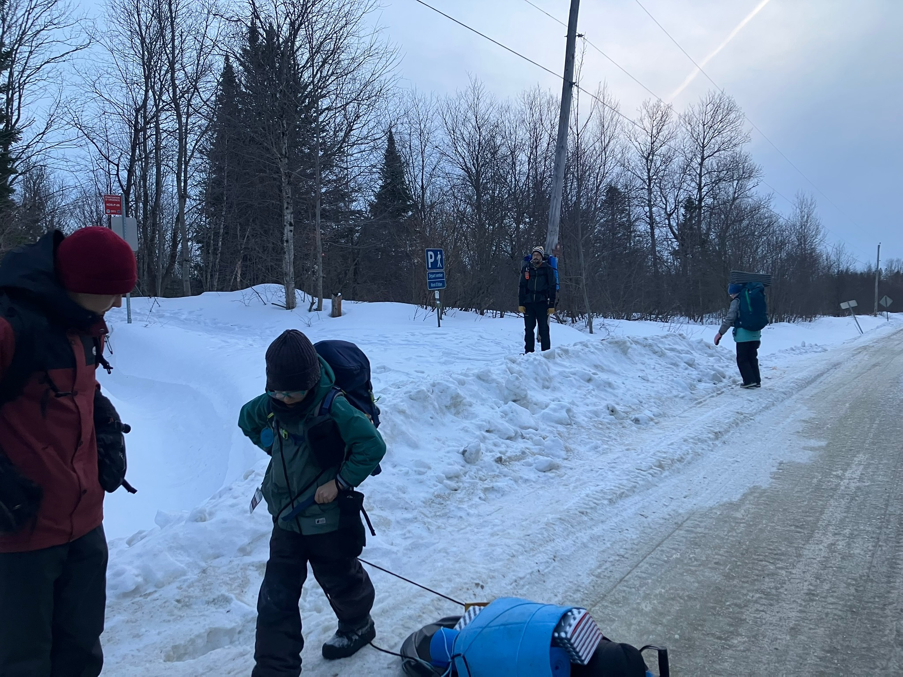
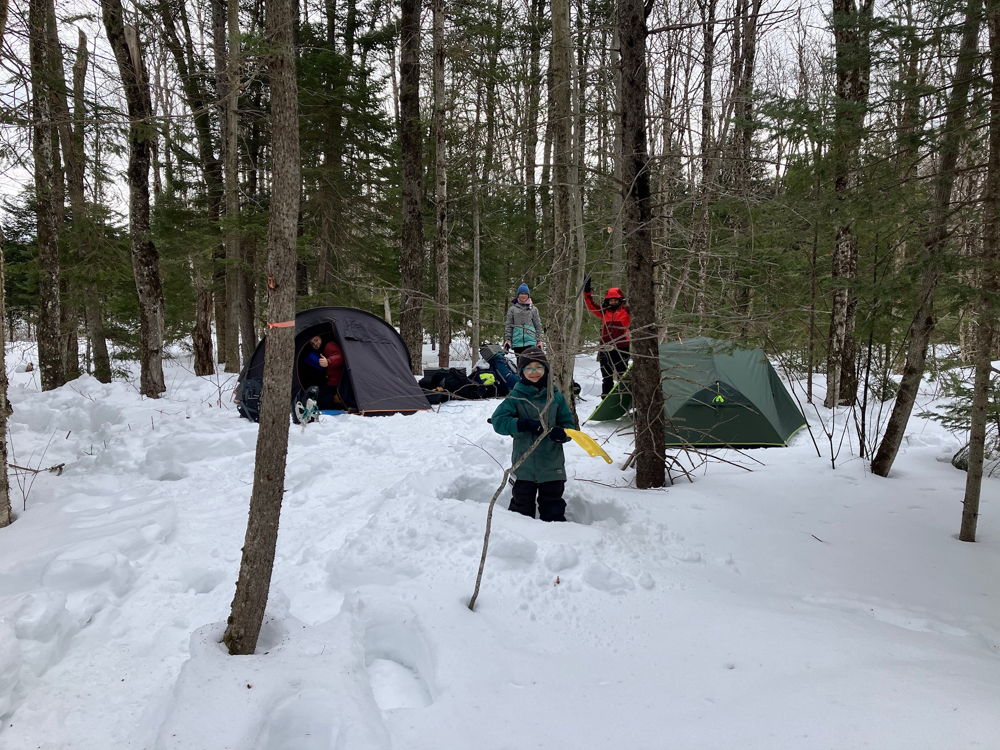
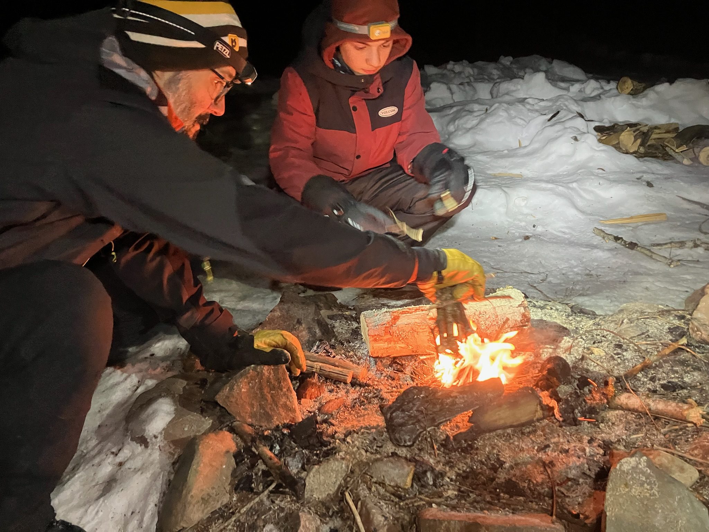
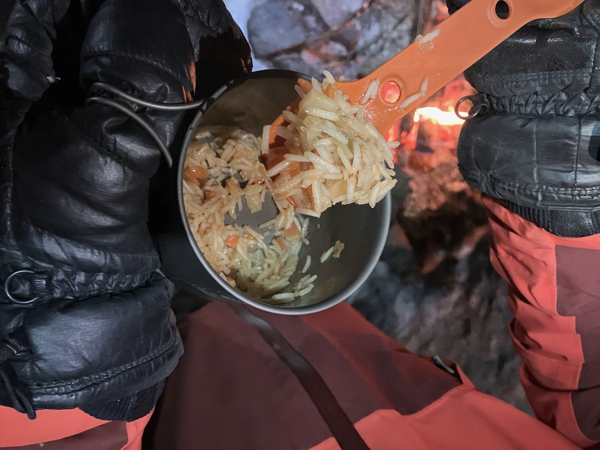

C'est la semaine de relâche scolaire de mars, et la température remonte un peu (autour de -2 degrés celsius au plus bas de la nuit). J'avais proposé à mes enfants de faire l'expérience du camping d'hiver, et ils étaient tous partants! Marion a pu se joindre à l'équipe grâce à un congé, et on a décidé de suivre un peu le plan de l'initiation au camping d'hiver que j'ai pu faire [ici](../2025-02-camping-hiver) et [ici](../2026-02-camping-hiver) ; donc simplement une nuit sur le site du camping du 10ème rang du mardi soir au mercredi avec un feu de camp et un bon souper / déjeuner!

On arrive sur le site vers 17h30 après la job, donc pas très en avance. On commence tout d'abord par poser nos 2 tentes. On a pris la luge de Sidonie afin de transporter un peu de matériel, ça aide! Le gros avantage est que le site est à proximité du parking, donc idéal pour une initiation. On en profite pour expliquer comment faire des ancres de neige pour les tentes, et on s'assure que les tentes sont bien stables. On a pris nos tentes 3 saisons, mais on a chacun 2 tapis de sol pour isoler du froid, et des sacs de couchage d'hiver ou plusieurs sacs d'été pour compenser.

Ensuite on teste l'allumage du feu dans le rond de feu qu'on a utilisé il y a 10 jours pour l'initiation. On profite ensuite d'un bon diner: on avait au menu ce soir du riz aux légumes et du couscous du randonneur! On a fini avec quelques guimauves pour le plaisir, et on a passé une belle soirée autour du feu à discuter! On a ensuite fait chauffer de l'eau pour avoir quelques gourdes d'eau chaude au fond des sleeping (pour les gars, les filles avaient les duvets d'hiver!)

## Matériel

Un petit tour du matériel utilisé pour cette première expérience de camping d'hiver en famille:

- Tentes 3 saisons: on a utilisé nos tentes habituelles (une trois places et une deux places), mais on a pris soin de les ancrer solidement avec des ancres de neige. On a aussi ajouté des tapis de sol pour une meilleure isolation contre le froid (tapis zig-zag + tapis gonflable).
- Sacs de couchage d'hiver: chacun avait un sac de couchage adapté aux températures hivernales, ou plusieurs sacs d'été combinés pour compenser.
- Luge: la luge de Sidonie a été très utile pour transporter le matériel jusqu'au site de camping, surtout avec les enfants.
- Matériel de cuisine: on a utilisé notre réchaud classique au nafta pour préparer le repas, et on a fait chauffer de l'eau pour les gourdes d'eau chaude.

On a bénéficié d'une température relativement clémente pour une nuit de camping d'hiver, ce qui a rendu l'expérience encore plus agréable pour tous, sans avoir à utiliser du matériel plus spécialisé pour des conditions plus extrêmes. C'était une belle introduction au camping d'hiver pour la famille, et on a tous hâte de recommencer!
