La dernière fin de semaine de mai, c'est la date de la "classique Trotteux", une sortie de course à pied le long des Sentiers de l'Estrie organisée par Hugo, Nadine et Nadine. J'ai eu la chance de participer à l'édition 2025, mais rien n'était prévu pour cette année. Après discussion avec les chums de course à pied, on a décidé d'explorer le fastpacking, et Hugo a proposé un ambitieux tracé le long du sentier national de la Mauricie, là où j'ai passé une fin de semaine l'an passé en famille ([ici](../2025-10-sentier-national-mauricie)).

## Le fastpacking, c'est quoi?

Le fastpacking, c'est une forme de randonnée rapide qui combine la course à pied et la randonnée, souvent sur de longues distances et avec un minimum de matériel. L'idée est de couvrir une grande distance en un temps relativement court, tout en portant le strict nécessaire pour l'aventure. C'est une excellente façon d'explorer des sentiers plus longs et plus techniques que ce que l'on pourrait faire en course à pied traditionnelle, tout en profitant de la nature et des paysages.

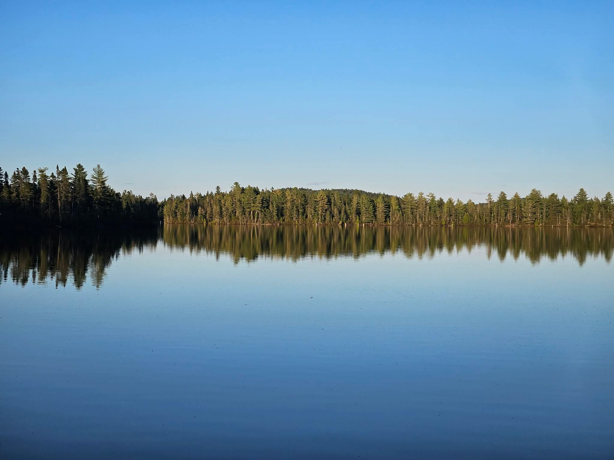
_le lac Shawinigan probablement (Simon)_

## L'équipe

Cette belle aventure est planifié entre Hugo, Simon et moi-même, c'est un peu notre entraînement avant la nouvelle tentative de notre FKT sur les Sentiers Frontaliers dans quelques semaines après [l'échec de l'an passé](../2025-07-sentiers-frontaliers/)!

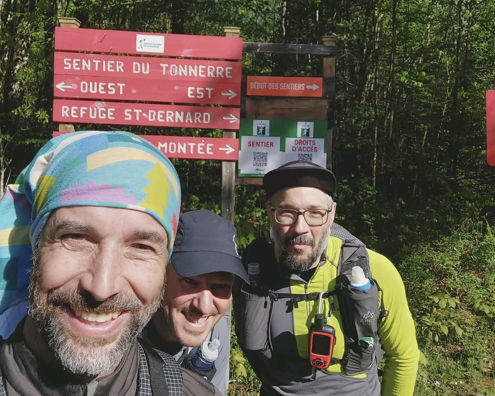
_Hugo, Simon et Julien au départ! (Hugo)_

## Le trajet

Hugo s'est appuyé sur le tracé de la course de la "Chute du Diable 75k" ([ici](https://www.alltrails.com/fr/explore/custom-routes/carte-29-decembre-2023-7c93ebe)) qui reprend pas mal le sentier national de la Mauricie. De plus le site internet du sentier national de la Mauricie ([ici](https://www.sentiernationalmauricie.com/)) est très pratique pour préparer le tracé: on retrouve les différentes cartes des sections et les emplacements des abris trois faces pour y dormir. Finalement le tracé est assez simple:

- Le premier jour on part au bout du rang Morin sur le tronçon Tonnerre, on enchaîne ensuite sur le tronçon Saint-Bernard, un peu plus roulant. Finalement on continue sur le tronçon Vianney-Guillemette pour terminer sur le tronçon Roland-Leclerc, au niveau de l'abri trois faces au km 3 de ce tronçon.
- Le deuxième jour on part de l'abri trois faces pour continuer sur le tronçon Roland-Leclerc, puis on enchaîne sur le tronçon de la Chute-du-Diable, et enfin le tronçon Le Trappeur pour terminer dans le parc national de la Mauricie, au niveau du stationnement du Lac Gérard.

Ce trajet permet de couvrir une bonne partie du sentier national de la Mauricie, il nous manque un morceau du tronçon Tonnerre et le tronçon Wabenaki, mais ça suffit comme initiation au fastpacking!

[Carte du tracé](https://caltopo.com/m/G72A02H#)

On peut aussi s'appuyer sur le guide "PRET A PARTIR" de BaliseQC que l'on retrouve [ici](https://baliseqc.ca/upload/fiches-pret-a-partir/PaP_SNQ_TraverseeMauricie_7j6n.pdf). Il décrit pas mal le trajet effectué, sauf quelques ajustements sur la fin du parcours.

## Préparation

On monte un plan de secours (merci Catherine pour l'inspiration!) au cas où on aurait des problèmes de santé ou de matériel, et on s'assure que tout le monde a une bonne condition physique pour ce genre d'aventure. On prépare aussi notre matériel de fastpacking, en choisissant des équipements légers et adaptés à la course à pied, tout en assurant notre sécurité et notre confort pendant la nuit. On planifie d'arriver dans la région le vendredi soir pour être prêts à partir tôt le samedi matin. Une connaissance d'Hugo pourra nous transporter depuis le point d'arrivée au point de départ le samedi matin, ce qui nous permettra de faire le trajet dans un sens sans avoir à faire du stop ou à revenir en arrière.

## Vendredi soir

On arrive assez tard sur notre spot de dodo pour la nuit, avec 2 autos. C'est une soirée très pluvieuse, on doit normalement avoir du beau temps le samedi, donc on est un peu rassurés!

## Samedi

On se lève tôt le samedi matin, et on est accueilli par une belle journée ensoleillée! On se prépare et on se rend au point d'arrivée de notre aventure pour laisser les 2 autos, et embarquer dans l'auto de Pierre vers 7h00. On arrive au stationnement du rang Morin vers 8h40, et on se prépare pour le départ. On est un peu nerveux, mais aussi très excités de commencer cette aventure de fastpacking sur le Sentier National de la Mauricie!

Je me rend compte que l'on doit débarquer au premier stationnement du rang Morin, alors que notre trajet prévu commence un peu plus haut à un second stationnement. C'est pas bien grave mais on a gagné un bon 200m de dénivelé pour commencer, ça va être un bon échauffement! Comme à l'habitude on part un peu vite, l'enthousiasme du début... Il faut s'habituer avec ce sac un peu plus petit que quand on fait une randonnée, mais bien plus gros que quand on part en course à pied. C'est un entre-deux un peu étrange, pas si désagréable (j'ai un 6kg soit environ 13 livres, le détail plus bas).

### Tronçon Tonnerre

On rejoint assez vite le tronçon "Tonnerre" (info [ici](https://sentiernationalmauricie.ca/tonnerre.html)) du sentier. On va faire 12k sur les 18k total du tronçon, car on ne part pas de l’accueil Catherine de la réserve faunique. Le gros attrait de ce morceau c'est la falaise Vianney-Guillemette sur laquelle on va marcher avec une belle vue au nord-ouest. C'est le moment de prendre des photos! Sans doute la partie la plus excitante pour nous 3 de tout le trajet!

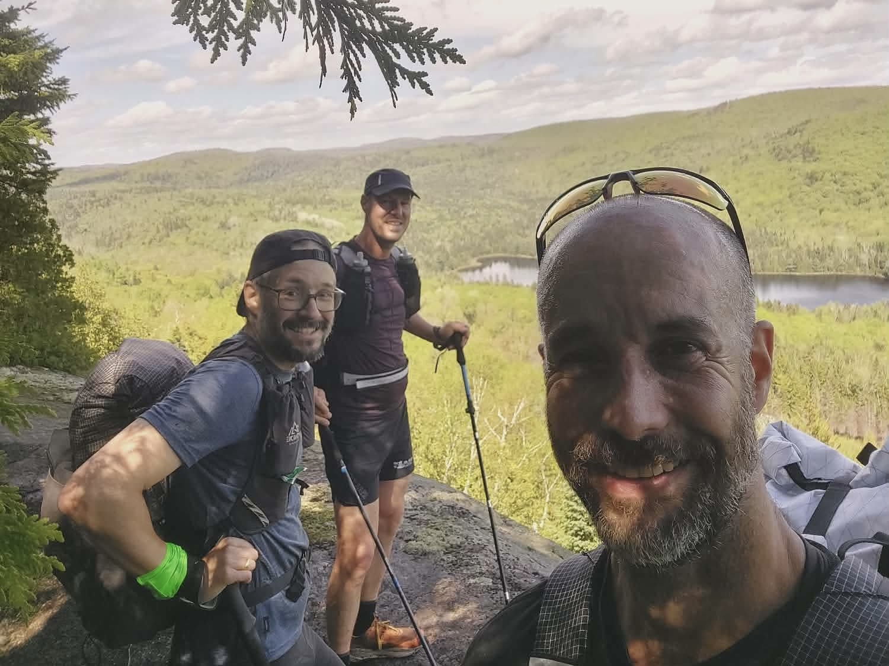
_un des nombreux points de vue sur la falaise Vianney-Guillemette (Hugo)_

Beaucoup d'eau sur le trajet, on comprend que le ravitaillement liquide sera très simple. Personnellement je vais fonctionner avec ma gourde filtrante de 600 mL remplie régulièrement, sans jamais stocker plus d'eau. On avance pas très vite sur cette partie, il y a plus de dénivelé. On met environ 3h pour boucler les 12km.

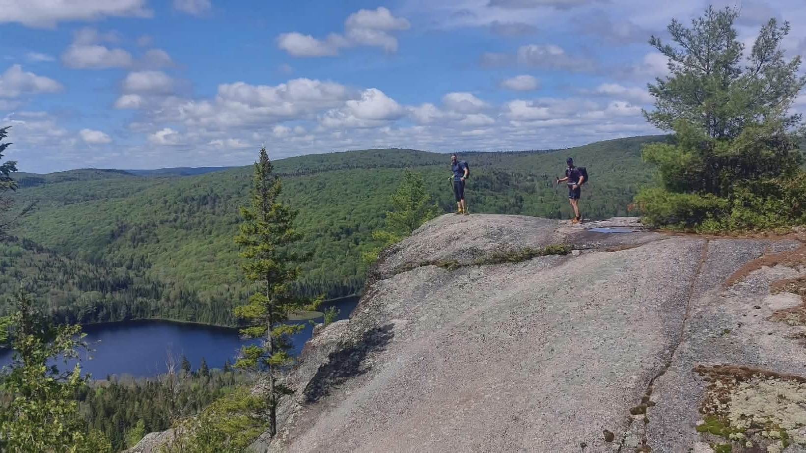
_un autre point de vue sur le tronçon Tonnerre (Hugo)_

### Tronçon Saint Bernard

En arrivant sur le lac Saint-Bernard, on tombe sur le fameux refuge du même nom. Je me rend compte maintenant qu'il y avait à priori des vestiges à explorer, car c'est comme un village abandonné? Bref on a rien vu, on était dans l'effort! Ce [tronçon](https://sentiernationalmauricie.ca/saint-bernard.html) est plus long (18km) mais est plus facile que le précédent. On commence par longer le lac, sur le flan gauche pour suivre le Sentier National (bien que notre tracé initial partait sur le flan droit comme le trail!). Ensuite on arrive sur le camping lac Saint Bernard de l'autre côté, l'occasion de discuter de notre journée avec une employée qu'on a croisé vers l’accueil. Accès aux toilettes aussi, c'est toujours un plus!

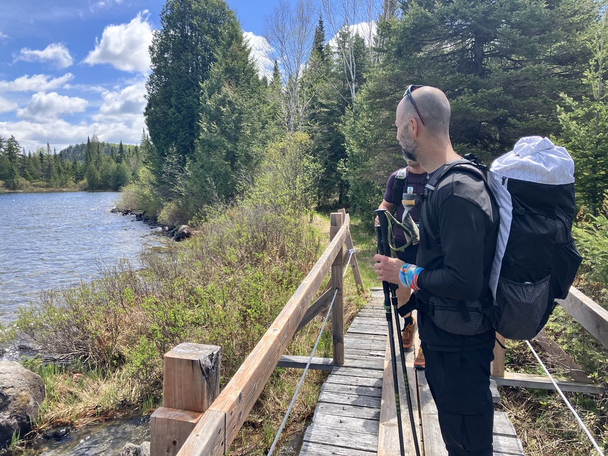
_le lac Saint Bernard (Julien)_

Jusqu'à présent, on a croisé aucun autre randonneur sur le trajet! On continue notre voyage sur une section plus classique, qui alterne entre sous-bois et chemin de quatres-roues. Le sentier est assez roulant, il permet de "trotter" un peu en descente. Il faut imaginer une vitesse de pointe pas fulgurante, mais quand même on arrive à courir un peu avec notre gros sac! On passe à côté du trois-faces dans lequel on a [dormi en famille](../2026-05-sentier-national-mauricie/) en octobre dernier, et on arrive finalement à l’accueil Pins-Rouge de la réserve faunique Mastigouche. C'est la fin du tronçon, ce segment nous aura pris environ 3h15, donc relativement plus rapide que le précédent!

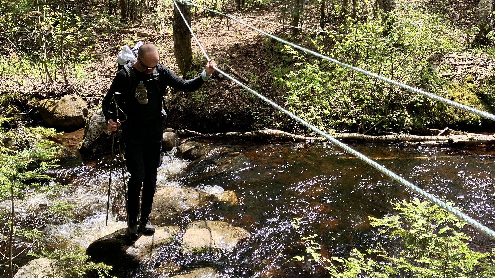
_passage à gué (Julien)_

### Tronçon Vianney-Guillemette

Après une courte pause eau/bouffe/toilettes car poursuivi par les maringouins, on repart pour un nouveau [tronçon](https://sentiernationalmauricie.ca/vianney-guillemette.html) que je connais déjà jusqu'au refuge Huppé. C'est le moment où la chaleur de l'après-midi est la plus intense, même en cette fin mai. Le temps est pour le moment magnifique. La longue montée avant le refuge se fait doucement, plus dur pour Hugo quand la chaleur est là! De mon bord, je dois négocier avec du chafting, chacun ses problématiques! Pause rapide au refuge (on a pas les clés de toute façon!). On se dit qu'on est déjà a mi-parcours (environ 40k) sur notre trajet de la fin de semaine, c'est encourageant!

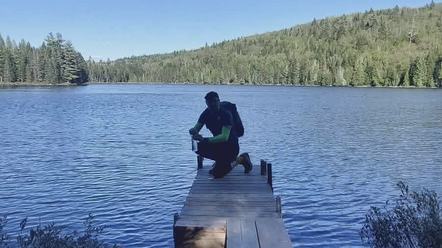
_ravitaillement en eau à coté du refuge Huppé (Hugo)_

On continue pour se retrouver sur les bords du grand Lac Shawinigan, magnifique. On va le suivre pendant un bon moment! Le tronçon de 15,4km se termine en face d'une passerelle qui permet de sortir du sentier si nécessaire, on voit du monde qui se baigne dans le lac juste en face! On prend pas la passerelle bien entendu et on continue sur le prochain segment avant la fin de notre journée!

_le lac Shawinigan probablement (Simon)_

### Tronçon Rolland-Leclerc

Ce [tronçon](https://sentiernationalmauricie.ca/roland-leclerc.html) de 10.7 km circule encore le long du lac Shawinigan jusqu'à stationnement du lac en Croix. Tellement de lac en Mauricie! C'est fou! Ça commence par une montée sèche alors qu'on pensait juste suivre le lac pendant nos 3 derniers km avant notre arrêt au trois faces de ce tronçon. Erreur! Hugo mène la petite troupe qui commence à avoir hâte de faire une pause salvatrice pour la nuit. Une fois la côte franchie, on déroule assez rapidement sur notre pause pour la nuit. On arrive vers 19h15, soit environ 10h15 sur le sentier pour un bon 49km de parcouru, et environ 1300m de dénivelé positif. Un bon morceau de fait!

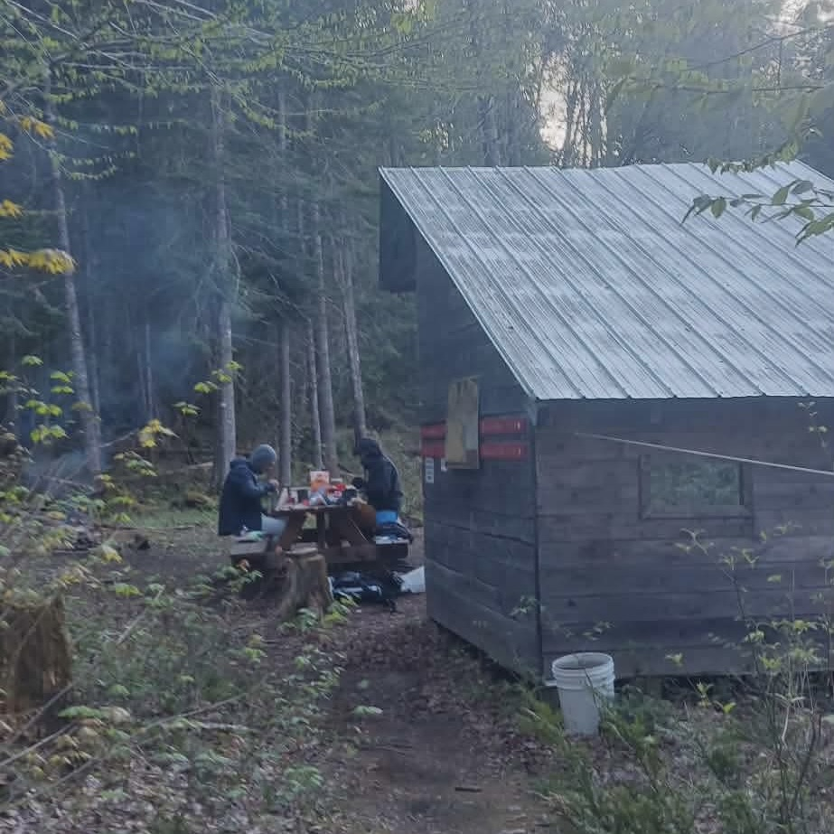
_diner du soir à coté de l'abri trois faces (Hugo)_

Petit message via le InReach pour prévenir notre "ange-gardien" qu'on est bien arrivés pour la nuit, on profite ensuite pour rapidement se changer avant de prendre froid, se nettoyer avec le lac à proximité. On décide Hugo et moi de dormir dans le trois faces car il n'y a personne, et Simon opte pour sa (nouvelle!) tente sur une des deux plateformes disponible. Le tout est en excellent état. Ensuite un souper qui fait du bien au moral. J'avais préparé de mon bord une sauce bolognaise végétarien avec du macaroni. Parfait pour récupérer! A 20h30 je suis déjà allongé sous le duvet. Le corps demande du repos, j'ai froid dehors! La nuit va nous permettre de récupérer.

## Dimanche

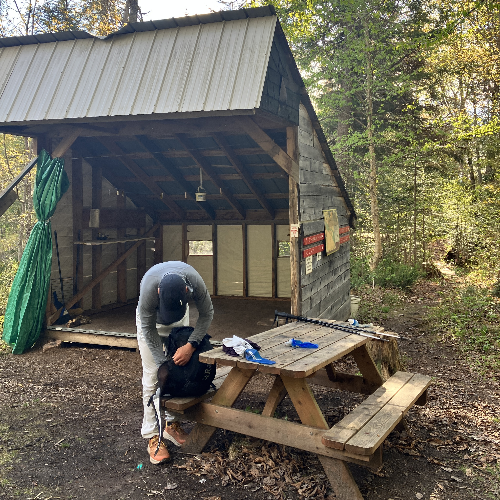
_fermeture des sacs avant de repartir (Julien)_

Levé vers 6h30 le dimanche, quelques gouttes sont tombés ce matin. Une nuit pas pire pour tout le monde, on semble avoir récupéré un peu d'énergie. On met un peu de carburant dans la machine pour la journée, on plie notre stock et on est de nouveau sur le sentier avant 8h00! Toujours aucune problématique pour l'eau, c'est disponible en abondance partout. Des cours d'eau sont là tous les 30mn pour nous permettre de nous ravitailler c'est magique. Après avoir passé la belle cascade, on arrive sur le pont flottant qui est le fun à passer! On a quelques pas technique à effectuer avant de finir le tronçon Rolland-Leclerc et de s'engager sur le nouveau.

### Tronçon Chute-du-Diable

On se rapproche de la civilisation avec ce bout! Cette [section](https://sentiernationalmauricie.ca/chute-du-diable.html) fait 11.2km et finit au niveau de l’accueil du Parc RécréoForestier de Saint-Mathieu. On croise enfin des humains sur le sentiers! Je pense qu'on était un peu trop enthousiastes pour les 2 filles en sortie longue de course à pied! Et on arrive ensuite sur la fameuse Chute-Du-Diable, avec un beau trois-faces également.

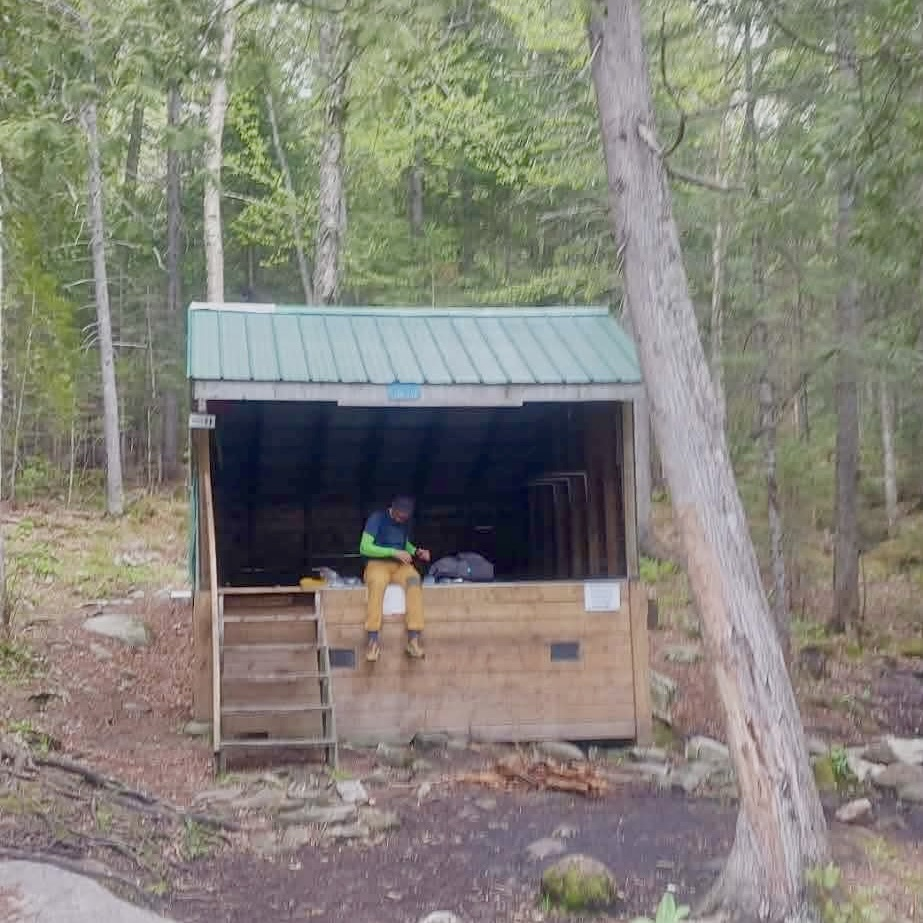
_lunch au bord de la Chute-Du-Diable (Hugo)_

S'en suit une montée finalement pas si longue, et l'arrivée de la pluie qui finalement nous est pas si désagréable car il fait pas si froid. La pluie sera en alternance pas mal toute l'après-midi, sans être trop dérangeante. J'ai juste constaté que mon sac n'est pas complètement étanche, et que le système du sac poubelle pour protéger duvet et linge est assez efficace! A l’accueil on jase un peu avec la fille du comptoir qui encaisse notre entrée dans le parc (en sortant du parc!). Toujours le fun de discuter un peu! On a pu croiser quelques randonneurs et coureurs dans le parc depuis la chute, j'imagine que le parc est plus populaire quand il ne pleut pas! Au final c'est le seul moment où on a croisé du monde en sentier ; le reste est bien creux dans le bois et moins utilisé par les randonneurs à la journée. Un bon 4h15 déjà pour ce premier 14km, on est définitivement plus lent qu'hier! Mais on a moins de "job" à faire aujourd'hui!

### Tronçon Le Trappeur

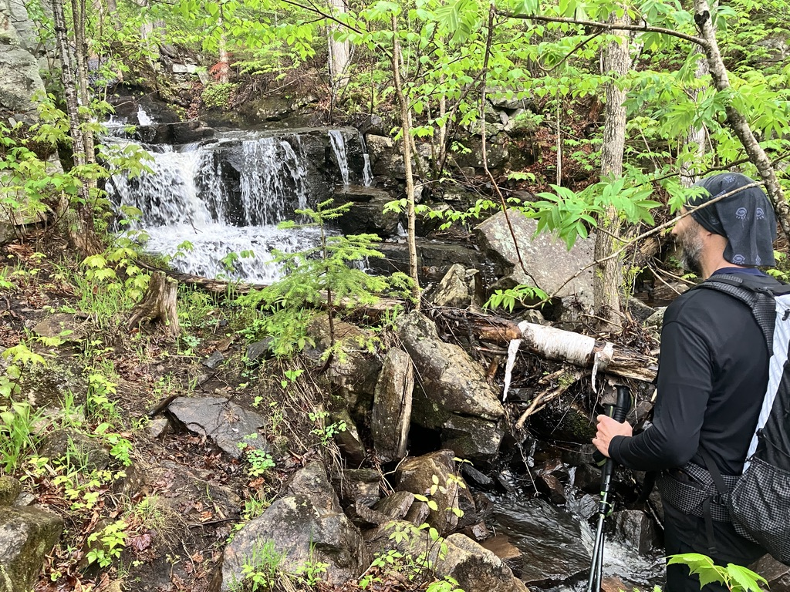
_rivière en escalier sur le tronçon Le Trappeur (Julien)_

C'est le dernier tronçon de notre aventure. Il mesure 14km, un peu moins spectaculaire mais on retrouve encore beaucoup d'eau (belle rivière dans les premiers km!) et un parcours dans le bois toujours intéressant avec un peu moins de point de vues. Les muscles sont fatigués, et on commence à trouver le temps long. Les douleurs se réveillent chez Hugo et Simon, genoux, dos... Les corps ne sont pas habitués à ces sacs à dos un peu hybrides! C'est après une bonne section qu'on rejoint enfin le territoire du parc national de la Mauricie, en longeant encore de nouveaux lacs. On retrouve une route de gravelle à proximité du lac Parker, c'est la fin du sentier Le Trappeur!

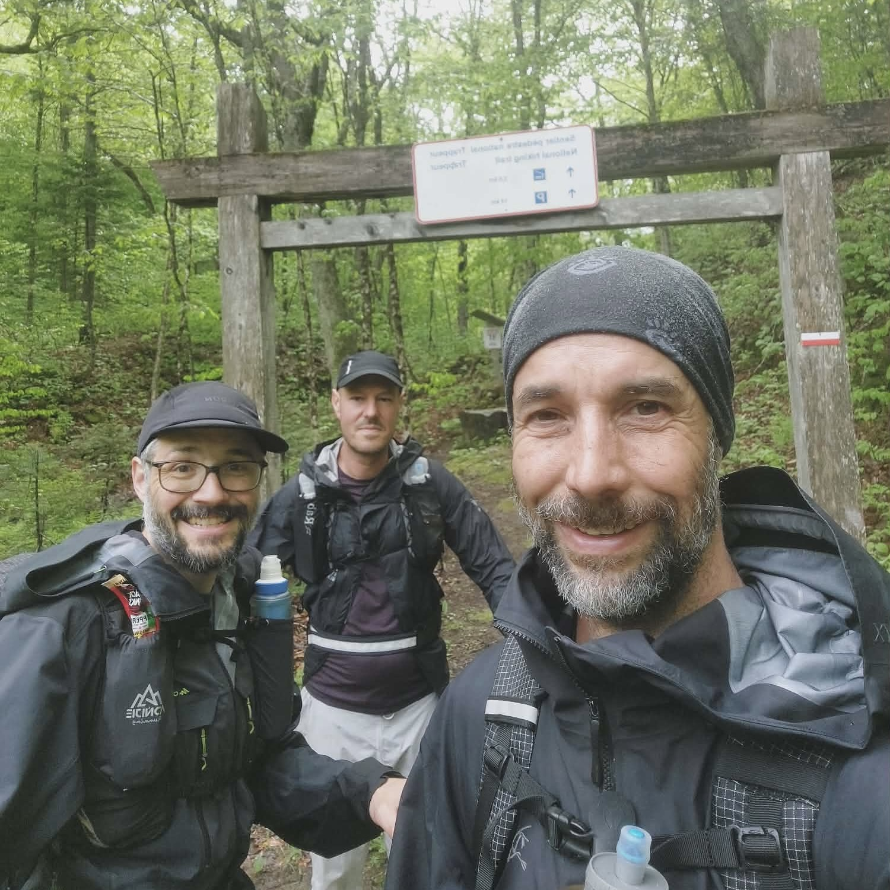
_fin du tronçon Le Trappeur, le sourire fatigué mais satisfait (Hugo)_

On "roule" sur la gravelle jusqu'au refuge Wabenaki, et c'est ici que notre chemin se sépare du Sentier National, qui continue au nord pour faire le tour par le haut du lac à la pêche (oui encore un lac!). Nous on va se contenter de trotter difficilement jusqu'au stationnement Saint Georges au sud du lac pour retrouver les autos posés en début d'aventure. C'est un clap de fin satisfaisant que de finir ce périple. Sans doute un peu ambitieux pour une initiation en fastpacking, mais complété avec force! On arrive un peu avant 16h, soit autour de 8h de sentier pour environ 35km au compteur et 1100m de dénivelé positif. Une belle aventure de 85km pour la fin de semaine!

## Matériel

Voici le stock que j'ai amené pour cette aventure. Il faut comprendre que l'objectif est de s'alléger un maximum pour être rapide, idéalement pouvoir trotter un peu sur la descente et le plat. Surtout garder une bonne vitesse de base.

[Lien vers la liste de matériel](https://docs.google.com/spreadsheets/d/1rppS00UzMtSwZa_p_FB8qa_CN3AVQRf-zQGSEkjHd_U/edit?gid=0#gid=0)

Le sac fonctionne pas mal avec ce poids. Simon avait un peu plus lourd sur les épaules, et il semble que c'était trop surtout la première journée.

Mon "Big 4":

- sac à dos Aonijie 30l: c'est un sac typé fastpacking avec de grandes poches sur l'avant pour mettre des flasques et de la nourriture. Ça fait quelques années que je l'utilise pour du commute et de la randonnée à journée. Il a bien fonctionné, pas de douleur et bien assez grand pour cette expédition (environ 600g)!
- un quilt/couette CSC Yeti en duvet: c'est une couette assez légère (~600g) produite par la compagnie européenne Yeti, que j'ai acheté en 2011 il me semble, quand j'allais beaucoup sur ce [forum](https://www.randonner-leger.org/forum/viewtopic.php?id=18974)! Bref sans doute les 100 EUR les mieux investi à l'époque, car elle est encore très fonctionnelle, et très compacte. Et bien assez chaud quand il fait au dessus de 5 degrés Celsius.
- un matelas Klymit Static V2: c'est un matelas gonflable assez bas de gamme, mais qui a l'avantage d'être compact et léger (470g). Pas isolé par contre!
- un tarp (X-Tarp de la défunte marque Arklight), un retour [ici](https://www.journaldutrek.com/x-tarp/). On avait pris ça en backup si jamais le trois faces était déjà rempli! En fond de sac, pas très lourd (475g avec les guidelines et de quoi la planter au sol)

En plus de cela j'avais mon kit léger pour le réchaud: le BRS 3000 avec un cartouche de 100g dans le pot Toaks 500mL. On peut pas bien faire plus léger et compact!

## Bouffe

Le type et la quantité de nourriture que j'avais amenée était plutôt orientée randonnée que course à pied de mon bord, et ça a bien fonctionné. J'ai pu ajouter des dîners histoire de varier un peu dans la journée: une tortilla avec du phili/concombre/tomates cerises/laitue le premier jour, et un [couscous en cold-soak](../../recipes/couscous-aux-legumes/) le second jour.

J'ai fais seché [une sauce bolognaise végétarienne](https://www.lacuisinedejeanphilippe.com/recipe/tofu-bolognaise) pour le souper du samedi soir, que j'ai accompagné de macaroni, merci le deshydratateur! Le matin c'est classique gruau + café pour moi ça fonctionne bien.

En plus de cela j'avais des barres (Val Nature et Clif), quelques gels, des noix, et des extra qui permettent de changer un peu (genre un paquet de Pop-Tarts et des peperettes). Je n'ai pas manqué de nourriture (environ 1.4 kg dans le sac au début)

## Conclusion

Cette aventure de fastpacking sur le Sentier National de la Mauricie a été une expérience incroyable. C'était un défi physique et mental, mais aussi une opportunité de découvrir des paysages magnifiques et de partager des moments inoubliables avec mes amis. Je suis fier de ce que nous avons accompli, et je suis déjà impatient de planifier notre prochaine aventure ensemble! Un merci à Pierre encore pour le lift sur place et Marion pour le suivi du plan d'urgence si jamais il y avait de quoi qui se passe mal, c'est toujours mieux d'être préparé et de mettre en place un système pour communiquer et agir en cas de besoin!
