## SF1, la seconde tentative!

L'an passé [j'ai couru](../2025-07-sentiers-frontaliers/) avec Marylin et Hugo sur la [grande traversée des Sentiers Frontaliers](https://sentiersfrontaliers.com/sentiers/longues-randonnees/), avec comme objectif de boucler le parcours en moins de 24h. C'est le moment de relire le récit si vous ne l'avez pas lu, mais on avait finalement stoppé notre tentative après 15h de course, au niveau de l’accueil de la ZEC Gosford. Depuis ce jour, le projet restait dans un coin de notre tête à chacun d'entre nous. On a tenté de le replanifier en automne, mais les dates fonctionnaient pas, ou un tronçon était fermé pour la chasse. On se retrouve donc en 2026 avec l'idée de tenter à nouveau ce parcours: malgré son côté très sauvage et brutal, l’environnement parcouru est beau et tellement varié. Comme dirait Monique, la présidente de Sentiers Frontaliers: _c'est plus que de la randonnée, c'est de l'aventure_!

## un FKT?

On garde en objectif d'être capable de tenter un [FKT](https://fastestknowntime.com/route/la-grande-traversee-des-sentiers-frontaliers-sf1-chartierville-woburn) avec la catégorie _unsupported_, donc on planifie toute la bouffe et on aura zéro assistance tout au long du trajet.

Quelques jours avant de se lancer on voit qu'un certain Simon Côté a bouclé le trajet en moins de 19h en solo _unsupported_. C'est très impressionnant!

## Le trajet

C'est exactement le même trajet que l'an passé:

<iframe src="https://caltopo.com/m/0TRBK" width="100%" height="600px"></iframe>

On a l'avantage de connaître maintenant les 53 premiers kilomètres suite à notre expérience de l'an passé. On connaît aussi un gros morceau de Gosford, seul les 12 ou 13 derniers kilomètres nous sont totalement inconnus. Pas les plus simples finalement!

## L'équipe

C'est une équipe à géométrie variable cette année. Hugo n'a pas souhaité embarqué mais il a joué un rôle central en prenant le poste d'ange gardien qui était confié à Monique l'an passé. Il avait accès à notre plan d'urgence et était en capacité d'intervenir en cas de besoin. Il a passé toute la journée dans la région et il a pu nous acceuillir à l'arrivée pour faire la navette vers l'auto laissée au départ! Simon aurait du faire partie de la partie, mais il s'est blessé deux semaines avant pendant [notre belle sortie en Mauricie](../2026-05-sentier-national-mauricie/), il a donc préféré annuler pour cette fois, sage décision.

On s'est retrouvé à deux, Marylin et moi, en lice pour cette tentative. On a décidé de conserver le défi à l'agenda, même à deux. On ne sait jamais quand on arrivera à planifier une autre fin de semaine si on décidait de reporter! Bref, prêt, pas prêt, on y va ce vendredi 12 juin!!

## Le timing

Cette année, on a décidé de partir plus tôt que l'an passé. La section difficile est entre le km 66 et 72 (quand on rejoint la frontière après le Petit Gorford jusqu'au Trou du diable). C'est sur la fin du défi, donc l'attention ne sera pas au top. On a choisit de faire cette section de jour. On tablait sur une durée d'environ 24h, donc on a décidé de partir depuis la douane de Chartierville à 20h30 ce vendredi 12 juin. Cela va nous faire parcourir de nuit la première portion du sentier, qu'on estime plus facile (et surtout déjà connu depuis l'an passé!) ; pour arriver assez tôt à Gosford et faire la section difficile de jour. Les conditions météo nous incitent aussi à utiliser ce créneau, avec de grosses chaleurs le vendredi et des prévisions d'orages le dimanche.

## Douane de Chartierville au 10ème rang

Comme l'an passé, j'ai découpé mentalement la grande balade en 3 sections de taille approximativement identique (sauf la dernière qui est plus gratinée mettons). Ce premier morceau était l’occasion de se préparer pour la suite, ne pas aller trop vite et retrouver des sensations. On respecte bien le timing planifié, on est sur le sentier à 20h40 (après une journée de boulot!). Pas de manège de véhicules avant de partir, on compte sur Hugo pour nous attraper à la fin!

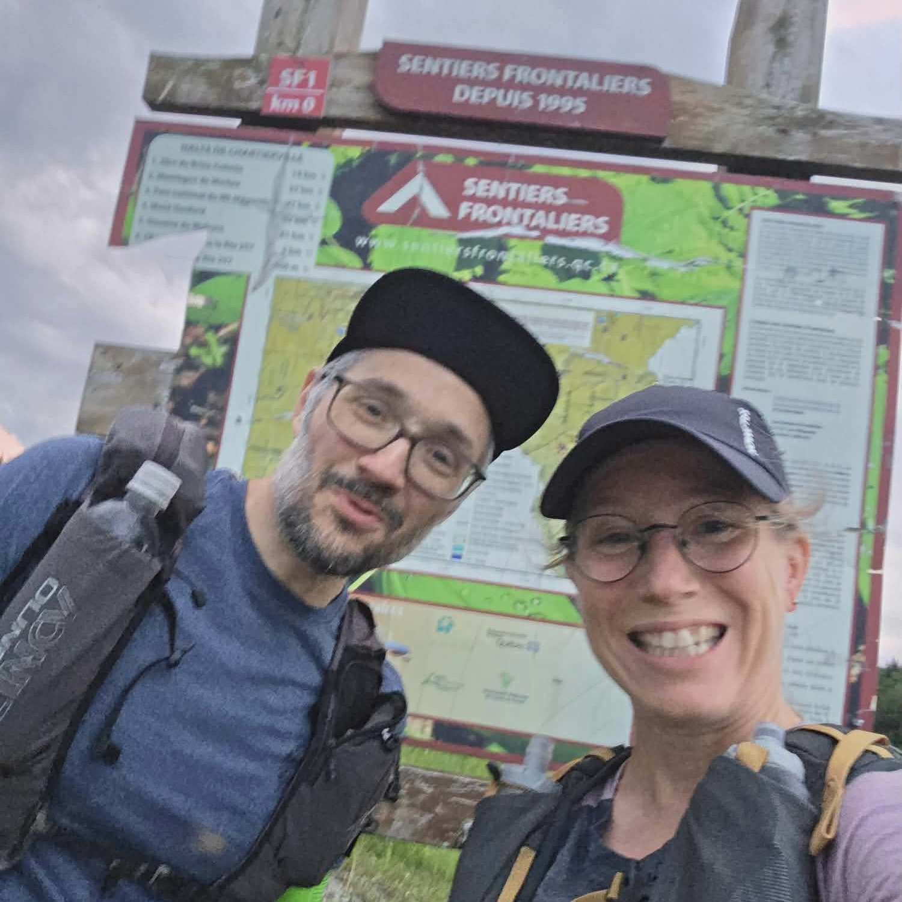
_C'est un départ!_

On a moins de difficulté à naviguer dans les 2 premiers km. Ensuite un bon bout roulant jusqu'à la montée de Salmon. La nuit s'en vient vite malgré tout! On retrouve une première fois la frontière, sous la nuit noire, en haut de Salmon. C'est déjà assez spécial de marcher sur la frontière. Ça ajoute un "kik" supplémentaire de faire ça en pleine nuit!!

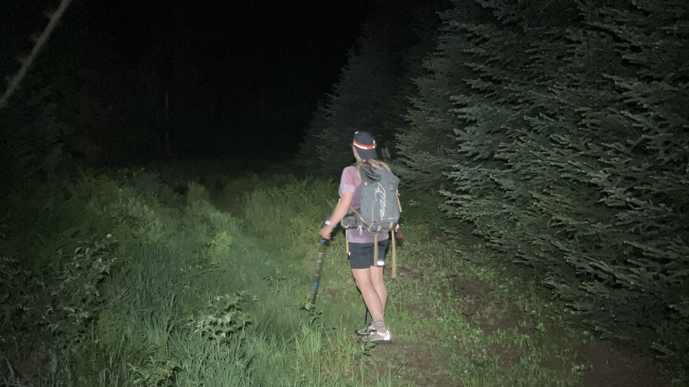
_Au mont Salmon!_

Ensuite la classique redescente sur l'abri trois-faces du Brise-Culotte (refill de l'eau!) et on remonte sur la frontière pour le Mont Trumbell. On a apprécié le ménage des bénévoles sur les sections nettoyées, c'est le fun quand ça roule! On passe l'intersection avec SF9 et le mont d'Urban, puis on va redescendre sur le rang du 10ème rang où est prévu notre second refill d'eau et la fin de la première section de ce défi. On est allé moins vite que l'an passé (environ 7h) mais l'idée était de se préserver pour la suite. Rien de spécial sur ce morceau, mis à part que c'est différent de courir ça en pleine nuit!!

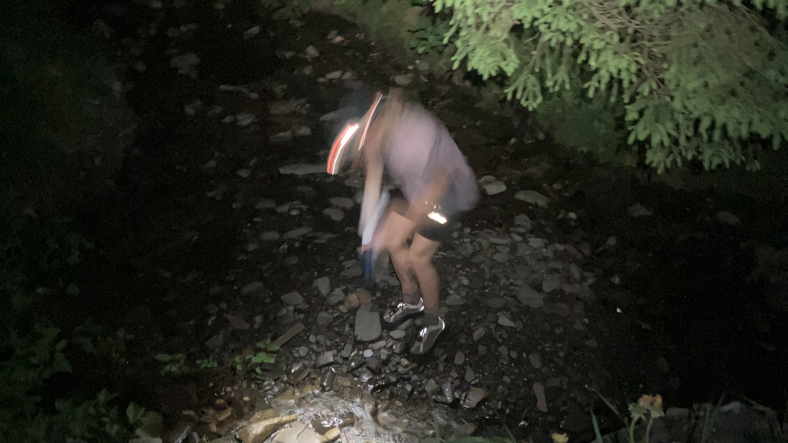
_Refill d'eau sur le 10ème rang, version impressionniste!_

## 10ème rang à l’accueil Gosford

Il est 3:30 du matin, on continue notre aventure. Après quelques centaines de mètres roulant sur le 10ème rang, il est grand temps de continuer à monter! On prend la direction de la frontière à nouveau, puis on on glisse jusqu'au lac Danger. Vers 4:30, le ciel commence à s'éclaircir puis le soleil arrive petit à petit. C'est beau, on est dans une aventure hors du commun et je profite avec Marylin de ce beau levé de soleil au milieu de la montagne. On est chanceux!

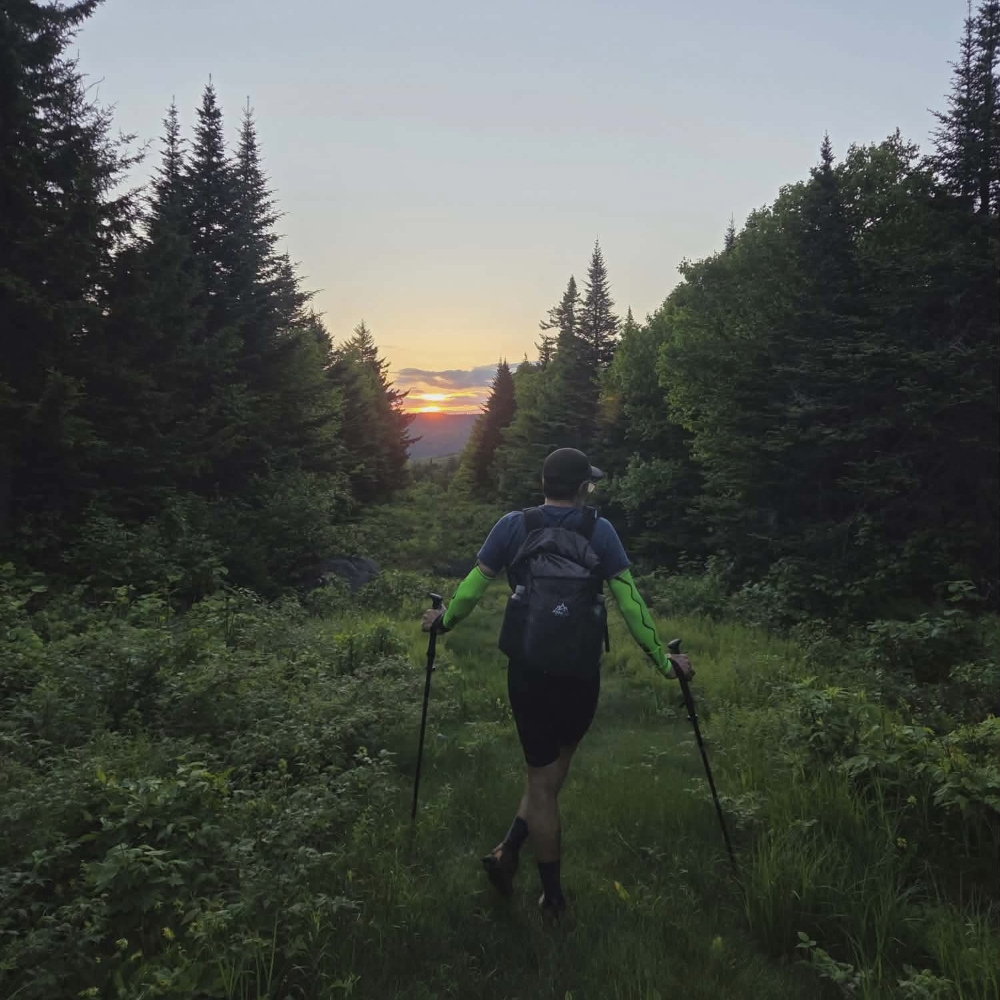
_Le soleil se lève sur la frontière!_

Encore sur cette section, pas trop de soucis d'orientation, on est à l’affût des balises et on se souvient de l'an passé. C'est plus fluide. Pause rapide au lac (pas de refill, on estime qu'il nous reste assez d'eau pour aller jusqu'à l'abri des Appalaches au km42). On attaque donc la fameuse montée vers la Montagne de Marbre! Et là, je trouve que ça cloche. Ça fait bientôt 10h qu'on avance, donc il est encore tôt (environ 7h du matin) et il fait frais. Cependant je sue à grosses gouttes dans la montée, je ne suis pas du tout à l'aise. J'ai mangé correctement et régulièrement et on boit de l'eau. Que se passe-t-il? La montée est très pénible pour moi, et j'arrive au "faux-sommet" point de vue avec un chandail très humide et pas la meilleure forme du monde. En analysant mes symptômes, on estime tous les deux que j'ai pas assez consommé d'électrolytes. On y va pour un traitement choc avec pastille de sel + un bon 500mL d'electrolyte pour essayer de ramener le bonhomme dans le défi. C'est tôt pour être aussi vidé!

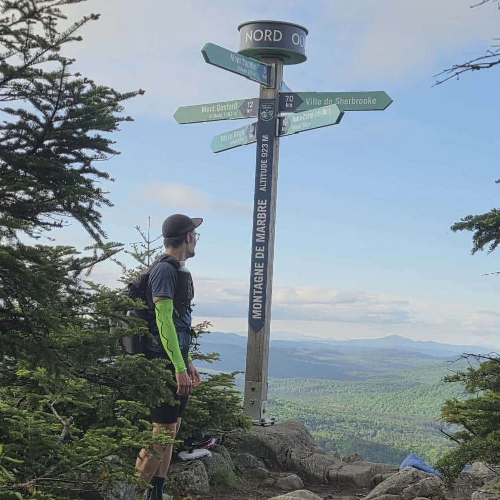
_Un gars un peu perdu sur la Montagne de Marbre!_

On repart assez vite pour ne pas prendre froid, en faisant un petit coucou au gars qui dormait au point de vue! J'essaie de récupérer tranquillement sur la phase plate entre Montagne de Marbre et Saddle, puis j'attaque Saddle avec beaucoup d'appréhension et la peur que ça fonctionne pas bien non plus! J'avais aussi en souvenir l'expérience d'Hugo l'an passé, et son combat contre la chaleur dans cette même montée de Saddle. Je ne croyais pas que j'allais "tomber" au même endroit! Finalement j'ai toujours pas des sensations exceptionnelles, mais la montée se fait avec moins de souffrance. Pour le reste du défi, je vais rester sensible sur les montées, mais effectivement j'ai mal préparé mon alimentation coté electrolyte sans doute. C'est à travailler pour les prochaines fois!

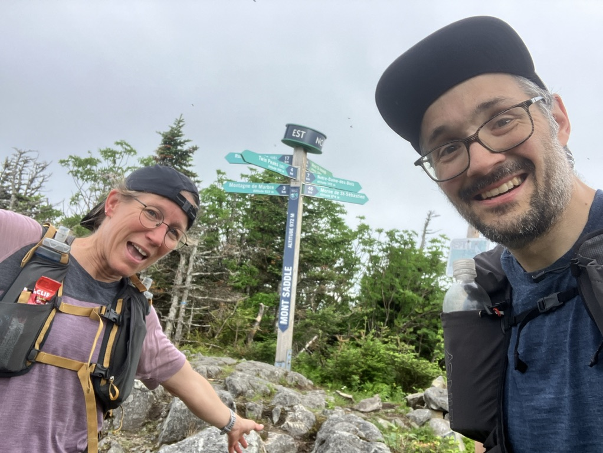
_Yes Saddle, on a réussi!_

Ensuite une descente jusqu'à l'abri des Appalaches, on arrive encore à trotter c'est bon signe! Refill au niveau de l'abri et changement de bas, une excellent idée, vu que le sol est plus sec maintenant. Retour sur la frontière (ça devient une habitude, mais ne pas oublier le nom du réseau de sentiers!) et une bonne section technique de 5km sur la frontière dont on avait gardé un mauvais souvenir l'an passé, Hugo étant plus très frais! Cette année, on savait à quoi s'attendre, on a pris les difficultés comme elle arrivaient, et on joggait un peu quand on pouvait. C'était assez confortable, on savait qu'on avait encore un gros morceau dans la ZEC pour finir notre défi! On arrive à l’accueil de la ZEC Gosford après 14h sur les sentiers (on s'est enregistré à 10h44 au bureau!). On est allé plus rapidement que l'an passé sur cette dernière section!

## De l'accueil Gosford jusqu'à la douane de Woburn

On était parti pour se dire: on prend un peu de temps mais on plie ça en 15mn. On reste finalement 30mn le temps de manger un peu, passer aux toilettes (grand luxe!), remplir l'eau, faire sécher les pieds...

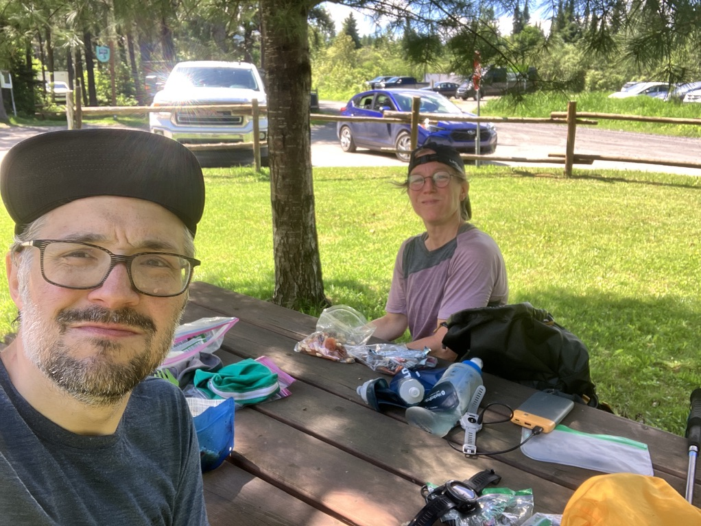
_Longue pause méritée à l'accueil de la ZEC Gosford_

Le confort, ça passe vite!! On essaie de pas trop penser qu'on avait stoppé ici l'an passé. Je découpe à nouveau mentalement ce dernière section en trois morceaux presque équivalents en distance:

- la montée vers le mont Gosford
- ensuite jusqu'au Trou du Diable
- la redescente vers la douane de Woburn

C'est aidant mentalement pour moi de voir ces "petits" tronçons de 10km max. Mais ça va être long quand même!

On veut vite se relancer dans l'aventure! Tout d'abord un bon 5km le long de la rivière Arnold sans dénivelé. On passe à coté des 3 plateformes de camping et on va commencer la longue montée vers le sommet Gosford. Je me trouve encore un peu "fragile" en montée, donc j'y vais à mon rythme, encouragée par Marylin qui aura été une source de motivation et un support tout au long de cette longue expédition! On fait un refill en eau au niveau de l'abri du ruisseau du Cap. On voit le bout de la montée, et là, surprise! On croise Monique notre chère présidente de Sentiers Frontaliers qui descendait après être montée pour une affaire de guêpes aux sommet (il n'y avait pas de guêpes finalement!).

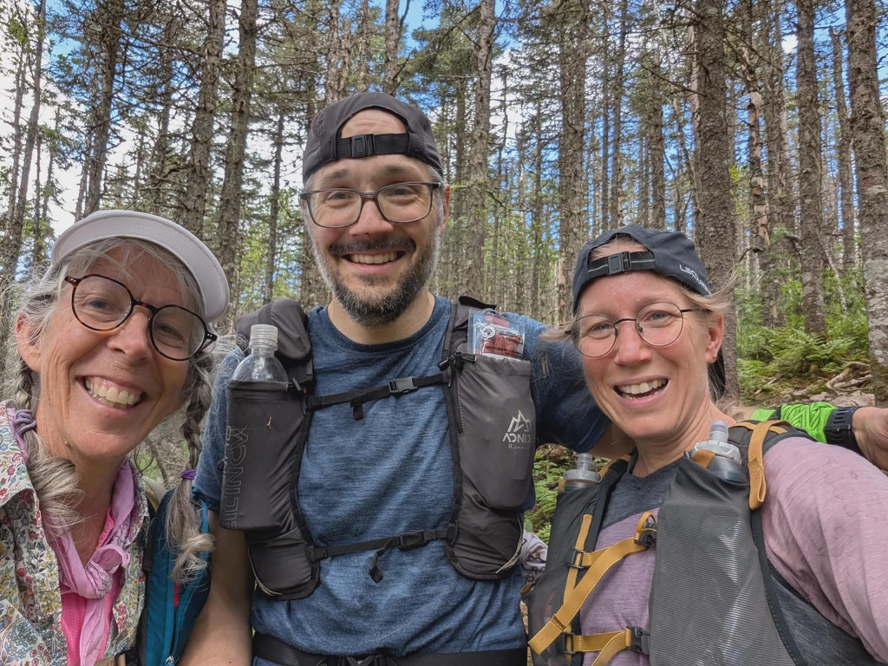
_On croise Monique en montant!_

C'est super le fun de la croiser à ce moment là! Elle n'était pas au courant de notre planning, donc la rencontre est totalement fortuite, mais ça m'a donné du peps pour finir ce grand projet! Depuis mon coup de suée sur la Montagne de Marbre, je n'étais pas 100% certain d'être en mesure de finir. Bref cette courte rencontre a été très bénéfique!!

Pause rapide au sommet du mont Gosford ensuite, juste le temps d'un snack, on a encore du chemin! Le passage vers le Petit Gosford est assez splendide, et je suis pas passé souvent sur ce sentier, donc j'en profite. C'est beau! On choisit de prendre le chemin qui passe par le sommet du petit Gosford, parce que pourquoi pas!

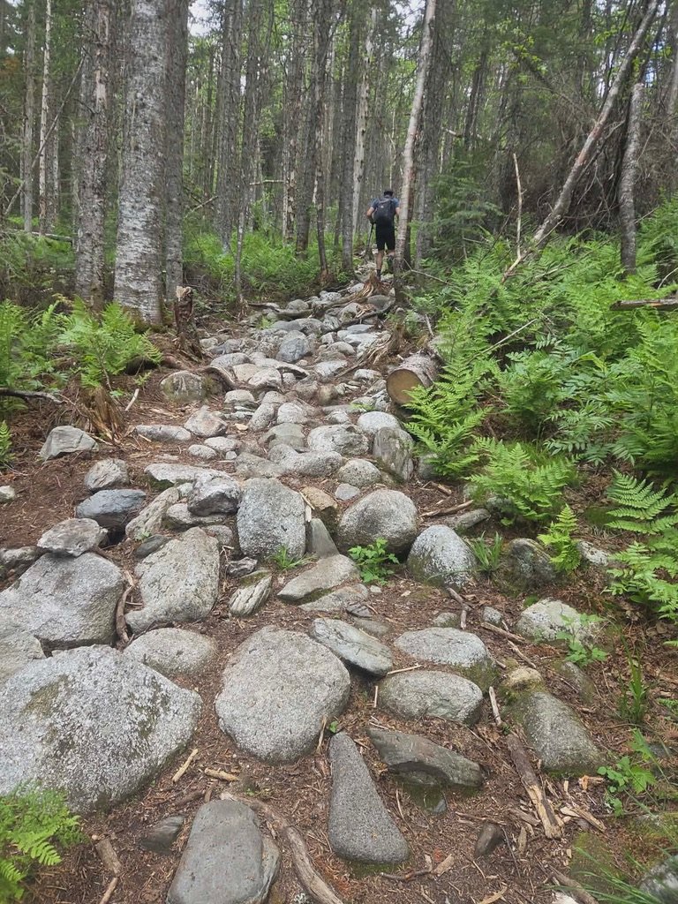
_Montée rocailleuse vers le Petit Gosford_

Passage rapide au niveau des plateformes après le sommet sans vue, je suis étonné de voir des randonneurs avec des souliers bien propres. Il semble que le stationnement proche du Petit Gosford soit à nouveau accessible en auto! Et finalement on reprend un peu de montée pour grimper vers la frontière juste à côté de Cap-Frontière. On va commencer la partie qui est indiqué comme "section à niveau de difficulté élevée", et je confirme! J'avais eu l'occasion d'aller jusqu'au km69 dans le cadre d'une corvée en septembre dernier, mais aujourd'hui le même sentier me parait bien plus compliqué. La progression est lente avec des up-and-down constants. On doit souvent mettre les mains. Certains passages sont presque "engagés" (bref tomber n'est pas une option ici).

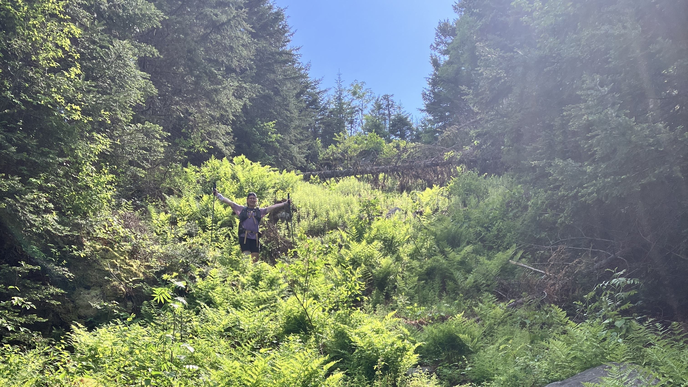
_Marylin au milieu des fougères!_

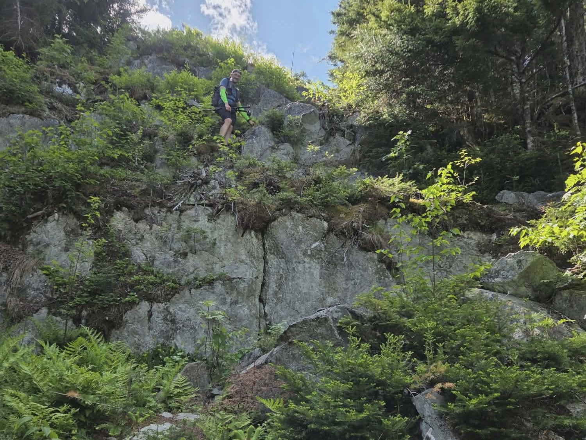
_Julien qui descend un cap rocheux_

En observant les données GPS à posteriori, Le kn 67 nous aura pris plus de 26 minutes à parcourir, ce qui est relativement assez long vu le rythme habituel sur ce genre d'aventure. Mais on prend ça un kilomètre à la fois, on aime ça!

En arrivant à la vue du Trou du Diable au km71, on se rend compte effectivement du "trou". La frontière, sur laquelle on navigue, "tombe" littéralement d'une centaine de mètres avant de remonter en face. On a l'impression de "tomber" pour aller jusqu'en bas! On a pas pris de photo, la fatigue commençait à affecter notre désir de ramener des images. On était rendu à un point qu'on avait juste envie de finir! En bas de la pente, je m'attendais à trouver un ruisseau. Je comptais dessus et j'avais indiqué à Marilyn qu'on pourrait se ravitailler en eau. La seul eau qu'on trouve au fond du Trou-du-Diable c'est de la glace qui n'a pas encore finie de fondre mi-juin, une vraie réserve de fraîcheur naturelle! Mais un soucis pour nous deux, avec une bien faible réserve d'eau pour finir les 10km qu'il reste à parcourir sur le sentier. Notre dernier ravitaillement en eau c'était en montant le Mont Gosford!

On décide de continuer le chemin, on fait un petit crochet vers les plateformes du Trou-du-Diable dans la montée pour voir si il n'y a pas un ruisseau proche, mais pas de chance pour nous. Il me reste un 300mL d'eau, ça va être sec pour les derniers kms!

Ce dernier tronçon de 10km est plus simple que le précédent, la frontière est "plus régulière" et on avance moins lentement. Quelques arbres en travers nous ralentissent, mais j'ai trouvé que ce n'était pas si horrible que cela. Le manque d'eau est plus problématique! Finalement après quelques kms je trouve une "swompe" pas trop moche et je décide de remplir ici. Marylin n'a pas confiance et préfère attendre mieux (on trouve un vrai ruisseau 3km avant l'arrivée!). L'eau récolté était plutôt belle. C'est agréable de pouvoir boire! La fin est ensuite assez longue. On est à bout, autant physiquement que mentalement. Marylin prendre une méchante débarque, pas évident pour le moral! Moi c'est pas mieux, je commence à voir des autos garés sur la frontière qui passe juste à coté du sentier. Le manque de sommeil est criant! J'ai l'impression de revivre la seconde nuit lors de l'[UT4M](../2017-08-ut4m/) en 2017! Finalement on arrive au bout, au lac, on entend Hugo! On répond et ça donne un boost pour finir en courant sur le chemin forestier qui termine cette belle aventure. On se croit à la Barkley avec la belle barrière jaune qui marque la fin!

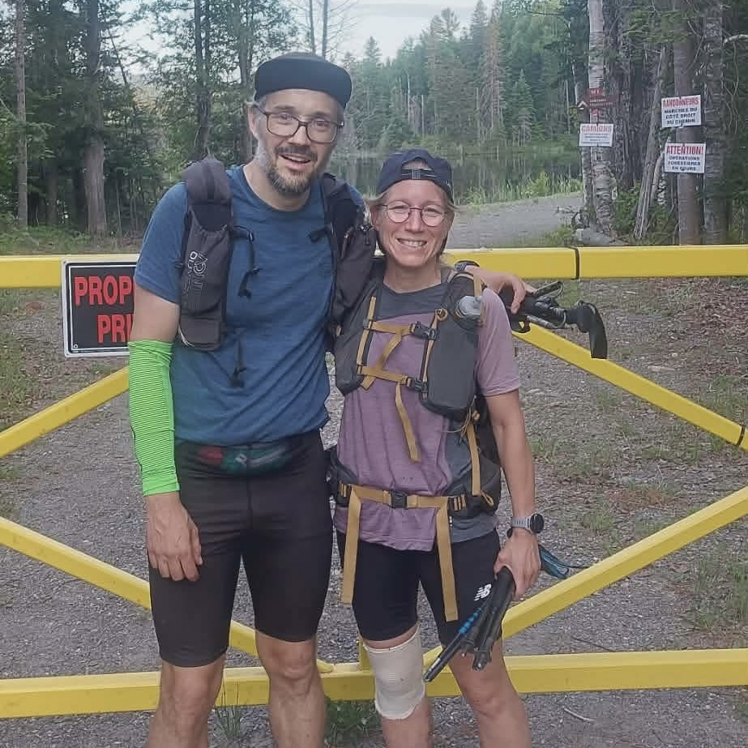
_On lit la fatigue dans mes yeux!_

La section Gosford nous aura pris 8h45 depuis l’accueil, pour un gros 29km. Pas si pire vu le milage effectué avant! Le dernier 10k a été fait en moins de 3h. On est heureux de finir sous le regard de Hugo, qui a veillé sur nous tout le long du trajet. Il n'était pas physiquement là sur le sentier, mais il était là avec nous, à veiller nos petits messages sur le InReach et Zoléo! Merci Hugo!!! Cette aventure était compliquée, et je suis heureux et reconnaissant d'avoir pu compter sur l'expérience de Marylin tout le long. J'envisage pas de faire genre de défi tout seul, je suis ben trop moumoune pour SF1 en solo comme on dit ici... Merci les amis, c'est vraiment le fun d'arriver à construire ce genre de plan ensemble... Est-ce que j'ai envie d'y retourner? J'écris ce récit le lendemain (dimanche) et non, la difficulté me donne pas le goût de recommencer ça. Mais j'ai l'impression qu'on oublie souvent les sections difficiles de nos souvenirs pour ne garder que le bonheur et les moments magiques passés au milieu du bois...

## Le matériel

Voici le matériel emmené ci-dessous. Beaucoup de linge "au cas où" et pas mal de nourriture. Je dois retravailler la partie hydratation!

[Lien ici](https://docs.google.com/spreadsheets/d/1fhvpZv2VniEtJAEmF6waeXKBfXN1aReSE3wYq2ifAwg/edit?gid=0#gid=0)

## Tracé Strava

Le lien vers le tracé sur [Strava](https://www.strava.com/activities/18916309269/overview)!
