import photo2012 from "./B46A7827-5699-4C2F-A104-819CCCBDFC0C_1_102_o.jpeg";
import photo2026 from "./06278070-2CEA-4C94-B9B5-0E228FFE40E0_1_105_c.jpeg";

## Le projet

Après notre baptême de longue randonnée réussi sur la traversée de Charlevoix l'an passé (voir [ici](../2025-08-demi-traversee-charlevoix/)), on se cherchait avec Marion de quoi faire en 2026. Ça tombait aussi avec une année ou on voulait rentrer en France voir nos familles pour les vacances d'été. Ça a pas été long de relier les deux fils et de suggérer de refaire le tour du Queyras (GR58), une randonnée qu'on a déjà parcouru deux fois en [2008](../2008-08-queyras/) (en couple) et en [2009](../2009-07-queyras/) (avec des amis). On a proposé aux enfants de "boucler la boucle" et de les guider dans ce territoire qu'on aime tant dans les Hautes-Alpes françaises.

## Le trajet

On connaît bien le territoire et on veut ajouter notre séjour afin de le "calibrer" pour nos enfants, l'idée comme d'habitude c'est pas de les brûler mais de leur faire découvrir et profiter du coin. L'an passé par exemple, l'étape de 15 km avait été trop longue pour Marcus qui avait 9 ans. Donc on veut ajuster pour faire des étapes réalistes malgré le dénivelé qui sera plus important que dans nos montagnes québécoises. On va finir par se rapprocher de notre version 2008, avec un tour qui ne passe pas par Ceillac pour éviter la montée / descente dans la vallée ; on enlève aussi le passage au fonds de Cervières, et on "skippe" la colette de Gilly vers Abriès. C'est effectivement un tour un peu allegé, mais cela permet de le faire rentrer dans 7 jours avec des étapes qui ne dépassent pas 12km et environ 1000m de dénivelé positif par jour.

[Lien vers l'itinéraire prévu](https://caltopo.com/m/3D0M02E)

Coté hébergement, on souhaite casser un peu la routine bivouac qu'on a au Québec et profiter du confort des refuges avec formule demi-pension. C'est un avantage en Europe de pouvoir finir sa journée de randonnée et de mettre les pieds sous la table au souper, profiter d'un lit en dur! Donc un peu comme en 2008/2009, on planifie un peu de bivouac, un peu de camping régulier, et un peu de refuge pour rester dans un budget raisonnable.

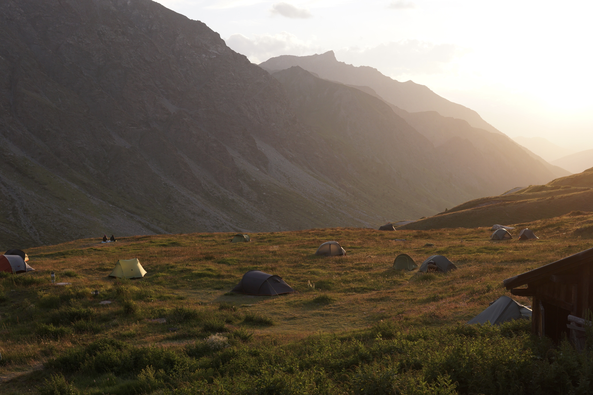
_Formule "campeur" au refuge Agnel_

Le tableau ci dessous résume le programme jour par jour, avec l'hébergement prévu. On avait prévu de dormir également au camping de Brunissard la veille du départ (camping de l'Izoard). On a pris la formule "campeur" au refuge Agnel, donc on plante la tente et on réserve la demi-pension au refuge. A la fin de notre séjour, on avait prévu de passer quelques jours au camping de Molines, qu'on aime bien pour décompresser!

| Jour           | Départ               | Arrivée              | Distance | Dénivelé positif | Hébergement du soir                     |
| -------------- | -------------------- | -------------------- | -------- | ---------------- | --------------------------------------- |
| 1 (15 juillet) | Arvieux (Brunissard) | Chalet de Furfande   | 11.1 km  | 940m             | Bivouac derrière le chalet              |
| 2 (16 juillet) | Chalet de Furfande   | Chalets de Bramousse | 9.9 km   | 649m             | Bivouac                                 |
| 3 (17 juillet) | Chalets de Bramousse | St Véran             | 12.8 km  | 1056m            | Gîte Les Gabelous ½ pension             |
| 4 (18 juillet) | St Véran             | Refuge Agnel         | 12.3 km  | 932m             | Refuge Agnel ½ pension                  |
| 5 (19 juillet) | Refuge Agnel         | L’Echalp             | 10.7 km  | 292m             | Camping de Abriès + resto               |
| 6 (20 juillet) | Aiguilles            | Souliers             | 11.3 km  | 674m             | Refuge Le Grand Rochebrune ½ pension    |
| 7 (21 juillet) | Souliers             | Arvieux (Brunissard) | 9.7 km   | 660m             | Pas d’hébergement prévu le dernier soir |

On avait également proposé à notre famille de nous accompagner. J'avais donc fait un Google Doc pour rassembler toutes les informations pertinentes afin de faire les réservations adéquates, et des infos sur quoi mettre dans son sac à dos, avec le détail de notre propre équipement. On a aussi construit une liste de repas jour par jour! Au final on a réussi à être accompagné chacun des 7 jours de notre randonnée, c'était un succès sur le plan de l'accompagnement!

_En bonne compagnie au lac Souliers!_

## Le récit

### Mardi 14 juillet

Après un début de séjour en France à Paris où il fait définitivement trop chaud en ce mois de juillet en France, Marion avait planifié de courir une course de trail entre frères et sœurs à Corrençon-en-Vercors (Trail de la Fleur de Lys) le 14 juillet. On arrive donc assez tard en fin de journée au [camping de l'Izoard](https://campingdelizoard.com) à Brunissard. On y avait déjà commencé notre tour en 2009, mais le camping a bien evolué depuis! Un beau coin "itinérant" a été aménagé pour les personnes en sac à dos ou à vélo, c'est là qu'on s'installe. Pour ce début de tour on sera un groupe de 8: nos 3 enfants, Anne (la sœur de Marion), Louis et Augustin (deux neveux du coté de Marion).

On demande aux jeunes (Eliott, Louis, Augustin) de nous préparer le souper: des pates aux chorizo avec de la sauce tomate. Ils se débrouillent bien avec le peu de matériel qu'on a! De notre bord avec Anne on organise les sacs de nourriture pour les 4 prochains jours, qui sont principalement en bivouac. On avait planifiés et partagés les achats en avance mais il faut maintenant mettre en commun et organiser logiquement les vivres. C'est long! On a plutôt de la nourriture "fraîche" sur ce tour, on s'appuie sur le livre "Food Rando". Marion comme à son habitude en début de randonnée est plutôt nauséeuse, donc elle est sous la tente! Le col de l'Izoard ne l'a pas épargnée!

Finalement on arrive à organiser notre bouffe, et on mange rapidement. Miam! Il reste à déposer l'auto d'Anne au niveau du refuge Agnel car elle va nous quitter lors de cette étape. On rentre vers 22h au camping pour un dodo bien mérité!

### Mercredi 15 juillet

Réveil assez matinal, il faut encore placer les sacs de nourriture dans les sacs à dos de chacun! C'est le dernier stress avant de démarrer l'aventure! Petit déjeuner, pliage des tentes et on arrive à décoller du camping vers 8h48, c'est pas si pire! On laisse une auto au camping qu'on retrouvera dans 7 jours! C'est les premiers pas avec le sac à dos chargé. C'est lourd! De mon bord j'ai pris un souper et un diner, chacun pou 8 personnes.

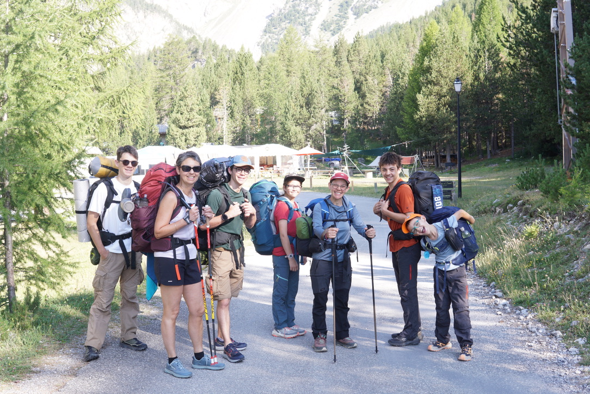
_traditionnelle photo de départ!_

On commence par quelques courbes de niveau à coté des différents hameaux de Arvieux. Puis on commence la véritable montée vers le col de Furfande, qui est notre premier test de dénivelé avec pas moins de 900m à gravir aujourd'hui. On se prend un pause lunch très classique vers la cabane de Plan Vallon (plus ou moins à la moitié de l'ascension du col). Marion est à nouveau pas très en forme. C'est dur pour elle la fin de l'ascension! Le reste de la troupe est plutôt en grande forme, donc c'est plutôt une bonne nouvelle. Mais comme habituellement Marion avance quand même, et elle arrive en haut. Marcus découvre le vent au col, et il en devient fou, il essaie de sauter et de se faire transporter de quelques centimètres!

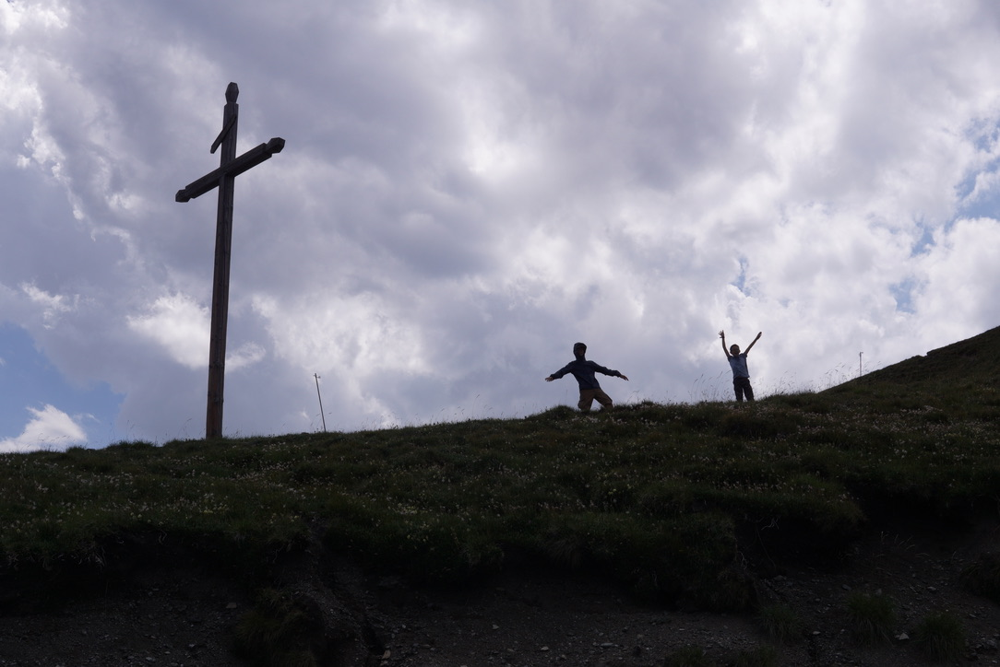

On redescend ensuite au niveau du refuge, c'est assez rapide. On s'assoit pour prendre une boisson de victoire pour cette première étape. On prend le forfait bivouac et douche pour un peu plus de confort, et on commence à placer nos tentes pour le premier vrai bivouac. Au moment de préparer notre souper (un mafé!) un orage de grêle nous surprend alors qu'on ne s'y attendait pas trop. On a tenté de placer la bâche au dessus de nous pour nous protéger, mais finalement on plaque la bâche à terre et on file tous dans nos tentes pour se protéger. Les tentes ont plus ou moins résisté au fort coup de vent, et la bâche a permis de "sauver" le repas! La tente noire utilisés par nos enfants a pris l'eau, elle était mal haubanée. On fait sécher les matelas et les sacs de couchage pendant le souper. L'orage n'aura duré qu'une dizaine de minutes mais d'une rare intensité! Un de nos voisins de bivouac a vu sa tente brisée pendant l'orage, et il va donc prendre une place dans le refuge pour la nuit.

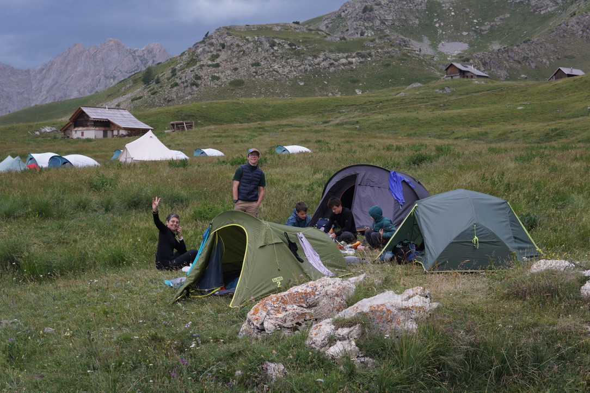

La soirée est ensuite bien plus tranquille, on se rentre dans nos sleepings quand le soleil se couche, après avoir profité une dernier fois du panorama exceptionnel avec les lumières du soleil rasant!

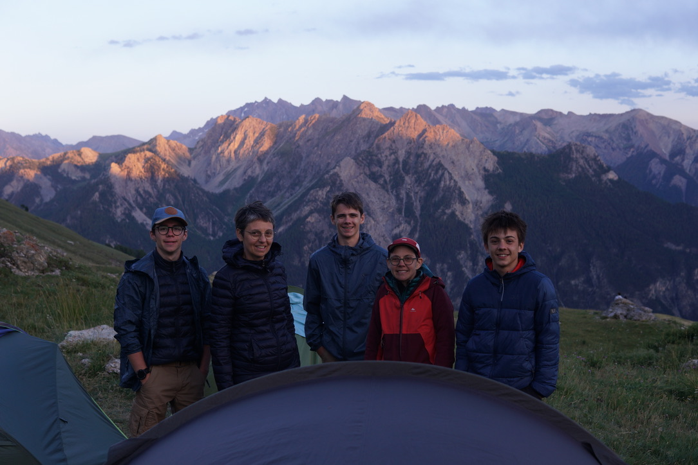

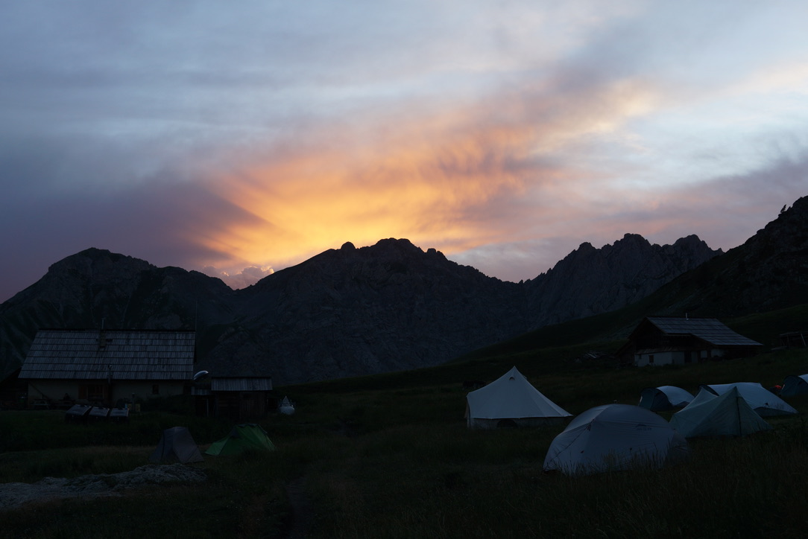

**Lien Strava de la journée**: https://www.strava.com/activities/19413822642

**Statistiques**:

- **Distance**: environ 12.5 km
- **Dénivelé positif**: environ 940 m

### Jeudi 16 juillet

Le réveil est un peu frais ce matin! J'avais oublié de bien attacher mon sac de couchage correctement: j'ai une couette/quilt et je dois ajuster les serrages en dessous de moi pour ajuster correctement l'apport de chaleur en fonction des conditions. La température est tombée à 8°C dans la nuit, ce qui est plutôt correct vu l'altitude (environ 2300m). Marion a bien dormi, et elle est prête pour une belle journée! On prend notre petit déjeuner et on plie les tentes pour repartir vers 9h15. On a d'abord une longue descente pour aller traverser le Guil à environ 1200m d'altitude.

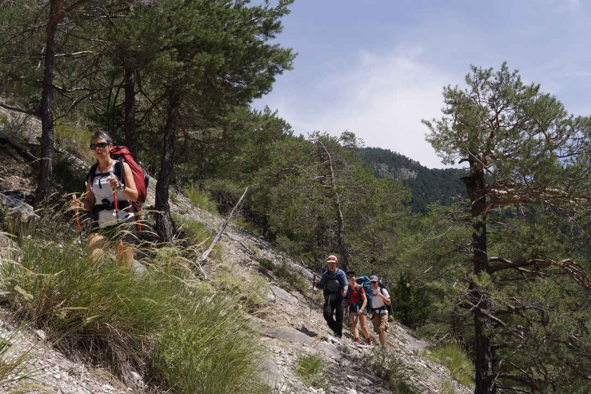

C'est toujours très long! Le chemin a été modifié pour éviter un long passage sur la route sur le bas de la descente, c'est apprécié! On fait notre pause lunch au niveau du Guil justement, les enfants en profitent pour se rafraîchir avec la rivière. Ce midi on a prévu une salade de pois chiche mais c'est un peu long à cuire malgré le trempage depuis le matin.

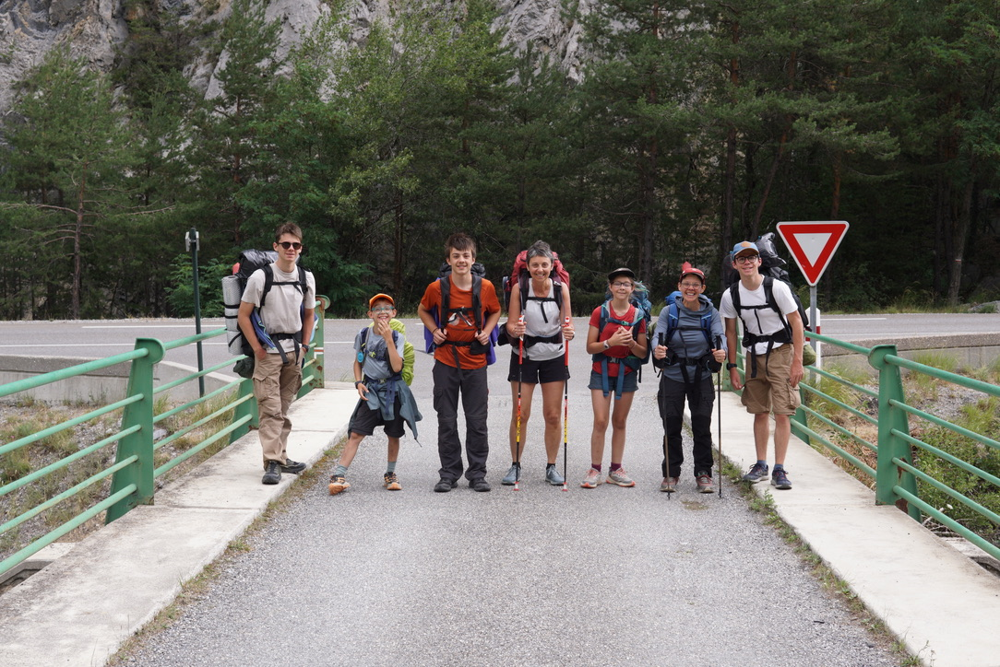

Nous avons ensuite une bonne montée de 600m afin d'arriver à notre bivouac de la nuit, autour des chalets de Bramousse. Finalement c'est plus dur que la veille car tout le dénivelé positif est effectué en après-midi. C'est le seul moment où j'entends Marcus râler de la semaine! Arrivés au niveau des chalets, on voit une affiche qui rappelle les règles pour le bivouac: pas avant 18h, pas après 9h et surtout à 1h de marche des hameaux, et les chalets sont effectivement un hameau de Bramousse! Lors de nos précédents tours, on avait systématiquement bivouaqué au milieu des chalets, cette année on est moins à l'aise... Finalement on se trouve un coin pour bivouaquer un peu au dessus des chalets le long du sentier vers le col Fromage, qui est plus discret qu'au milieu des chalets 😇.

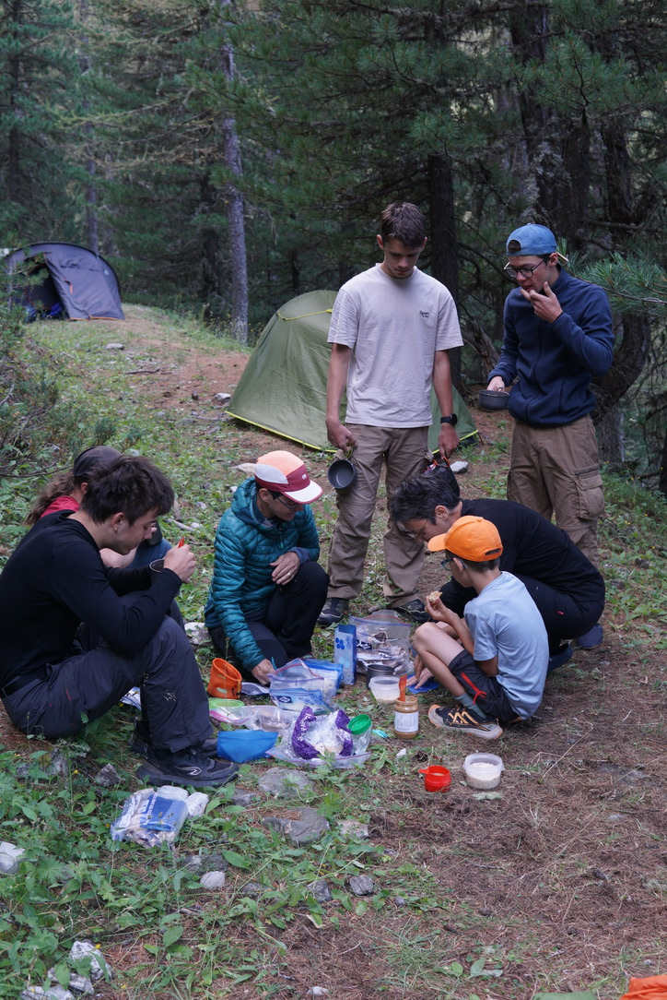

La soirée est belle. C'est moins haut (1800m?) donc on aura moins froid que la veille. On mange pour le souper un dal-baht avec des lentilles corail et du riz, c'est délicieux! On commence à avoir moins de gaz sur nos réchauds, est-ce qu'on aura assez pour tenir jusqu'au col Agnel et la cartouche de gaz en extra?

**Lien Strava de la journée**: https://www.strava.com/activities/19416954965

**Statistiques**:

- **Distance**: environ 10.5 km
- **Dénivelé positif**: environ 700 m

## Vendredi 17 juillet

C'est la plus grosse journée qu'on a planifié! On avait décidé de se lever tôt (6h45) pour partir pas trop tard, plier les tentes avant de déjeuner. Après notre traditionnel gruau, on décolle vers 8h45. Au programme, un enchaînement de 3 cols dont le col des Estronques qui culmine à environ 2900m d'altitude!

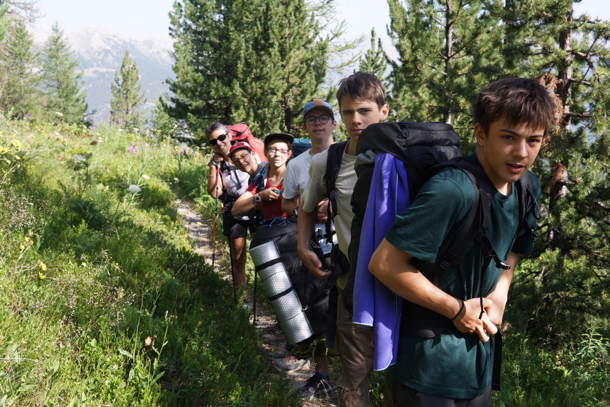

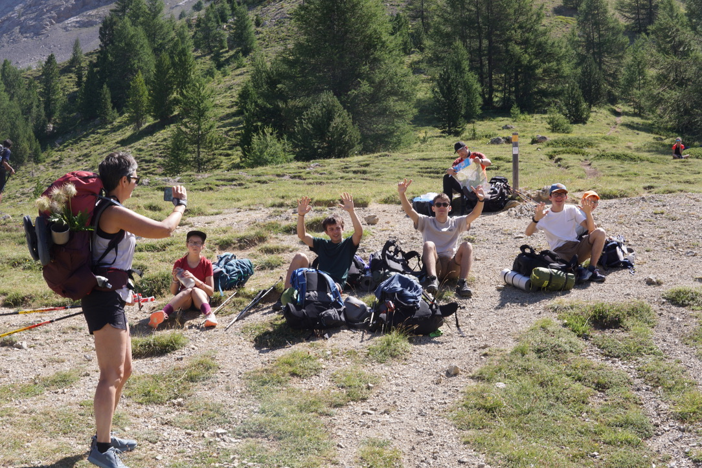
_Au col Fromage_

Mais l'avantage de la journée est que la majorité de la progression se fait à flanc de montagne sans descendre trop dans la vallée lors de chaque passage de col (par exemple entre le col Souillet et le col Fromage). Sur le chemin on arrive à voir le village de Ceillac qu'on a "skippé" en prenant le col Fromage. C'est un de nos ajustement par rapport au tracé officiel du GR58 qu'on s'est permis 😊. On arrive à monter le dernier col avant notre pause lunch! On se pose juste après le col des Estronques, un peu protégé du vent. On a du vent en haut, Marcus en profite au maximum! On se fait une sorte de pizza sur pita ce midi!

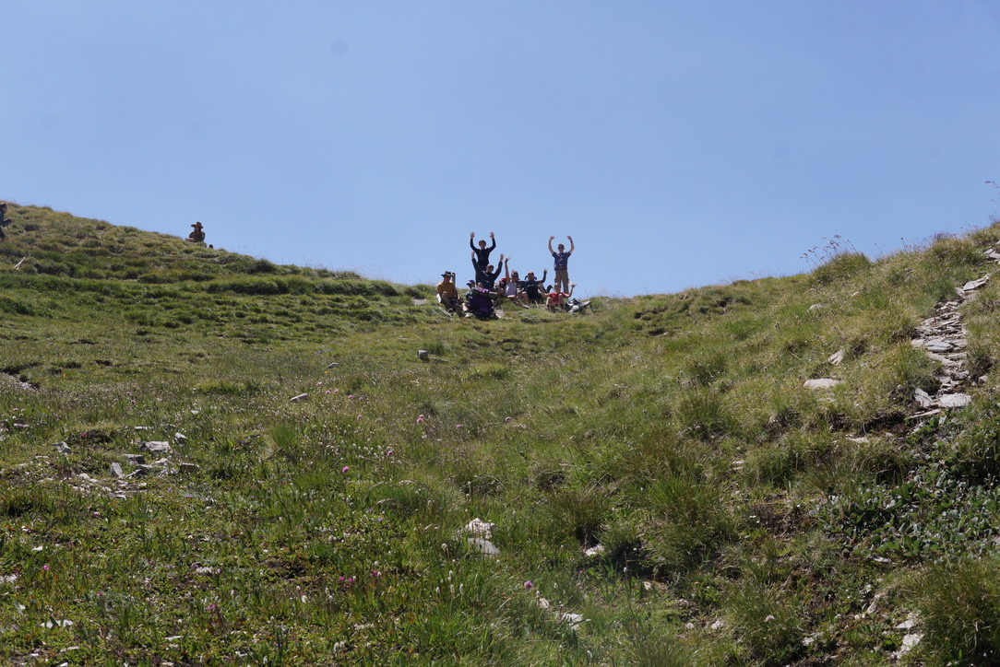
_Pause au col des Estronques_

Ensuite on a une belle descente pour rejoindre la cascade de a Pisse, à coté du village de Saint Véran qui est notre étape pour la nuit. Sidonie et moi on est les seuls à sortir les maillots de bain pour prendre la pause sous la cascade! Il ne reste qu'à se motiver un peu pour finir les 200m de dénivelé pour atteindre Saint Véran. C'est l'heure de faire quelques achats à l'épicerie du village pour les 2 prochains jours. On retrouve ensuite le confort d'un gîte ce soir aux "Gabelous", c'est la première fois qu'on fait étape ici! Le souper et le déjeuner sont inclus dans la formule demi pension, c'est très apprécié! On en profite aussi pour faire un peu de lavage de nos vêtements (le soleil sèche vite!), et prendre une bonne douche bien chaude! On croise aussi Guillaume, Audrey, Léandre, Joannie et Anatole qui vont nous rejoindre à partir de demain pour finir le tour avec nous! Ensuite souper de roi (croziflette) et un dodo un peu trop chaud dans le gîte!

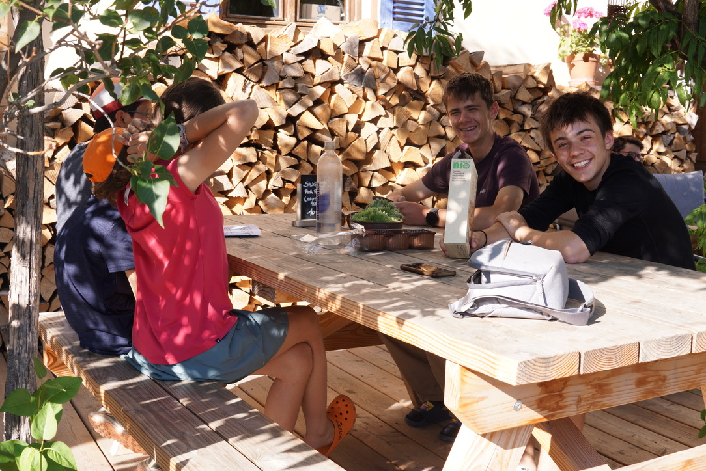
_Confort au gîte!_

**Lien Strava de la journée**: https://www.strava.com/activities/19416969134

**Statistiques**:

- **Distance**: environ 12 km
- **Dénivelé positif**: environ 1000 m

## Samedi 18 juillet

On se lève et on prend un bon déjeuner au gîte, ça nous change un peu du gruau traditionnel! La seconde partir du tour est plus "assisté" que la première, avec moins de bivouac et plus de refuge, donc ça veut dire moins de poids dans les sacs et plus de confort! Après s'être rempli de céréales, pain, yaourt, on est prêt pour une nouvelle journée. On se retrouve avec Guillaume et sa gang à la sortie du village en direction de la chapelle de Clausis et du col de Chamoussière, notre objectif du jour.

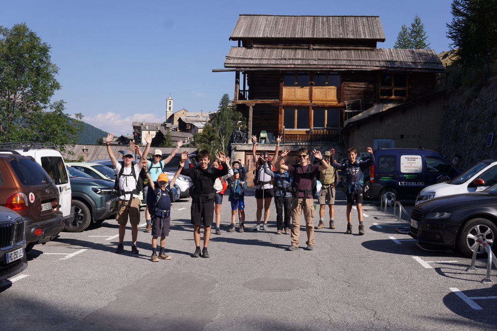

C'est aussi le dernier jour de Anne, Louis et Augustin donc on va profiter d'une journée avec un groupe de 13 personnes! On décolle tous ensemble vers 9h20, pas si pire vu la coordination avec l'auto de Guillaume à Saint Véran.

Le début de la randonnée est très facile avec pas mal de piste forestière sans gros dénivelé jusqu'à la chapelle. On décide de ne pas prendre notre pause lunch à la chapelle (c'est un spot lunch ben classique!) mais on monte un peu plus haut pour profiter d'une pause à côté d'un petit ruisseau pour recharger notre stock d'eau. Un bon classique pain/jambon/saucisson/fromage ce midi avec notre ravitaillement de Saint Véran. C'est très bon!

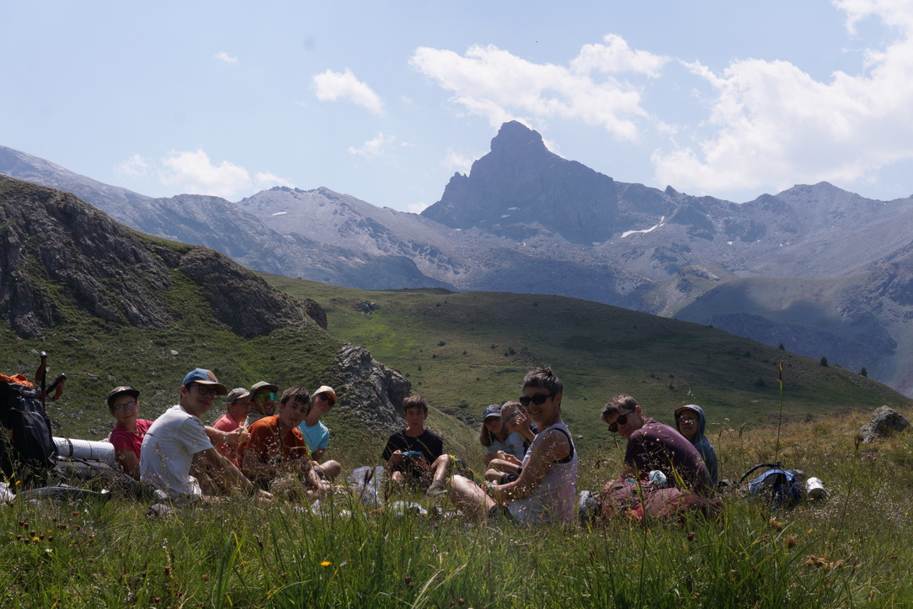

Ensuite on entame la longue montée vers le col de Chamoussière. Les enfants sont pas mal en tête, avec entre autre Marcus et Anatole qui sont les plus jeunes. Ils sont plus rapide en tête que derrière les parents, c'est très psychologique tout ça!! J'essaie de prendre une accélération pour les dépasser au col, mais je pars un peu trop tard et certains enfants sont déjà au col quand j'arrive!

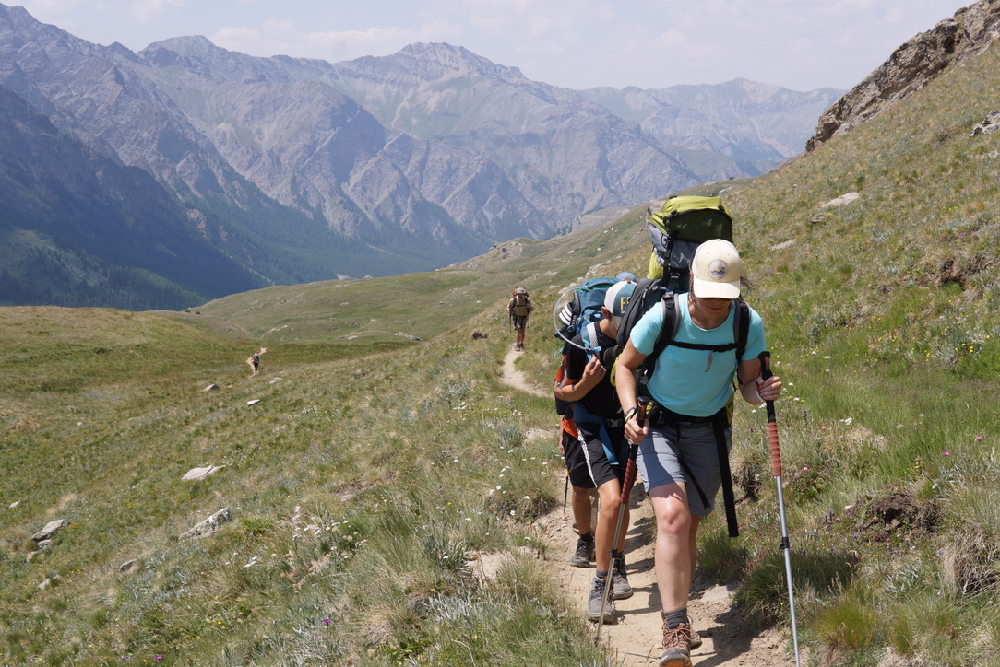

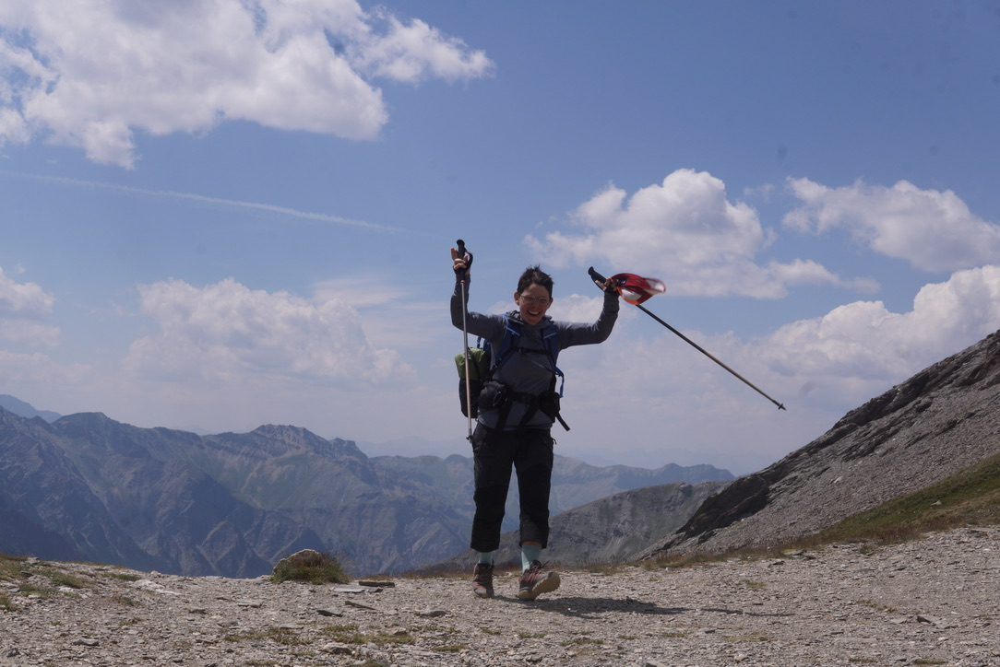

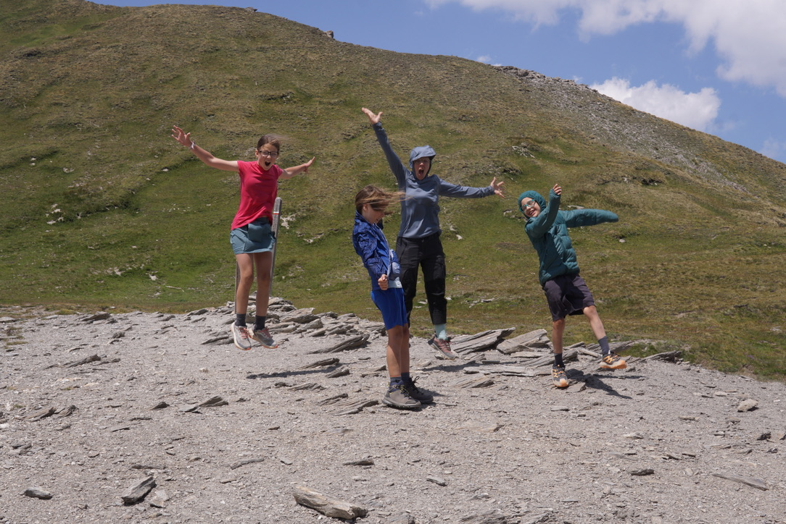

On retrouve en haut une famille qui randonne avec un âne, qui a décidé de faire un pause plus longue que prévue par la famille! 🤣 On les retrouvera au bivouac à côté du refuge Agnel en soirée. Ensuite une descente dans les cailloux jusqu'au refuge Agnel, Anne en profite pour passer ramener son auto au plus prêt du refuge. Elle va passer la nuit avec nous avant de repartir en auto le lendemain matin avec les 2 cousins Louis et Augustin.

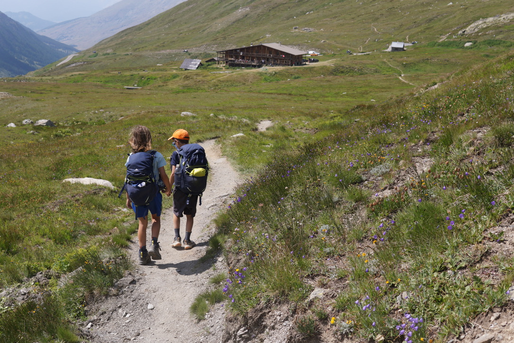

Le refuge Agnel est un "gros" refuge avec une capacité de plus de 100 lits. Donc c'est un peu l'usine pour prendre sa douche (on a pris la formule campeur donc on pose la tente mais on a accès au refuge pour souper, déjeuner, toilette et douche!) et prendre une consommation en terrasse. On arrive à poser nos tentes vers 18h (on respecte la réglementation!). Le repas est bon au refuge: chiffonnade et jambon et gratin de pommes de terre, mais c'est beaucoup plus bruyant que le précédent gîte au village de Saint Véran. Belle nuit ensuite après notre traditionnelle séance de photo de coucher de soleil. La nuit ne sera pas si froide (environ 7 ou 8°C) alors qu'on est plus haut que Furfande (environ 2600m d'altitude ici). Je m'habille mieux donc je ne souffre pas du froid!

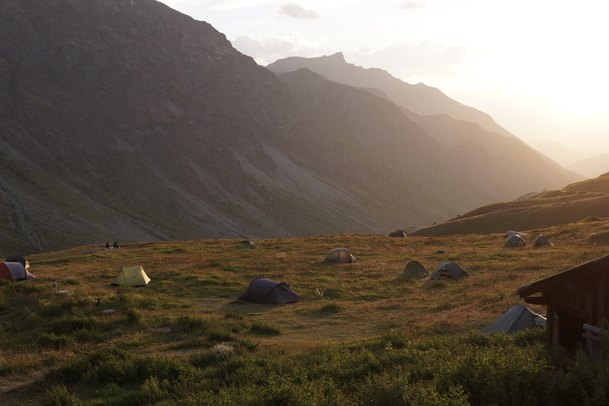

**Lien Strava de la journée**: https://www.strava.com/activities/19416983863

**Statistiques**:

- **Distance**: environ 12.5 km
- **Dénivelé positif**: environ 950 m

## Dimanche 19 juillet

Une belle nuit, sans avoir trop froid, c'est agréable! C'est encore plus agréable quand on peut rentrer au refuge le matin à 7h pour prendre son petit-déjeuner! Par contre c'est le moment des adieux pour Anne, Louis et Augustin. Ils ont à priori bien aimé l'expérience (sans doute moins les sacs à dos un peu pesant! Ca tournait autour de 12 kg lors de la pesée à Saint Véran!) Ils ont même droit à une "Ola" pour leur sortie du groupe!

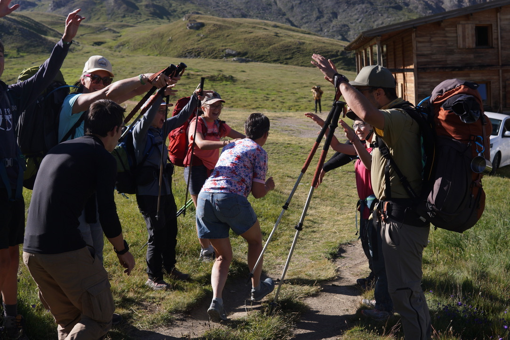

On part vers 9h en plus petit groupe (juste 10!) pour une étape sur le papier pas très compliquée, avec peu de dénivelé positif jusqu'au col vieux, puis une longue descente jusqu'à l'Echalp. On profite du paysage du lac Egourgeou pour faire une longue pause lunch (taboulé avec tomates! on a juste attendu 15mn que la semoule gonfle avec de l'eau froide!). On visite pour la première fois des cabanes de berger en pierres sèches juste au dessus du lac, je n'ai pas le souvenir de les avoir vu lors de mes précédents passage ici. On vois des traces de passage qui datent du milieu du XXème siècle.

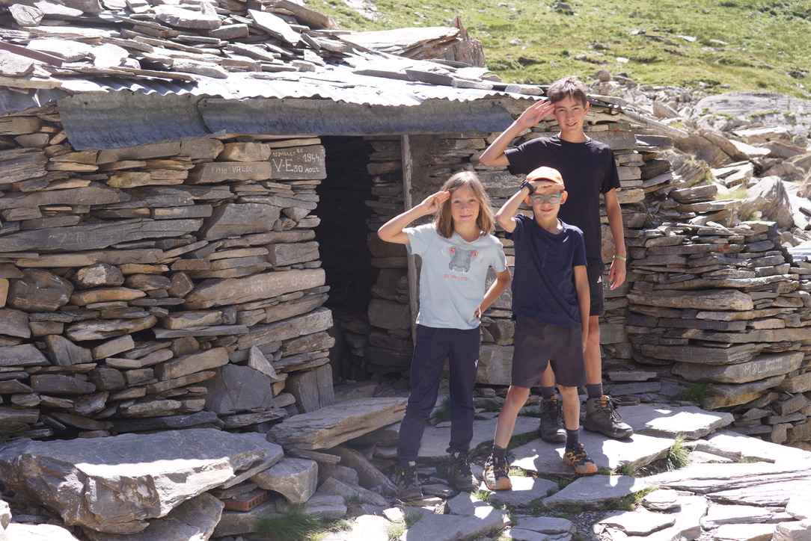

Je suis un peu agacé par le rythme du groupe, c'est comme si il y avait un peu trop de pauses à mon goût! Après réflexion c'est sans doute lié au fait qu'on arrive au 5ème jour de notre aventure, et on est bien rodé, il faut trouver ses marques avec Guillaume Audrey + les enfants qui sont uniquement au second jour! On compte aussi sur une navette en bas afin de nous avancer jusqu'à Abriès et le camping, et j'ai pas noté en avance les horaires. Bref le stress est là!

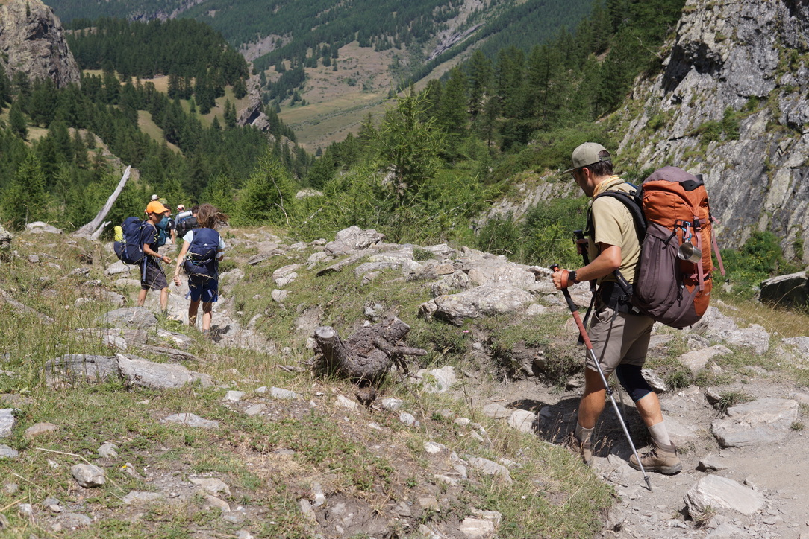

Finalement on arrive en bas autour de 16h et la prochaine (et pas mal seule) navette passe vers 16h50 donc tout est beau. On en profite pour avancer en comité réduit jusqu'à "La Monta" afin de ne pas poireauter pendant 50 minutes 😇. La navette arrive à l'heure et on atterrit finalement à Abriès. On a du mal à se coordonner entre l'épicerie qu'on veut faire pour le soir et les prochains jours, et le camping où on veut passer la nuit. La nuit au "Caravaneige" à l'entrée de Abriès va nous coûter la modique somme de 120 euros pour 10 personnes, c'est pas mal cher par rapport à ce qu'on paie ailleurs. Mais on va dire que le service est plus qualitatif avec douches illimitées et papier toilettes disponible aux sanitaires!

Le souper sera un peu improvisé avec les restes des étapes précédentes (une sorte de Dal Bhat) avec quelques pates en extra. Mais surtout des fruits et du melon frais de l'épicerie, ça change tout! On finit le soir avec une crème glacée au bar du camping (standing on vous dit!) alors que la finale de la coupe du monde de soccer joue sur grand écran!

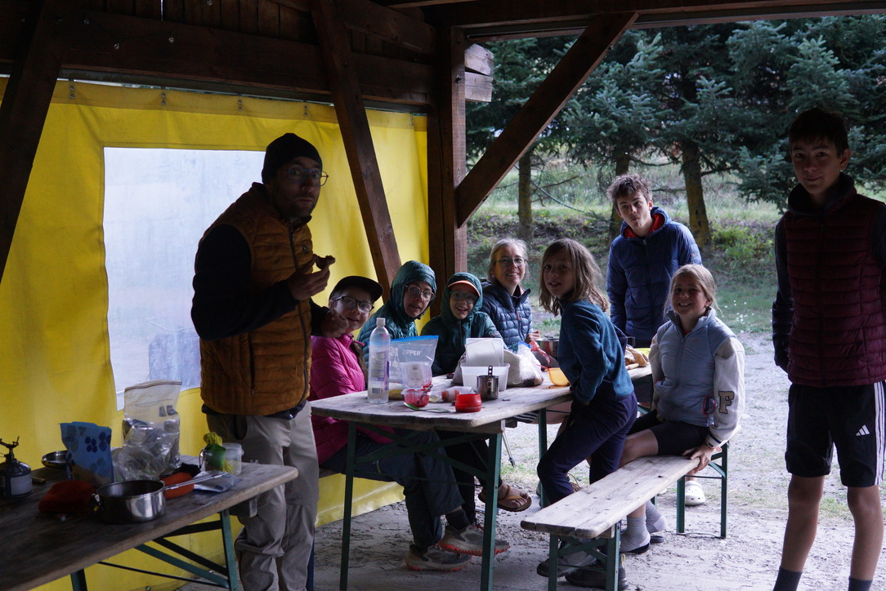
_Souper improvisé!_

**Lien Strava de la journée**: https://www.strava.com/activities/19416998368

**Statistiques**:

- **Distance**: environ 12.5 km
- **Dénivelé positif**: environ 300 m

## Lundi 20 juillet

On commence à voir le bout de l'aventure, c'est déjà le 6ème jour de randonnée! Nuit un peu froide malgré une altitude plutôt basse, la proximité du cours d'eau a sans doute été un facteur. On a mis le cadran à 6h30 afin d'être en mesure d'attraper la navette qui nous amènera à Aiguilles pour le début de notre trajet. Cela permet d'éviter à la fois la collette de Gilly la veille et le passage au hameau des "Fonds de Cervières" qui aurait trop allongé notre tour. Encore une fois on peut se permettre de calibrer notre aventure comme on le souhaite! On arrive à prendre notre navette à 8h40. En arrivant à Aiguilles après le passage sur la nouvelle route qui évite les éboulements (impressionnant!) on fait un brin d'épicerie pour les 2 derniers lunchs qui nous restent, sachant qu'on dort le soir en refuge avec demi-pension.

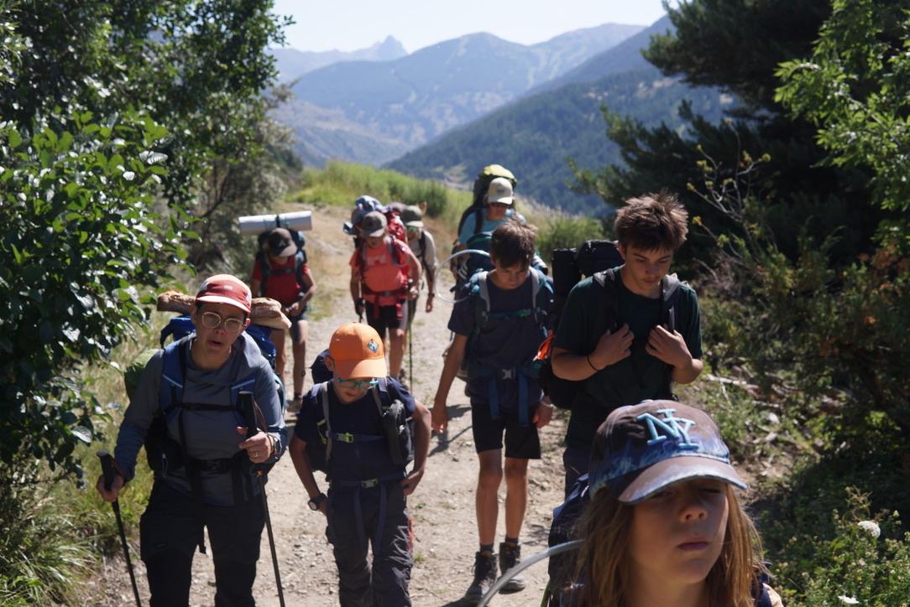

On arrive à réellement partir à 10h sur le sentier, c'est un peu tard. On commence la longue montée vers le village de Souliers, et il fait déjà très chaud. Il n'y a pas beaucoup d'ombre et on est relativement à basse altitude. On est un peu mêlé car les panneaux d'affichage qui indiquent Souliers à 16 km alors que j'avais planifié un 10 km aujourd'hui!

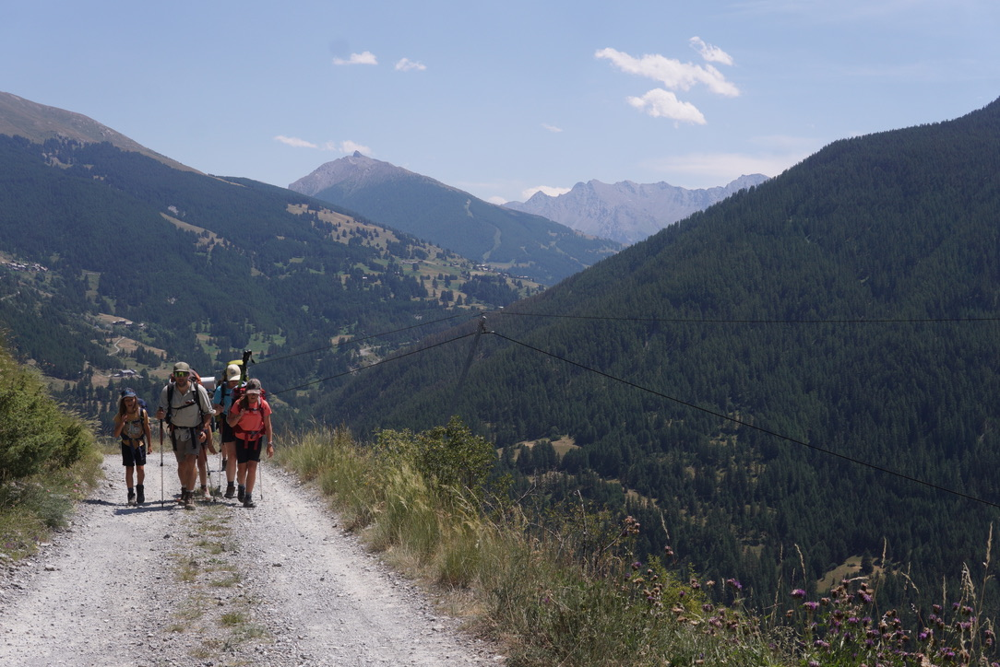

Notre pause lunch n'est pas très agréable, le long d'une route forestière on trouve un peu d'ombre coincé dans la pente avec un ruisseau à côté. Par contre le paysage est beau, car on remonte le long de la vallée d'Aiguilles. On voit la route de Molines, mais aussi de Saint Véran où on est passé quelques jours avant! Mais le sentier de jonction c'est principalement un sentier de 4 roues, moins agréable. A noter qu'on est sur une variante du GR58 donc ça explique aussi.

En arrivant au hameaux "Le Rouet" on voit les 2 options pour rallier le village de Souliers où on dort ce soir. La version 16k qu'on voyait initialement passe par l'alpage du Péas (c'est l'option Whoa!) et le 10k que j'avais planifié passe par la route vers Souliers (donc un peu moins Whoa!). On décide de découper le groupe en 2, car j'ai très très envie de faire la version qui passe par l'alpage de Péas, mais il semble que je soit le seul dans ce cas 😇. Le reste de la troupe passe par la version courte! J'en profite pour "lâcher les chevaux" sur les 8 km qui restent, et ça fait du bien! Je rattrape même un randonneur qui nous avait doublé en début de matinée, et je jogge en descente!

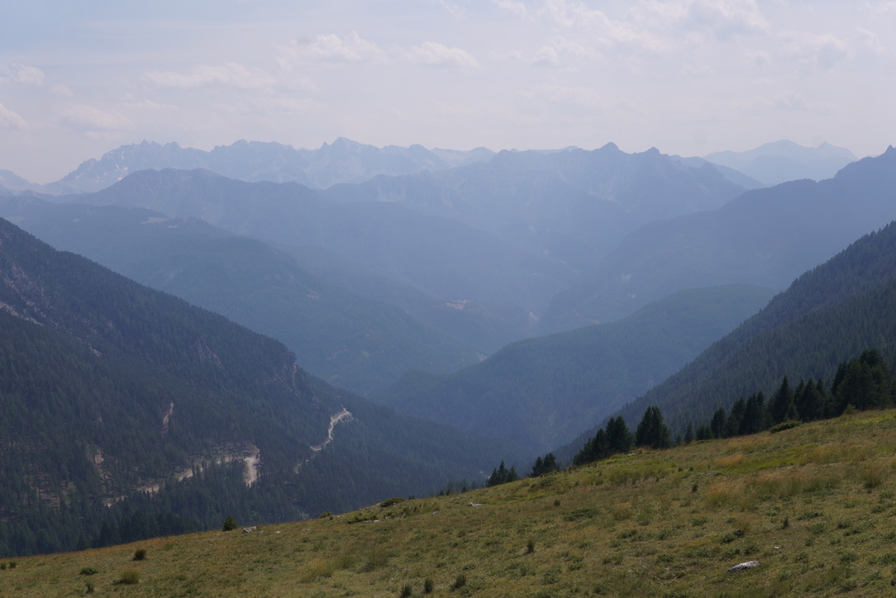

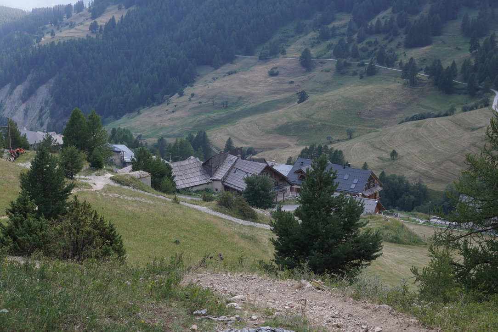

En arrivant au village, je vois le fameux refuge du Grand Rochebrune où on a déjà dormi à 2 reprise. Je suis le premier à arriver, le reste du groupe a décidé de la prendre cool et de faire une longue pause à coté d'un torrent. Je prend le temps de faire le check-in au refuge et je descend rejoindre le reste du groupe sur la route qui monte à Souliers. Mes parents arrivent également dans le même temps (ils font la dernière étape avec nous!) et on passe les accueillir avec les enfants quand on arrive au refuge. Encore une fois on a eu un temps sans pluie, une belle journée un peu trop chaude!

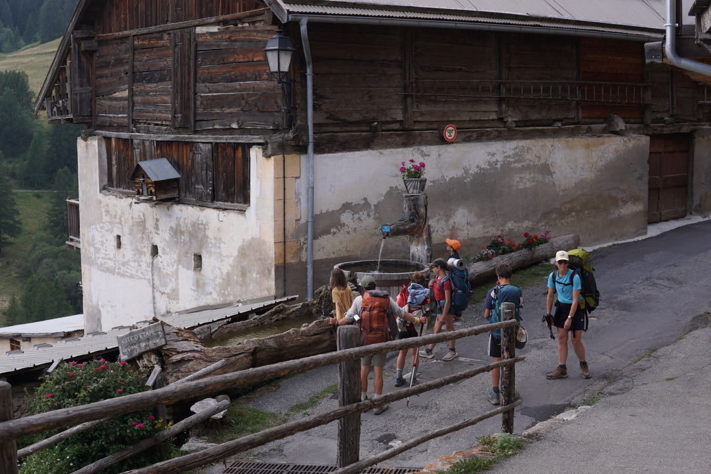

Ce soir au programme on a un peu de lessive avant la dernière journée, une douche et un bon séjour à 12 dans le refuge. Le souper est un plat portugais avec du porc et du chorizo, c'est original et très bon! On finit sur un classique tiramisu. On a le temps de discuter avec la gérante qui tient le lieu depuis 3 ans, on lui dit qu'on était passé en 2008 et 2009! Petit jeu de cartes et on file au dodo vers 22h.

**Lien Strava de la journée**: https://www.strava.com/activities/19417005814 et après le lunch: https://www.strava.com/activities/19417012687

**Statistiques Groupe 1**:

- **Distance**: environ 11 km
- **Dénivelé positif**: environ 500 m

**Statistiques Groupe 2 (moi!)**:

- **Distance**: environ 18 km
- **Dénivelé positif**: environ 850 m

## Mardi 21 juillet

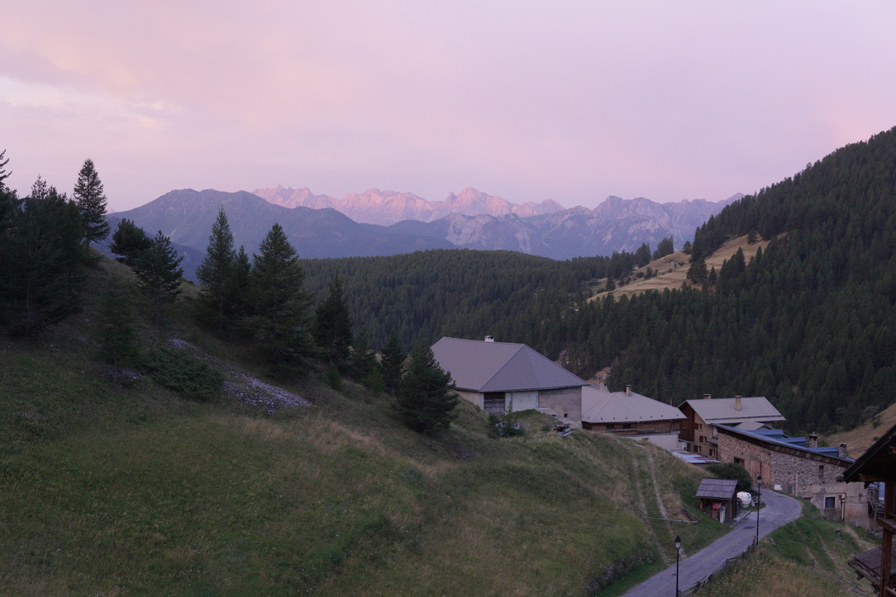
_Point de vue du refuge au lever du soleil!_

Dernière journée! On boucle la boucle aujourd'hui! Mes parents qui commencent à être âgés nous accompagnent, donc on va y aller un peu moins vite! Après un bon déjeuner, on arrive à décoller à 8h30 du refuge, c'est aidant de ne pas plier de tente le matin! La montée vers le lac Souliers est assez régulière mais c'est quand même environ 600 mètres de dénivellation positive. Le rythme est plus lent que les jours précédents!

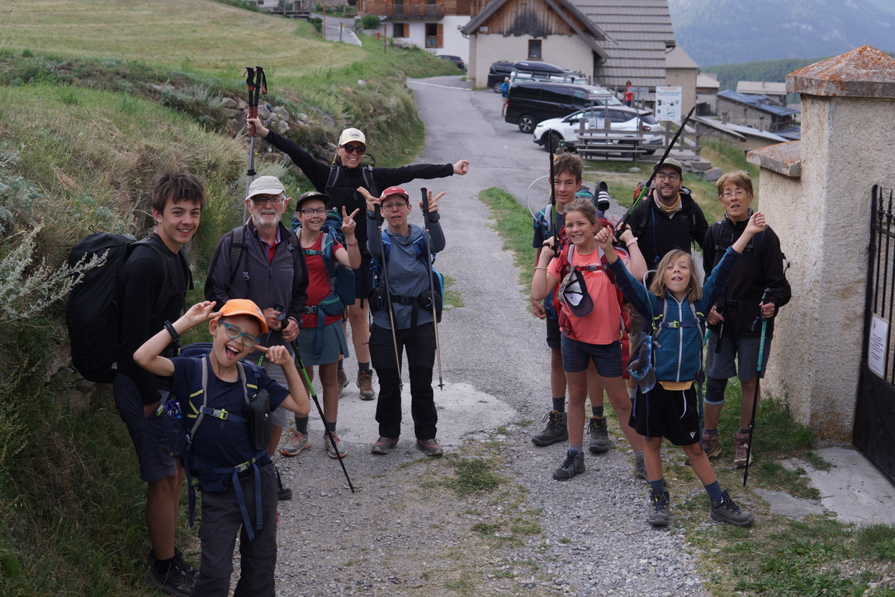
_Belle gang!_

J'arrive à refaire la photo qu'on avait prise en 2012 avec Eliott quand on avait bivouaqué au lac Souliers (les sapins ont poussés)!

<table style={{ width: "100%", tableLayout: "fixed" }}>
  <thead>
    <tr>
      <th style={{ width: "50%" }}>2012</th>
      <th style={{ width: "50%" }}>2026</th>
    </tr>
  </thead>
  <tbody>
    <tr>
      <td style={{ width: "50%" }}>
        
      </td>
      <td style={{ width: "50%" }}>
        
      </td>
    </tr>
  </tbody>
</table>

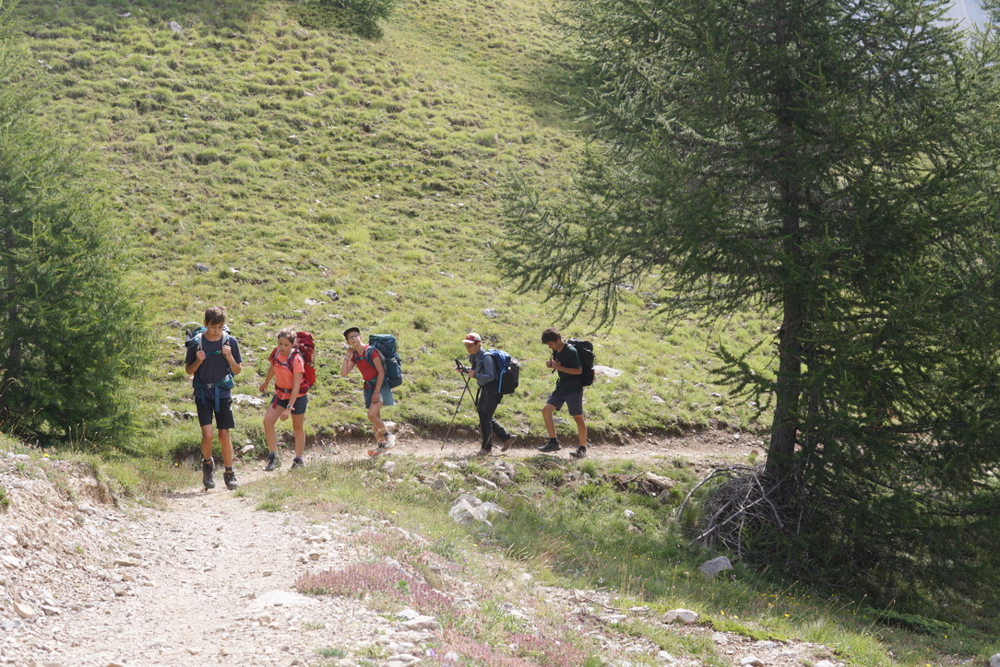

Le chemin a été modifié depuis le temps avec une montée plus progressive en lacets, Le "petit" groupe arrive au lac après environ 3h de montée. C'est lent 🤣. Un bon lunch au lac avec un mix de tout les restes accumulés depuis le début de notre aventure (enfin on finit les sardines!!). On repart ensuite vers la fin de notre étape, Brunissard.

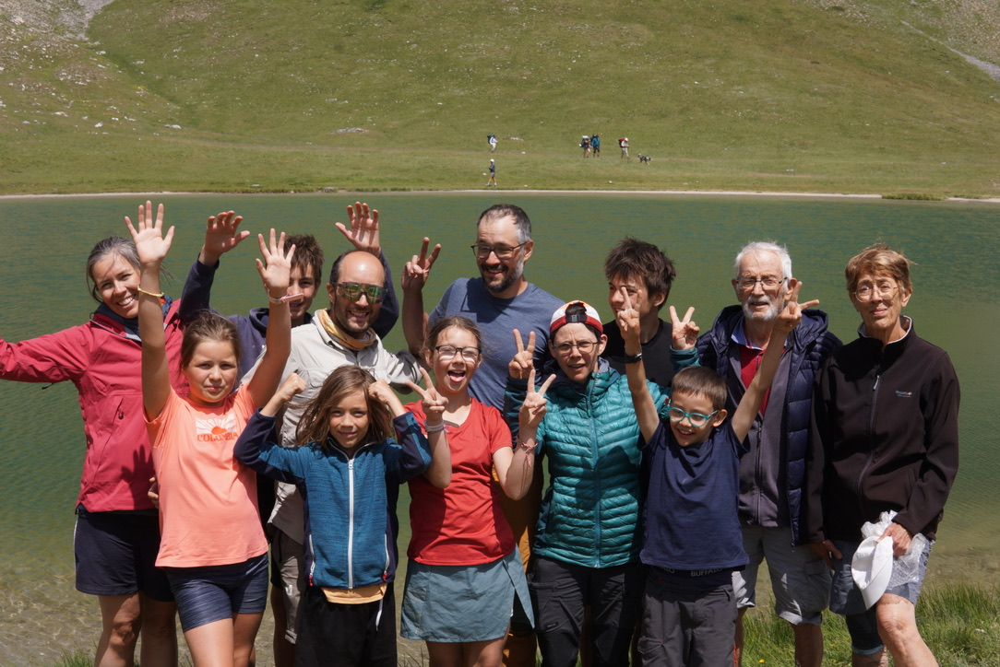
_Belle troupe devant le lac!_

Mon père me fait une frayeur et chute sur les fesses dans la descente, heureusement sans gravité. Un signe qu'on avait sans doute sous estimé la difficulté de l'étape pour mes parents. On décide de leu faire skipper la partie entre le parking de la casse déserte et le village de Brunissard qui est encore plus scabreuse. Une auto qui redescend les posent vers la chapelle de Brunissard sans soucis!

Pendant ce temps on descent en vitesse avec Eliott, Léandre et Anatole. On rejoint les parents, et je vais faire un petit bout en solo pour retrouver notre auto laissé au parking du camping de l'Izoard, à environ 1.5 km. Et c'est la fin! On prend pas le temps de faire une photo finish comme les précédentes éditions, on doit partir un balai d'auto afin de déposer les parents à Souliers et Guillaume à Saint Véran pour qu'ils retrouvent chacun leur auto respective! Le reste de la troupe utilise la navette pour se retrouver à Ville-Vielle vers 17h30. C'est toujours plus long que planifié de déplacer des autos dans le massif! On se dit qu'il faudrait compter plus sur la navette pour nous aider dans ces mouvements!

On finit notre aventure par deux jours de camping à Molines afin de se reposer avant de finir nos vacances en région lyonnaise.

**Lien Strava de la journée**: https://www.strava.com/activities/19417020411

**Statistiques**:

- **Distance**: environ 10.5 km
- **Dénivelé positif**: environ 650 m

## Petit point matériel

Voici la liste de matériel qu'on a utilisé pour notre tour du Queyras 2026. On a essayé de rester léger! A la pesée à Saint Véran, nos sacs était pas mal léger: 12 kg pour Julien, environ 8kg pour Marion et 8 kg aussi pour Eliott. Je ne me souviens plus pour Sidonie et et Marcus. Les sacs de Anne, Louis et Augustin étaient plus lourds car ils avaient moins d'expérience et donc moins de matériel technique pour alléger le poids. On a aussi utilisé un peu plus de nourriture "fraîche" que d'habitude, donc ça a ajouté un peu de poids. Mais globalement on est satisfait de notre équipement!

[Matériel Tour du Queyras 2026](https://docs.google.com/spreadsheets/d/1A-pWsCleKJmgoxlAK9Sa5_-y-qS1w-EXYuVUas4rHbA/edit?usp=drive_web&ouid=109198128855748917090)

## Conclusion

Nous avons passé une semaine formidable dans le Queyras, avec des paysages à couper le souffle et des moments inoubliables en famille. Le mélange de bivouac, de camping et de refuge a permis à chacun de profiter du confort tout en restant proche de la nature. Les enfants ont relevé le défi avec brio, et nous avons tous créé des souvenirs précieux. Nous recommandons vivement cette randonnée à ceux qui cherchent une aventure accessible mais enrichissante dans les Alpes françaises.
