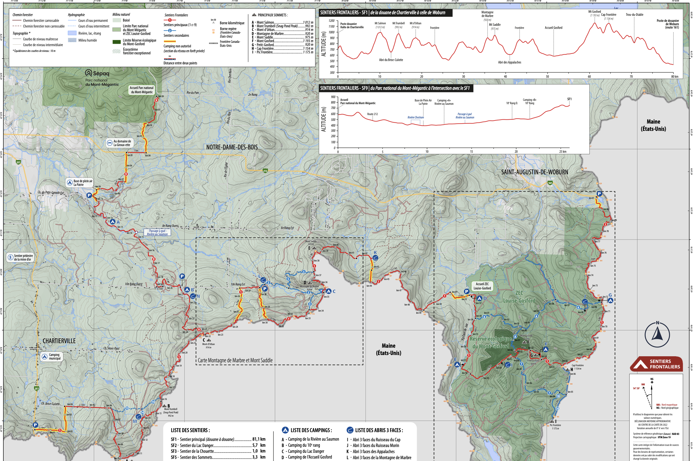
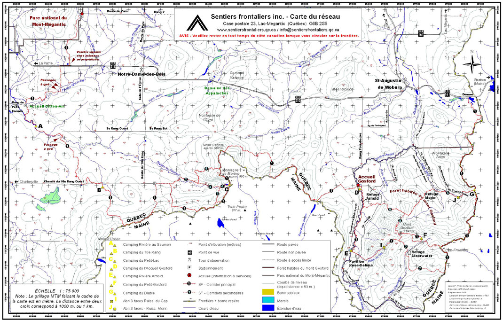
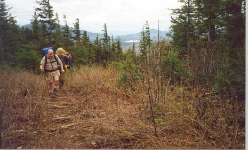
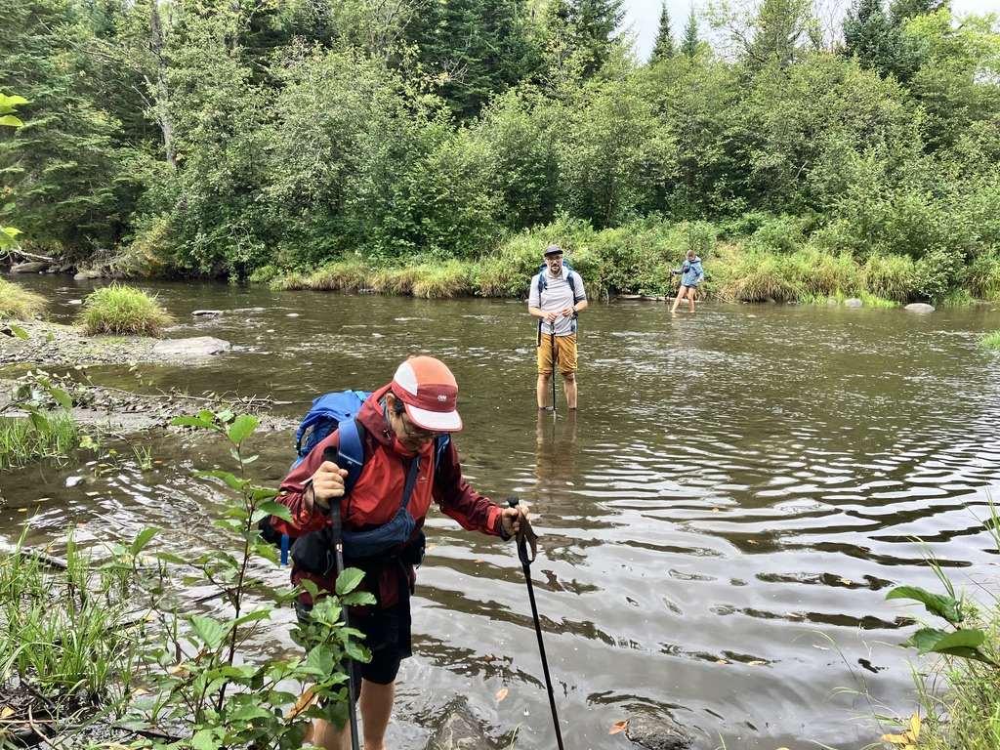
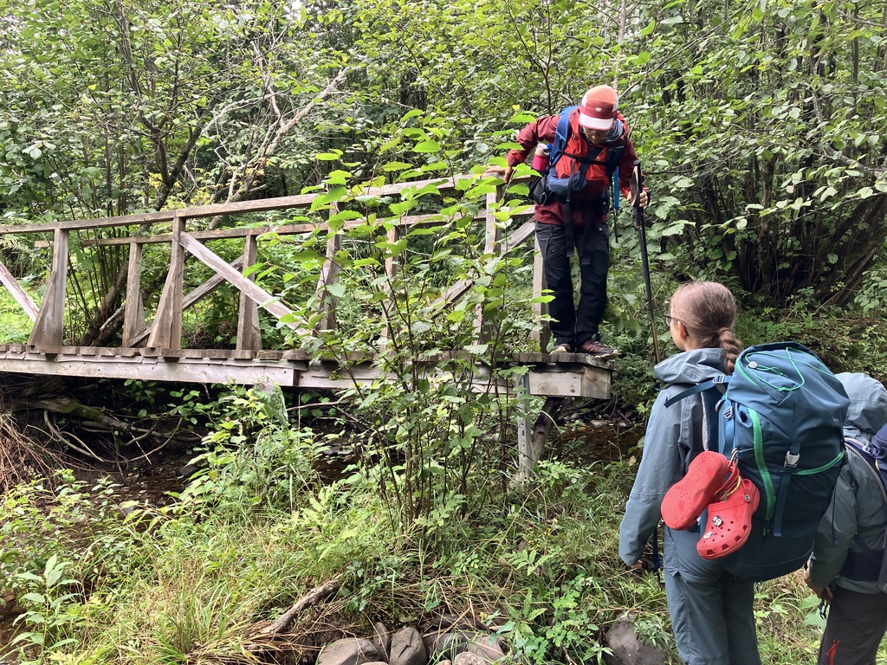
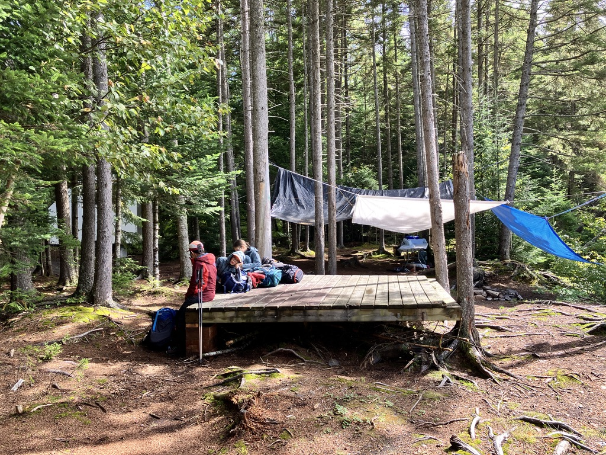
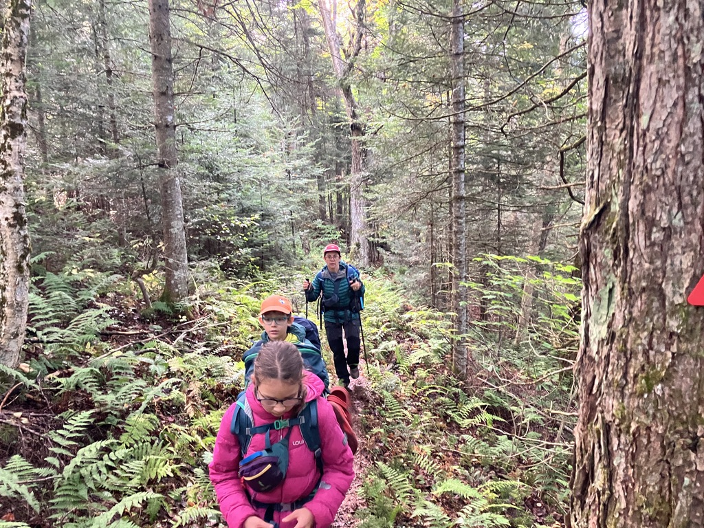
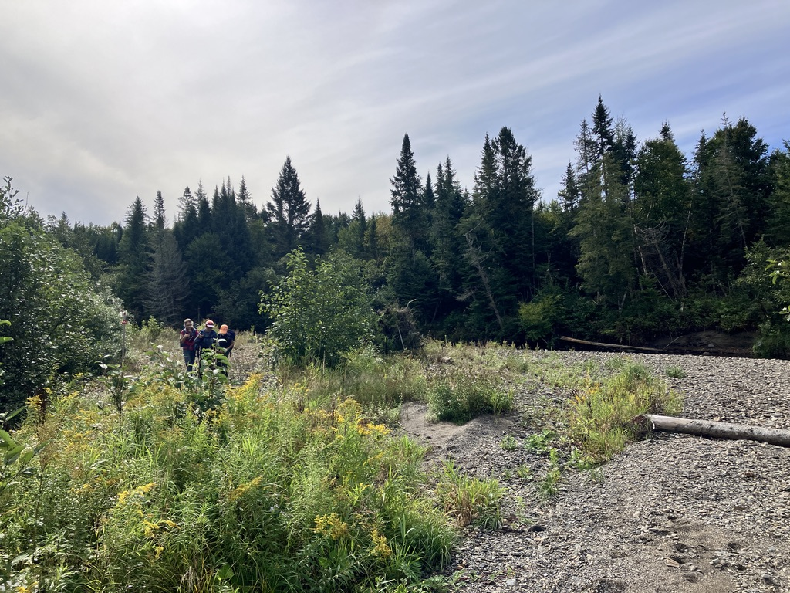
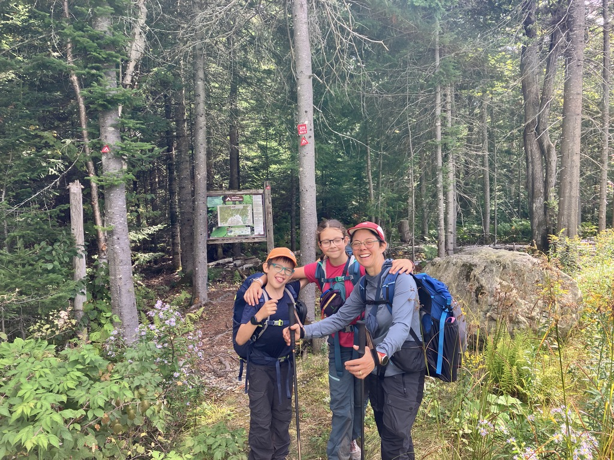

## Genèse du projet

Depuis que j'ai rejoint le Conseil d'Administration de Sentiers Frontaliers l'an passé, je vois passer de nombreuses sorties et projets sur le réseau et j'avais le goût de proposer un évènement pour rejoindre un peu plus les familles, en plus des habituels "EBR - Expéditions des Braves Randonneurs" ou "ECE - Exploration des Chasseurs d'Étoiles". En discutant avec Monique, notre présidente bénévole, on avait identifié un trajet sur SF9 la branche moins populaire du réseau, en 3 jours planifié pour la fin de semaine de la fête du travail ici au Québec (5-6-7 septembre). Le projet se serait appelé "mini-EBR" et était orienté pour les familles baroudeuses, avec des étapes plutôt courtes:

- Samedi 5: stationnement de la montagne de Marbre jusqu'à l'abri 3 faces W8banaki (9.5km et 500m de dénivelé positif) via SF1 puis SF9
- Dimanche 6: abri 3 faces W8banaki jusqu'au camping de la rivière au saumons (9km et 43m de dénivelé positif) sur SF9
- Lundi 7: Camping de la rivière au saumons jusqu'au parc du Mont Mégantic - Secteur AstroLab sur SF9 (11.5km et 400m de dénivelé positif)

Le trajet est décrit sur cette carte: https://caltopo.com/m/R040T56

Cependant on a décidé fin juin de ne pas aller de l'avant avec ce projet, car il commençait à être tard dans l'année, et aussi je n'avais jamais mis les pieds sur la majorité du parcours, ce qui est une faiblesse assez importante! On a quand même gardé l'esprit du trajet, sans la première journée pour être capable de finir le dimanche et laisser Sidonie pouvoir profiter de l'activité offerte par sa troupe éclaireur le lundi!

## Un peu d'historique sur SF9

_Carte du réseau actuelle sur BalisesQC, mise à jour pour la dernière fois en 2022_

Depuis que je connais le réseau de Sentiers Frontaliers, autour de 2023, j'ai toujours trouvé étrange ce lien entre le parc du Mont Mégantic et la frontière, c'est pas très évident comme trajet et moins "vendeur" que le trajet SF1 qui part d'une douane à une autre douane. En fouillant sur le site ["Internet Archives"](https://web.archive.org/web/20260000000000*/www.sentiersfrontaliers.qc.ca) de Sentiers Frontaliers, j'ai pu remonter dans l'historique du réseau, jusqu'à 2002 date du premier site sur `sentiersfrontaliers.qc.ca` (tiens c'est étrange pourquoi aujourd'hui le domaine est [sentiersfrontaliers.com](https://sentiersfrontaliers.com)?). En particulier je suis tombé sur la carte du réseau en 2007:

_Carte du réseau issue des archives de 2007_

Historiquement le sentier reliait donc le parc du Mont Mégantic à la douane de Woburn uniquement! Le tronçon entre le Mont d'Urban (jonction SF9) et la douane de Chartierville n'a été ajouté que récemment, circa 2009. Avec Internet Archives, j'ai aussi pu collectionner les "mots de la direction" depuis 2002, et effectivement on parle de ce nouveau tronçon dès 2006 afin de rejoindre le Cohos Trail qui se termine justement à la douane de Chartierville. Bref SF9 est donc l'ancien SF1 si on veut et donc c'est un tronçon chargé d'histoire pour Sentiers Frontaliers! Je vais essayer de construire une page "historique" avec mes découvertes sur le site de Sentiers Frontaliers, ça permet toujours de mieux comprendre comment et pourquoi les sentiers sont positionnés ainsi!

_Une photo sur le sentier trouvé sur le site en 2002, il y a presque 25 ans! Qui se reconnaît dessus?_

## Récit de notre aventure

### Vendredi soir

On décide de partir la veille afin d'avoir un 2 jours / 2 nuits dans le bois et de maximiser notre expérience 😇. Oui on aime ça le dodo dans la nature et les repas autour du feu! On pose notre auto à l'arrivée, c'est à dire au parc du Mont Mégantic - secteur AstroLab et on s'était organisé avec Julie, chargée de projet à Sentiers Frontaliers pour se faire lifter jusqu'au départ, le camping du 10ème rang au sud de Notre-Dame-Des-Bois. Merci à elle!

On arrive en début de soirée à l'abri 3 faces W8banaki pour une soirée bien calme, avec notre ravitaillement du dépanneur de Notre-Dame (il faut faire marcher un peu le commerce local!). La pluie nous surprend alors qu'on s’apprête à faire griller les guimauves, mais on passe une super soirée sur l'abri à lire le livre d'or dans l'abri! C'est notre première nuit ici, on commence à avoir bien exploré tous les abris 3 faces du réseau 🤣.

### Samedi

Petite journée (9km), on se presse pas pour se lever (7h30?). Le temps est maussade avec l'impression qu'on est au milieu du nuage, il bruine! Notre déjeuner s'améliore avec quelques saucisses qu'on a pas mangé la veille, c'est motivant pour la journée de commencer avec un tel carburant!

On commence notre trajet tranquillement pour remonter en direction du parc de Mont Mégantic! Les premiers kilomètres sont assez laborieux, avec la pluie de la veille, la bruine du matin et la végétation on se retrouve assez rapidement avec les pantalons totalement mouillés. Les souliers sont pas en meilleurs états, pas évident d'éviter tous les trous d'eau. C'est là qu'on se dit que SF9, comme initiation à la longue randonnée pour des nouvelles familles c'est pas le terrain de jeu idéal, c'est un peu trop _rough_. Le sentier est cependant très bien indiqué avec des bornes à tous les 50m. C'est rare de perdre les bornes, même si le chemin est assez peu tracé. C'est effectivement le bout du réseau le moins emprunté vu la quantité de mousse à terre!

Au bout de quelques heures, vers 12h, on arrive vers le fameux passage à gué, qui est bien documenté sur le site de Sentiers Frontaliers. C'est impressionnant quand on arrive à ce point, car même si la rivière n'est pas très profonde, c'est assez large et c'est la première fois qu'on doit traverser une rivière sans pont! C'est la rivière aux saumons qu'on traverse, et on sera ensuite assez proche puisque le camping de notre prochain arrêt sera le long de cette même rivière.

Finalement tout se passe sans encombres, avec des stratégies différentes: Marion et Sidonie sont passées pieds nus, moi j'ai gardé mes souliers (donc j'ai eu les pieds ben humides pour la fin de la journée!) et Marcus a choisit l'option du "passe-rivière-sur-le-dos-de-papa" qui permet de garder les pieds aux secs sans enlever ses souliers! On se permet une pause lunch juste après le passage à gué avec un simple [couscous aux légumes](/recipes/couscous-aux-legumes/) qui a gonflé depuis ce matin, ça nourrit! Le reste du trajet est assez court, mais toujours très humide. Un pont un peu scabreux permet de passer un mince filet d'eau!

On arrive sur le site du camping au environ de 14h (oui c'est tôt!). Le coin avec la plateforme est déjà occupé par plusieurs bâches, une cuisine et un sorte de cabane mobile. Ça me parait un peu tôt pour préparer la chasse qui commence en octobre 🤣. Bref on préfère avancer un peu pour se poser vers la rivière.

On arrive tellement tôt que c'est presque long d'attendre le souper! Bref on en profite pour faire un petit feu et jouer le long de la rivière. Je trouve que quand on est au milieu d'une sortie sur plusieurs jours comme celle-ci, on est très "connecté". À la maison c'est plus facile d'être chacun de son bord sur son activité, son cellulaire ou bien dehors. En randonnée comme aujourd'hui, on est presque forcé de vivre à 100% avec les autres participants. On a pu faire une partie de jeu de cartes et on avait pas chacun notre cellulaire à checker. C'est précieux ces moments "déconnectés". On soupe comme à l'habitude avec une soupe et un [dahl de lentilles corail](/recipes/dahl-lentilles-corail/). On croise d'autres randonneurs qui font le trajet dans l'autre sens: ils sont partie du Mont Mégantic (secteur Franceville) et vont dormir le lendemain soir à l'abri 3 faces du Brises Culottes. C'est un beau programme!! Dodo à 20h sous les tentes, on est fatigués!

**Lien Strava de la journée**: https://www.strava.com/activities/20064509049

**Statistiques**:

- **Distance**: environ 9.5 km
- **Dénivelé positif**: environ 70 m

### Dimanche

Réveil à 6h30, c'est une plus grosse journée qui nous attend, et on a pas de dîner pour ce midi, on compte passer à la cantine pour une bonne poutine, donc on doit pas traîner! Après un bon déjeuner bien classique on arrive à partir à 8h30. On connaît le début du sentier car on avait déjà dormi ici l'an passé, en stationnant l'auto vers la base de plain air de la Patrie.

Arrivé vers la base de plain air, il y a un détour qui fait passer par la foret publique plutôt que dans la base de plain air. C'est agréable et on se mouille moins les pieds que la veille! On finit le détour avec un nouveau passage à gué sur la rivière Chesham, mais on est experts maintenant!

Par contre cette fois je prend l'option pieds nus pour éviter les souliers mouillés pour les 10 derniers kms! Le sentier continue tranquillement avec une belle vue sur la rivière Chesham, avant de remonter en direction de la route 212. On traverse la route à hauteur du gite La Giroux-ette, et on continue vers le nord après une petite section sur la 212. Une belle côte nous attend avant de rejoindre le parc du Mont Mégantic (presque la seule de la fin de semaine!) et on navigue un 2km dans les bois avant de déboucher au niveau de l'AstroLab, c'est la fin de notre courte aventure!

**Lien Strava de la journée**: https://www.strava.com/activities/20064523907

**Statistiques**:

- **Distance**: environ 12 km
- **Dénivelé positif**: environ 450 m

## Matériel

Rien de bien original pour cette sortie. On avait 2 tentes pour être capable de dormir à 2x2 au camping de la rivière aux saumons, et puis notre stock habituel. Toujours le fidèle réchaud au naphta qui nous évite l'achat de can de gaz non rechargeables!

## Conclusion

Belle aventure dans un terrain peu parcouru par les randonneurs québécois! Un grand merci à l'équipe d'entretien de Sentiers Frontaliers, ça prend de la job pour aller passer le weed-eater dans les sentiers pour éviter que l'herbe et les fougères soient trop hautes! Parcourir ce sentier ça donne aussi des idées d’enchaînement intéressant, comme partir du Mont-Mégantic secteur Franceville pour rejoindre Chartierville ou bien Woburn! Ca peut être une aventure passionnante à faire en gang ou avec une version fast-packing! Par contre je vais revoir ma copie pour un "mini-EBR" familial l'an prochain, je pense pas que SF9 soit le meilleur choix. On va travailler sur CalTopo pour construire de quoi plus pertinent!
